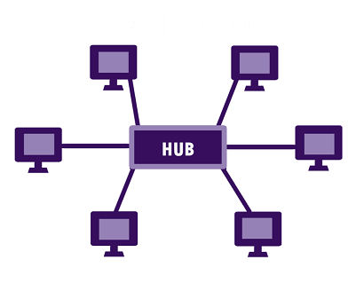

# URL format

# LAN,MAN,WAN
Local Area Network
Metropolitan Area Network
Wide Area Network
MAN lies in between LAN and WAN in terms of:
- area coverage(LAN less area, WAN very high area)
- data transfer rate(LAN more data transfer rate, WAN less data transfer rate)
Internet is WAN.
# Local Area Network
Twisted pair cable
Commonly used topology is star topology.
# Network Interface Card(NIC)
Every NIC (Network Interface Card) has a **48-bit** globally unique identifier called as **MAC** Address (Media Access Control Address) burned into its ROM chip. This MAC address is used to deliver Ethernet Frames (packets) to a computer.
# IP
IP address only exists if a device is connected to the network.
# Topology
## Star topology

Devices connected through a central device.
## Mesh topology
Every devices connected to every other device.
## Ring topology
Every device is connected to the next, forming a ring.
## Bus topology
Every device on a common link.
# DES
- block cipher(encrypts data in blocks of size 64 bits each).
- symmetric key encryption.
- same key for encryption and decryption.
- Based on
	- substitution(confusion)
	- transposition(diffusion)
# HTTPS
the communication protocol is encrypted using Transport Layer Security.
# Trojan horse
- program disguised as an useful application.
- doesn't replicate like viruses but can be destructive.
# Logic bombs
- disgruntled employees to destroy data after they've left a company.
- involve installing a hidden program on a system that is designed to activate at a predefined event.
# Subnet mask
Basically a valid subnetmask, when written in binary, has to consist of only consecutive 1's and then 0's, but no intermittent mixing. I.e.:
```
255.255.255.128 -> 11111111.11111111.11111111.10000000 is valid
255.255.255.0   -> 11111111.11111111.11111111.00000000 is valid
255.255.255.144 -> 11111111.11111111.11111111.10010000 is not valid
```
`/20`means 20 ones. `11111111.1111111.11110000.00000000` which is `255.255.240.0`.
# ARP
- maps IP address to hardware MAC address.
# Error free communication
Transport layer
# X.25
- packet switching protocol
- WAN
- X.25 is interface between DTE and DCE
- three layers covered in the X.25 standard.
# PDU

# Gateway 
covers most protocols in TCP IP suite.

# CSMA/CD
The access mechanism used in an Ethernet is called Carrier Sense Multiple Access with
Collision Detection (CSMA/CD).


# VLAN
Logical network that can group devices/users regardless of their different physical locations.
# NAT
- connects a large number of hosts to the global internet using a smaller number of public IP address, so preserves IP address space.
- enhances security for private networks by keeping internal addressing private from the external network.
# BGP
Between two different autonomous systems or even within autonomous systems.
# Access Control
## Discretionary Access Control
- policy defined by the one who owns a resource(object).
- the owner of a resource defines who can and cannot access the item.
- example: ACLs, read, write, execute permissions that can be given to users and groups.
- call discretionary because they're implemented at the discretion of the data owner.
- every modern OS supports DAC
## Mandatory Access Control
- No ACLs associated with the object.
- Access for an object is based on the 
	- sensitivity of the object.
	- user who is attempting to access it.
- one of the most secure
- SELinux, AppArmor; choose one or the other, as these systems are not compatible.
- need to know basis
## Rules-Based Access Control
- Based on rules defined by system administrator
- example: network firewall
- firewall administrators create a set of rules that describe the types of network traffic that are allowed to pass through the firewall.
- Rules may be based on anything
	- ip address
	- network protocol
	- time of day
	- user identity
## Roles-Based Access Control
- based on roles that the user performs within the organization.
- for example: roles can be human resource or finance.
Mandatory access control systems are the strictest and most secure type of access control, but they’re also the most inflexible. In order to change permissions, the administrator has to reprogram the specific user’s access, not just the security lists at the entry point. MAC systems are primarily used by companies and agencies that require the utmost levels of security.

DAC systems are considered to be the most flexible and offer the highest number of allowances compared to other types of access control. Because it’s the most flexible, it’s also not as secure as some other types, especially mandatory access control systems. Since one person has total control over the system, he or she might grant access to someone who shouldn’t have it. Discretionary access control systems are best for companies that expect the most ease of use and flexibility.

References:
Access Control and Identity Management
By Mike Chapple

# Packet Switching vs Circuit Switching
## Circuit Switching
- if A wants to connect to B, all the nodes between A and B will be occupied for entire duration of call, thus 50% wastage of resources as at once, only one person speaks in telephone conversation. Inefficient user of resources.
## Packet Switching
- Each packet take different route within the network.
- The network node decides whom to send this towards.
- More overhead as each packet carries routing information.
References:
GPRS: Gateway to Third Generation Mobile Networks
By Gunnar Heine, Holger Sagkob
# Remote Access Protocols
- RDP
- SSH
- RAS
SNMP isn't a Remote Access Protocol.
# Switch vs Router
The only difference is on which layer they operate.
[Pasted image 20240127163347](_resources/Pasted%20image%2020240127163347.png)
Switch operates in data link layer and router operates in network layer.
Router uses mesh topology.
References:
Sams Teach Yourself Network Troubleshooting in 24 Hours
By Jonathan Feldman
# Hub vs Bridge


If you look at the front of the hub, you will see an indicator called the collision light, the more often it blinks the more often your data is not getting to its destination.
Switch is a multiport bridge.
Hub operates at layer1 (physical layer) whereas switch and bridge operate at layer 2(data link layer).
# OSI model layers functions
There are 7 layers.
## Transport Layer
- reliable end-to-end data transmission.
## Physical Layer
- electrical and physical specifications for transmitting data over a network.
## Network Layer
- standard way of transmitting data between devices.
## Application Layer
- any options that has applications on it.
## Data Link Layer
- breaks data into smaller units.
- integrity and accuracy checker
## Session Layer
- anything with session, connections on it.
# TCP/IP model
- Officially there are 4 layers in TCP/IP model.
- Specifically, they are the Network Access Layer, Internet Layer, Transport Layer, and Application Layer.
# Twisted pair cables
100 meters
# Coaxial cables
1 km
# Optical Fibers
5 km
# Guided Media
Uses physical cables.
# Unguided Media
Uses air or vacuum.
# Microwave communication
1GHz=1000MHz
0.3 GHz-3GHz
Line of sight between transmitting and receiving devices.
# Radio Waves
30MHz-300MHz
not suitable for higher speed data transmission.
# ARP
Address Resolution Protocol. 
Maps IP addresses to physical addresses(MAC Address).
If data not in ARP cache, ARP sends a broadcast message to all devices on the network to resolve the mapping.
References:
Cisco Secure Internet Security Solutions
By Andrew G. Mason, Mark J. Newcomb
# IEEE
802.3=ethernet
802.4=token bus
802.5=token ring
# Point To Point Protocol
# Error detection
CRC
# Error Correction
FEC(Forward Error Correction)
# Parity Check
1 bit
# Checksum,CRC,FEC
Depends on the number of bits in the data being transmitted.
# IPV6
4.3 billion
# Subnetting
## Classful Addressing
Class A:
255.0.0.0

Class B:
255.255.0.0


Class C:
255.255.255.0

Network and Host bits.
## Rules of subnetting

References: Andrew G Blank TCP IP Foundations
https://bmsce.ac.in/Content/IS/Subnetting.pdf
# MRTG
Multi Router Traffic Grapher
PRTG is same as MRTG, only difference is it's commercial.
Uses SNMP.
# Digital signature
only provides authentication, rest fulfills all CIA triad.
