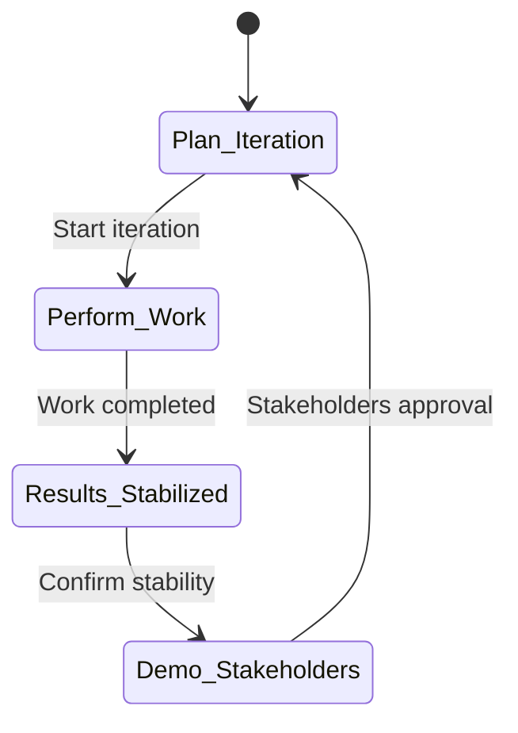

# Good software
- software isn't manufactured in the classical sense, it's developed or engineered.
- software doesn't "wear out".
- software can be custom built or custom build.
- maintainability
- functionality
- firmness
- commodity
- delight
# Software design principle
- no tunnel vision
- don't reinvent the wheel
# Software Engineering
is defined as systematic, disciplined and quantifiable approach for the development, operation and maintenance of software.
# RAD
- Rapid Application Development
- less than 90 days software.
- 5 phases
- user needs to be involved in RAD and prototyping to get desired output.
## drawbacks
- requires highly skilled devs.
- it increases the component reusability.
# Software project management
- project planning
- scope management
- project estimation
# Software requirement specification(SRS)
- functional requirement
	- **functionality, portability and reliability** isn't functional requirement. They're non-functional requirements.
	- business needs is a functional requirement.
- non-functional requirement
- goals for implementation
- doesn't contain the algorithm for software implementation.
- unambiguous.
- also called black box specification.
# Waterfall model
- simplest model of SDLC.
- not suitable to accommodate changes.
# Evolutionary process model
- incremental, concurrent development and WINWIN spiral model isn't relate to it.
# Verification and validation model
- V-model
# System analysis
- understand software limitations.
- learning system related problems.
- impact of project on organization and personnel.
- study of an existing system.
# Architectural design
- software is a system.
# Software
- programs
- docs
- operating procedures
# Spiral model
- risk management is most important feature.
- two dimensions
	- radial
	- angular
- risk analysis performed on every loop.
- spiral and prototyping model doesn't necessitate defining requirements at the earliest in the lifecycle.
- barry boehm founder
# Prototyping model
- vertical
- horizontal
- domain
- diagonal doesn't exist.
- Both RAD and prototyping model facilitates reusability of components.
- spiral and prototyping model doesn't necessitate defining requirements at the earliest in the lifecycle.
# Iterative model
- simpler to manage
- divided workload
- early revenue generation
# Incremental testing
- top-down
- non-functional
- functional
- big-bang is not a type of it.
# Requirement engineering
- elicitation
- analysis
- validation
- design is not a part of requirements engineering
# Software testing lifecycle
- test case design
- test execution
- defect tracking
- maintainence
- coding is not a phase in this lifecycle.
# Software development life cycle
- preliminary investigation and analysis
## Planning and designing phase
- parallel run
- sizing
- specification freeze
# Model selection
- requirements
- dev team and users
- project type and associated risk
# Advanced version of existing software
- iterative
- RAD
# Agile
- incremental
- iterative
## Agile manifesto
- customer collaboration
- individuals and interactions
- working software
# Adaptive software development(ASD)
- assumption
- association
- learning
# Sustained development of legacy systems
- reverse
- re-engineering
# Build and fix model
- between 100-200 LOC
# Agile scrum methodology
- project management that emphasizes incremental progress.
# CASE
- Computer-Aided Software Engineering
# Software design models
- 2 dimensions
	- abstraction
	- process
# Software design concepts
- abstraction
- architecture
- it's not low cohesion and high coupling.
# Software design
- constraints
- changing requirements
- describes the software
# Structural design
- specification model
**Design Notation is not a symbolic representation system**
# Architectural design
- meets system's functional requirement is not the truth.
- testing the system is not architectural design decision.
- application types
- system distribution
- architectural styles or patterns
# Physical view
- hardware and software 
# Architectural conflict
- large-grain components improves performance but reduces maintainability.
- redundant data improves availability but decrease security.
- localizing safety-related features increase communication, decreases performance
# Shared database or repository pattern
- set of inter-acting components can share data.
# Architectural model
- static structural 
- dynamic process
- distribution
- input is SRS.
- Steps
	- Analyze SRS.
	- Evaluate candidate architectures.
	- Select architecture and finalize architecture.
# Explicit architecture
- stakeholder communication
- system analysis
- large scale re-use
# Performance
architecture and system characteristic
# System organization styles
- shared data repository
- shared services and servers
- abstract machine or layered
# Repository model
- shared data in central db and accessible by all sub-systems.
- each sub-system maintains its own db and passes data explicitly to other sub-systems.
# CBSE
Component based software engineering
Benefits
- quality better
- delivery time quicker
- productivity higher
## Properties of components
- independent
- standardized
- deployable
- documented
Examples: EJB,COM+,.NET
Component interfaces defines a set of standards for components, including interface standards, usage standards, and deployment standards.
# Client server architecture
- protocols used by server is used to communicate.
# Design heuristic
- Evaluate first iteration of the program structure to reduce coupling and improve cohesion.
- Desirable: More fan-in, less fan-out. Fan-in is the incoming modules and fan-out is the outgoing modules. outgoing means controller so less good.

# Design
- input information requirements.
- output data and program structure, interface characteristics, and procedural detail.
# Architecture is not the operational software
Rather, it enables a software engineer to
- design vs requirements?
- architectural alternatives?
- reduce risks.
# Testing
- evaluating deliverables to find errors.
# Cyclomatic complexity
It tells us about how complex a given function is.
If a function has 0 conditional statements, the cyclomatic complexity of the function will be 1.
More cyclomatic complexity, more complex the software, more complex the **testing** and less **understandable** it becomes. (Because there will be lots of possible execution paths depending on conditions.)

Cyclomatic complexity=edges-nodes+2
**It is not a size measure.**
# Run chart

- lower and upper  limits are present.
# Maintenance testing
- depth and breadth testing

Referred books: Software Engineering, Kaseem A Saleh. This book has tons of examples related to these testing.
# Black box testing
- boundary value analysis
- equivalent class testing
- decision-table or tree based testing
- state based testing
- cause and effect graphing
More books to refer:
Software Verification and Validation: An Engineering and Scientific Approach
By Marcus S. Fisher
Essentials of Software Testing
By Ralf Bierig, Stephen Brown, Edgar Galván, Joe Timoney, Joseph Timoney
Practical Software Testing: A Process-Oriented Approach
By Ilene Burnstein
# Functional testing
is a test type
# Levels of testing
They all are dynamic testing.

Reference: Pankaj Jalote Software Engineering
# Software testing life cycle

Reference: SOFTWARE TESTING : A Practical Approach
By SANDEEP DESAI , ABHISHEK SRIVASTAVA
# Sanity testing
does the software works just enough so that it is sane?
test execution level

References:
SOFTWARE QUALITY ASSURANCE, TESTING AND METRICS
By BASU, ANIRBAN

Software Testing Tools: Covering WinRunner, Silk Test, LoadRunner, JMeter ...
By Dr. K.V.K.K. Prasad
# Exhaustive testing
- test all the possible inputs.
- impractical but possible.
- humanly impossible.
# Usability testing
- user-centric testing
- is the app user friendly?
- black box
# White box testing techniques
- Path testing
	- statement coverage
	- branch coverage
	- multiple condition coverage
	- path coverage
	- loop coverage
- data flow testing
- object-oriented testing
	- inheritance
	- polymorphism
	- gui
	- binding coverage
	- state-based testing
Also called structural testing.
References:
A Practitioner's Guide to Software Test Design
By Lee Copeland
Testing and Quality Assurance for Component-based Software
By Jerry Gao, H.-S. J. Tsao, Ye Wu
The Software Project Manager's Handbook: Principles That Work at Work
By Dwayne Phillips
Software Engineering
By Bharat Bhushan Agarwal, Sumit Prakash Tayal
Software Verification and Validation: An Engineering and Scientific Approach
By Marcus S. Fisher
Software Testing: Principles and Practice
By Srinivasan Desikan, Gopalaswamy Ramesh
# Alpha testing vs beta testing
Alpha testing at developer's end, beta testing at customer's end. Beta testing also called acceptance testing.
References:
Software Engineering and Testing
By B. B. Agarwal, S. P. Tayal, Mahesh Gupta
# Test plan parts
- schedule
- risk occurrence
- entry and exit criteria
incident reports is not a part of test plan.
# Integration testing
Objective is to test the module interfaces in order to ensure that there are no errors in the parameter passing, when one module invokes another module.
Reference:
Software Engineering and Testing
By B. B. Agarwal, S. P. Tayal, Mahesh Gupta
# Exploratory testing
Experience-based test design technique.
# Stop testing
when the risks are resolved.
# Testing standard
ISO
# Which testing is performed first?
## Regression testing
Regress means to return to a previous, usually worse state.
When a program is changed from P1 to P2. While testing P2, we don't only verify that change P2-P1 works, we also want to verify that the unchanged part P1 also works.

The best time to perform regression testing is 
- after the software has been modified.
- when the environment that is running the software has been modified.
References: 
Aditya Mathur, Foundations of software testing
## Static testing
Testing of a software without executing it on a computer.
- code reviews
- static code analysis
References:
Guide to Advanced Software Testing
By Anne Mette Jonassen Hass

**Generally static testing is performed first obviously.**
# Ad hoc testing
done without planning and documentation.
# Performance testing
A compiler might be tested to check if it meets the performance requirements stated in terms of the number of lines of code compiled per second.
A well performed application is one that lets the end user carry out a given task without undue perceived delay or irritation. Performance really is in the eye of the beholder.
**It is non-functional testing.**
# Incremental testing
Unit test->integration test->system test.
# Big bang testing
Testing entire program at once.
References:
Software Quality: Concepts and Practice
By Daniel Galin
Testing Computer Software
By Cem Kaner, Jack Falk, Hung Q. Nguyen
# Component testing
It is testing each units. It can be black box as well as white box.
References:
Testing and Quality Assurance for Component-based Software
By Jerry Gao, H.-S. J. Tsao, Ye Wu
# Six sigma
3.4 defects per million lines of code.
Define, measure, analyze.
Refers to six standard deviations.
# Defect removal efficiency (DRE)
Defect removed/(defects escaped+defects injected) `*` 100%
For example, defect removal efficiency is 70% if 70 out of every 100 defects are identified and removed.
References:
Systematic Software Testing
By Rick David Craig, Stefan P. Jaskiel
Metrics and Models in Software Quality Engineering
By Stephen H. Kan
# Direct measure of product
-  lines of code (LOC)
- execution speed
- memory size
- defects per reporting time period
# Indirect measure of product
- quality
- complexity
- reliability
# Direct measure of SE process
- benefit
- applied effort
- investment
# Indirect measure of SE process
anything that ends with ity is indirect.

References:
Experimentation in Software Engineering
By Claes Wohlin, Per Runeson, Martin Höst, Magnus C. Ohlsson, Björn Regnell, Anders Wesslén
Metrics and Models in Software Quality Engineering
By Stephen H. Kan, Kan

# Function point
FP= UFP `*` CF
UFP=count total

CF=0.65+0.01 `*` S

# SMI
Software Maturity Index
References:
Software Engineering: A Hands-On Approach
By Roger Y. Lee
# Number of errors found per person hours expended
Metric
# Software project schedule
Distribute effort
# Project distribution of effort
40-20-40
40% of the effort to analysis and design
20% to actual coding
40% to backend testing and debugging

References:
Soft Computing
By Dr. K. Ramesh Kumar
# Cost estimation techniques
## Algorithmic Cost Modelling
Build a model based on historical cost information.
The model will relate size to cost.
Predict based on that model.
## Estimation by analogy
Look at same domain applications.
Take analogy from such completed projects.
## Parkinson's law
Work expands to fill time available.
Cost determined by available resources than by objective assessment.

References:
Sommerville software engineering
# COCOMO
- Constructive Cost Model
- doesn't account for software reuse, different approaches for software development.
- B.W. Bohem

# Failure cost
Costs due to poor quality of product.
## Internal failure cost
Cost of detecting errors before shipping the product.
- rework
- repair
- failure mode analysis
## External failure cost
Cost of fixing errors after shipping the product.
- complaint resolution
- product return and replacement
- help-line support
- warranty work

References:
Software Design for Six Sigma: A Roadmap for Excellence
# SQA
Quality management in software engineering is known as SQA.
## Quality in software
- compliant software
- quality output
- delivery within budget and schedule
## SQA plan for project
- Evaluations to be performed
- Audits
- Documentation
Amount of technical work isn't a SQA plan.
## Appraisal cost in SQA
- inter-process inspection
- maintenance
- testing
Cost of activities that are designed to find quality problems.
# Statistical quality assurance
Find defects.
Find its cause.
Find 20% of cause that causes 80% of defects.
And start fixing it.
# Formal technical reviews
Find errors so that they don't become big defects after release of software.
# Review summary report
What was reviewed?
Who reviewed?
What were the findings?
# CMMI
- answers the question "how mature are my software development workflow?"
- software CMM, people CMM, systems engineering CMM
Capability Maturity Model Integration
It doesn't recommend processes but it assesses the maturity of existing process.
5 maturity levels of organization
1) initial:
2) repeatable
3) defined
4) managed
5) optimized
## Initial
- ad-hoc
- informal
- not documented
- Project success depends on a particular team member's efforts.
- low quality, full of errors, running over time and budget project.
## Repeatable
- partial documented
- process is repeatable but success is not guarenteed.
- Some project management tools are used.
- SQA
## Defined
- 100% documented
- past experiences valued
- project management done ALL.
## Managed
- metrics collected
- predict future
## Optimized
- use metrics to optimize
# Software configuration management
Typical SCM tool provides functionalities dealing with software revision and version management, software build and release management, software change management, and software auditing. 
- control and maintenance of objects generated by software development and maintenance process.
- tracks
	- change request
	- versions of system components
	- release of system versions to customers
## Software configuration management activity
- identify configuration item
- release management
- branch management
- risk management isn't a part of this.
References:
Software Configuration Management
By Jessica Keyes
# Configuration management

References:
Configuration Management Principles and Practice
By Anne Mette Jonassen Hass
# Mainline
Sequence of baselines representing different versions of a system.
# Branching
The creation of a new codeline from a version in an existing codeline.
# Use case diagram

- describes functions of the SYSTEM
- defines interfaces
- static
- behavioral aspects
- functional software requirements
Has "include" for modularization, and extend for exceptional/abnormal situations.
Tip:
Name use cases with verb phrases.
# Relationships
- communicates
- extend
- include
- generalization
# Use case description 
## format
- underline text refers to another use case.
- extensions section uses complicated numbering scheme.
- indentation is used in order to make extensions easier to read.
## how to write
- actors=stakeholders
- precondition=true then run statement
- need list review before writing each use case
## contains
- use case
- use case number
- actors are primary and secondary
- stakeholder and needs

# Iterative development

References:
Disciplined Agile Delivery: A Practitioner's Guide to Agile Software ...
By Scott W. Ambler, Mark Lines
# GRASP pattern
General **Responsibility Assignment** Software Pattern
It's a mental model to help object oriented design.
- Expert
	- Who is responsible?
	- Assign a responsibility to the information expert.
	- Expert is a class that has all the information necessary to fulfill the responsibilities.
- Creator

	- Who creates?
	- Assign class B the responsibility to create an instance of class A if any of the following is true:
		- B contains A
		- B aggregates A
		- B has the initializing data for A
		- B records A
		- B closely uses A
- Controller
	- Who handles system events?
	- Assign the responsibility for handling a system event message to a class like below (any one true is alright)
		- Business or overall organization(a facade controller).
		- The overall "system" (a facade controller).
		- An animated thing in the domain that would perform the work (a role controller).
		- An artificial class(pure fabrication) representing the use-case(a use-case contoller).
- Low Coupling
	- How to support low dependency and increased reuse?
	- Assign responsibilities so that coupling remains low.
- High Cohesion
	- How to keep complexity manageable?
	- Assign responsibilities so that complexity remains low.
- Polymorphism
	- How to handle alternatives based on type?
- Pure fabrication
	- Low coupling, high cohesion support
- Indirection
	- Avoid direct coupling.
	- Use a mediator.

- Don't talk to strangers
	- Law of delimiter.
	- Client should not need to know about its indirect object. 
	- The responsibility to talk to indirect object of client should be of direct object.
- Protected variation
	- stable interfaces for parts of system that we think are likely to change.
	- protect system from variation.

References:
Agile Software Engineering Skills
By Julian Michael Bass

Spatial Modeling in Natural Sciences and Engineering: Software Development ...
By Jürgen Friedrich
# GoF pattern
- Gang of Four
## Singleton
- doesn't deal with client server interactions.
- developer of a class wants to ensure that there will never be more than 1 instance of class created.
- In Java, singleton class is created in 2 steps.
- Clone of singleton object can be created.
References:
Introduction to Object-Oriented Programming
By Timothy Budd
## Observer
- Reduce interconnections between two classes.
- How can objects communicate with each other without any information of which class they belong to?
- one-to-many dependency among objects.
## Delegation 
- if class1 needs an operation which class2 already has, we need this pattern.
- don't inherit, associate.
timothy lethbridge
## Adapter
Two incompatible objects connected using adapter.
different signatures, same methods.
## Facade
How do you simplify the view that programmers have of a complex package?
promotes weak coupling.
# Behavioral Patterns
- communication between objects
# Player-Role Pattern
- Avoid multiple inheritance.
- How do you best model players and roles so that a player can change roles or
possess multiple roles?
# Chain of responsibility
The Chain of Responsibility pattern establishes a chain within a system, so that a message can either be handled at the level where it is first received, or be directed to an object that can handle it. 
Reduces coupling.
# TRUE FALSE
The level of coupling alone can't be considered in isolation from other principles such as expert and high cohesion.

Facade means a block that represents an entire system or subsystem. Facade pattern promotes weak coupling between subsystem and its clients.
An interface-as-controller design decreases the opportunity to reuse logic in future applications.
High cohesion when someone does less amount of things by themselves and delegates more tasks to others.
References:
Sun Certified Enterprise Architect For Java Ee Study Guide, 2/E
By Cade Mark
# Aggregation

- open diamond on the side of whole.
- structural relationship between a whole and its parts.
- has
- is part of
# Association

## Association Labels

Two types:
- Association names
- Role names
Association name is a verb or verb phrase.
If both omit, association has "has" by default.
# Heuristics
- Name classes, attributes and roles with noun phrases.
- Name operations and association with verb phrases.
- Capitalize class names but not attribute, operation, association and rolenames.
- Stick to binary associations.
- Prefer association names to rolenames.
# Time-oriented
Sequence diagram is time-oriented.
# Component diagram

# Generalization

# Try catch finally

References:
A Programmer's Guide to Java Certification: A Comprehensive Primer
By Khalid Azim Mughal, Rolf W. Rasmussen

Best book so far.