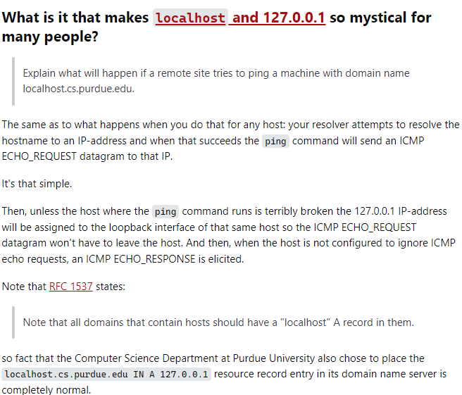

# Design goals
## Multi-tenant
To be usable by independent entities.
## Fault-tolerant
Because it's foundational to the internet.
## Scalable
Because the internet grows.
## Performant
Slow DNS leads to slow applications.
It was achieved by applying these design patterns.
# Design patterns
## Federation
To be multi-tenant.
## Replication
To be fault-tolerant.
## Distribution
To be scalable.
## Caching
To be performant.
DNS is a database(a good mental model).
# DNS is organized as a tree
## Every node in the tree is a label.
"en", "wikipedia" and "org"
## The root label is empty.
""
## Labels are separated by a dot.
"en.wikipedia.org"
## Ordered from most to least specific.
"en.wikipedia.org." instead of ".org.wikipedia.en"
## The last dot is usually omitted.
"en.wikipedia.org" instead of "en.wikipedia.org"
- DNS requires that children of a node (nodes that branch from the same node) have different labels, which guarantees the uniqueness of the domain names.

# Review Questions
## The computer science department at Purdue university chose to place the following type A resource record entry in its domain name server:
`localhost.cs.purdue.edu 127.0.0.1`
Explain what will happen if a remote sites tries to ping a machine with domain name `localhost.cs.purdue.edu`.
https://serverfault.com/questions/1146287/what-will-happen-if-a-server-decides-to-point-its-a-record-to-localhost

# Root zone
Who owns the root zone?
Since that'd give a single organization a lot of power.
Root zone is managed by ICANN.
Even though, it's managed by a single organization, its DNS servers are hosted by 12 different organizations.
The list of these organizations is published by IANA, a subsidiary of ICANN.
Why 13 DNS servers?
It's because adding a 14th server simply would not fit in a single DNS UDP packet.
The list of servers doesn't need to be discovered, because it's well known. i.e it's built into DNS resolvers and operating systems.
Root servers provide the IP addresses of TLD servers.

# Authoritative DNS servers
Every DNS servers must have at least 2 name servers that serves its DNS records.
There are 2-4 name servers per zone. These servers are called authoritative name servers because they're the authority on DNS records for the domain names in that zone.
Only these servers will be trusted to reply with the correct DNS records for that zone. Locations for these servers are announced through NS records.
These records are stored at the name server of the parent zone, so the zone that delegates to the child zone.
But they should also be stored at the name server of the child zone.
For eg: Name server of the UK zone should be stored both at the name server of the root zone and the name server of the UK zone.
This means the name server maintained by a website, example www.example.com will have its own name server.

# Zone Transfer
Whenever there is a change in the zone data on the primary DNS, then the changes have to be propagated to the secondary DNS of the zone. This is called Zone Transfer.
Since, a primary DNS server only has the master copy of the zone, and the secondary DNS will have a copy of the zone for redundancy.
TCP is used for zone transfer.
Zone transfers can be full or incremental.
- Full zone transfers are referred to as AXFR(asynchronous full transfer or authoritative full transfer)
- Incremental zone transfers are IXFR(incremental transfer)
AXFR offers no authentication, so any client can ask a DNS server for a copy of the entire zone.
