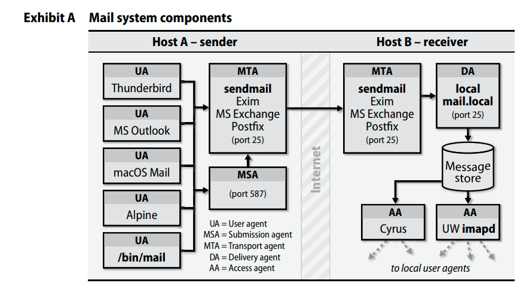
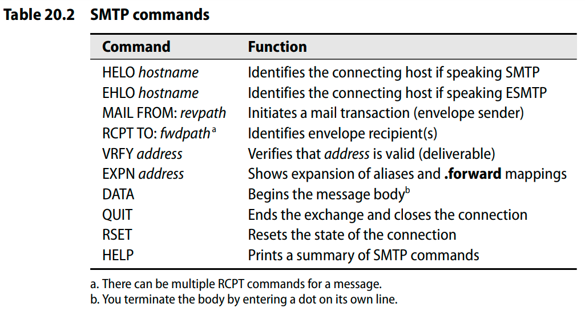

# Mail System Architecture

## User Agent
`/bin/mail` was the original user agent.
One of the elegant features is that user agent doesn't necessarily need to be running on the same system - or even the same platform - as the rest of your mail system. Users can reach their email from a Windows laptop or smartphone through access agent protocols such as IMAP and POP.
## Submission Agent
- MSA make it easy for mail hub servers to distinguish incoming from outbound email.
- Gives user agents a uniform and simple configuration for outbound mail.
- MSA often does minor header rewriting and cleanup on incoming messages.
- Typically, MSA is just really MTA listening on a different port with a different configuration applied.
## Transmission Agent
- SMTP
- Accept mail from a user agent or submission agent
- Understand the recipient's addresses
- Rewriting addresses to a form understood by the delivery agent
- Forwarding the message to the next responsible mail server or passing it to a local delivery agent to be saved to a user's mailbox
- sendmail, exim and postfix are MTAs

## Local Delivery Agents
- Email can be delivered to a person, to a mailing list, to a file, or even to a program. However, the last two types of recipients can weaken the security and safety of your system.
- procmail, maildrop
## Message Stores
- Stored in /var/mail/username
- But big companies are moving to other technologies for their message stores, usually databases.
## Access Agent
- IMAP4 and POP
- IMAPS and POP3S security better with ssl
- We love IMAP. (Read about advantages of IMAP and differences between IMAP and POP.)

# The SMTP protocol
works at different places 
- UA-MSA/MTA
- MSA-MTA
- MTA/MSA-antivirus scanning programs
- MTA-MTA
- MTA-DA

## A typical SMTP conversation to deliver an email message
- HELO
- EHLO
- MAIL FROM:
- RCPT TO:
- DATA
- QUIT