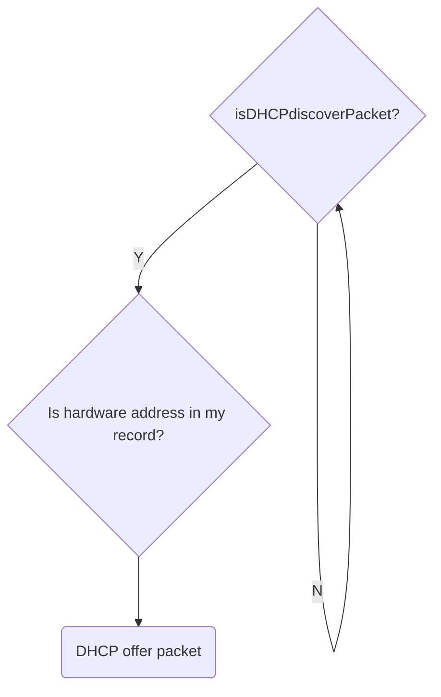

To view logs
```
journalctl -u NetworkManager
```
## Step 1 DHCP Discover
Client IP will be `0.0.0.0` because the client doesn't yet have an IP address.
Destination hardware address(ethernet address) is set to all `FFFFFFFFFFF`.
The destination IP address is set to `255.255.255.255` because it's a broadcast IP address.
The DHCP client puts its hardware address in the DHCP discover packet because that address distinguishes the client from any other host on the network.
**Ethernet,IP**
Source: HonHaiPrecis_34:ff:f9 (90:32:4b:34:ff:f9),0.0.0.0
Destination: Broadcast (ff:ff:ff:ff:ff:ff),255.255.255.255
## Step 2 DHCP Offer

Figure shows the flowchart for the server for this step.
Following things are included in DHCP offer packet:
- IP address(remember that although it's broadcast packet, the future IP address of client is also sent.)
- Subnet mask
- Length of lease
Source IP= IP of dhcp server
Destination IP=IP of relay/proxy
Proxy switches the packet to the client based on MAC address.
Reference: https://networkengineering.stackexchange.com/questions/11120/how-dhcp-offer-unicast-works
There can be more than 1 DHCP server because the network administrator might set up more than one DHCP server. Therefore, the DHCP client might receive more than one DHCP offer. If the DHCP client receives more than one offer, the client will take the first offer that is received.
> First Come, First Take

**Ethernet,IP**
Source: Sophos_05:91:96 (c8:4f:86:05:91:96),10.13.160.1
Destination:HonHaiPrecis_34:ff:f9 (90:32:4b:34:ff:f9),10.13.166.142
## Step 3 DHCP Request
Client broadcasts DHCP Request packet.
Source IP=0.0.0.0(client requesting the IP's IP)
Destination IP=255.255.255.255(broadcast IP)
### Why broadcast?
- Client still doesn't have an IP address to address the packet for direct delivery. Its IP address is 0.0.0.0 and destination address is 255.255.255.255
- All DHCP servers need to hear the request as there might be multiple DHCP servers.
In this packet, following things are listed:
- DHCP server's IP address so that other can cool down their IP address.
- Client's hardware address, so the mapping between hardware->ip address can be done. So the ethernet source address is client's hardware address.
- The ethernet destination address is FFFFFFFFF. It means all hosts will receive this notification.
## Step 4 DHCP Acknowledgement

# How is routing precedence is determined in DHCP Offer and Acknowledgement packet from server?
I'm learning about the DORA process in TCP IP. And the way server communicates with client is very "confusing" to me.

Let's take an example of DHCP Offer: At this point, the client is still not having its IP address. But in wireshark, the destination address is shown as the "client's to be ip address". How will a packet be routed to a non-existent IP address?

Likewise in case of acknowledgement packet, are we really routing by IP address? Because here also destination IP is the IP of client assigned by server which I believe the client hasn't really get it.

Is there a precedence of addressing that takes place, for example: if there is MAC address then route by MAC address or something like that.

If yes, Who defines the routing precedence?

Answer:

DHCP without relay isn't routed, so the DHCP client can always be addressed by its MAC address through switching (=L2 forwarding).

Relayed DHCP can be routed (=forwarded on L3) between the relay agent and the DHCP server via the agent's IP address.

**It's clear that I need to learn about lower layer protocols first before learning about DHCP to be clear.**

References:
https://docs.infoblox.com/space/BloxOneDDI/186810534/DHCP
https://community.ruckuswireless.com/t5/RUCKUS-Self-Help/Understanding-DHCP-DORA-process-from-Wireshark-packet-capture/m-p/71576
https://www.gns3network.com/what-is-dora-process-in-dhcp/
https://networkengineering.stackexchange.com/questions/51987/why-does-the-dhcp-protocol-need-a-client-id
https://networkengineering.stackexchange.com/questions/58778/how-does-a-dhcp-relay-router-forward-the-packet-to-the-server
https://networkinwireshark.wordpress.com/tag/dora/