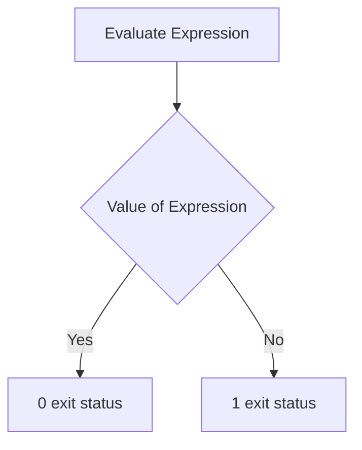
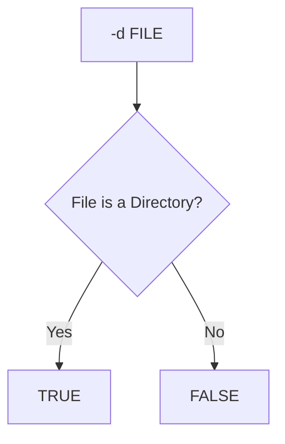
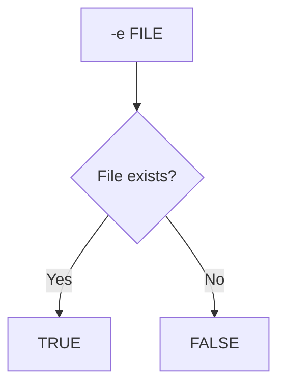
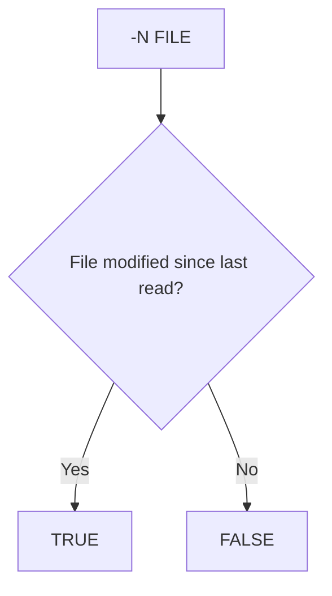
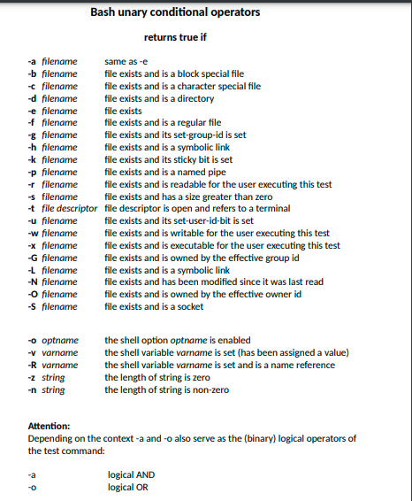

```
test expression
or
[ expression ]
```



- In the second form of the command, the [ ] (brackets) must be surrounded by blank spaces.
- You must test explicitly for file names in the C shell. File-name substitution (globbing) causes the shell script to exit.





For more information:
https://www.ibm.com/docs/en/aix/7.2?topic=t-test-command

