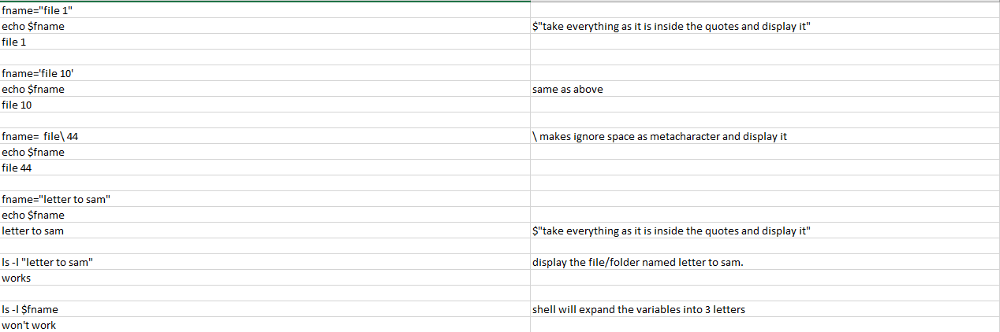
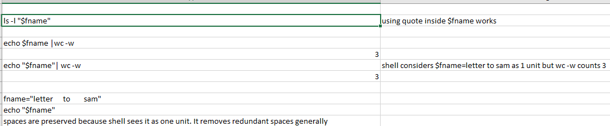

# ls

`ls -l dirname1 dirname2 filename1`

will show details inside each directory and filenames. Multiline output.

`ls -ld dirname1 dirname2 filename1`

will show output in 1 line for each directory and file.

`ls -d s*`

Lists every directory name starting with s.

`ls -ld *c*`

Lists all filenames that've c in it followed by any number of characters to the left and right.

`echo *`

Puts all file and directory name on the output.

`ls *` or `ls -d *` or `ls -ld *`

```cmd
inspiron@inspiron-virtual-machine:~$ ls
ata_file  Desktop  Documents  Downloads  Music  Pictures  Public  snap  Templates  Videos
inspiron@inspiron-virtual-machine:~$ ls *

shows everything inside directories and all the files.

ata_file

Desktop:

Documents:

Downloads:

Music:

Pictures:

Public:

snap:
firefox  snapd-desktop-integration

Templates:

Videos:


inspiron@inspiron-virtual-machine:~$ ls -d *
ata_file  Desktop  Documents  Downloads  Music  Pictures  Public  snap  Templates  Videos

Same as ls.

```

Does something.

`echo ~`

Shows `/home/user` directory.

`ls -ld ~`

Long Listing of home directories.

```cmd
-d, --directory
              list directories themselves, not their contents
```

If you use `ls -d *`, then you will see not just directories, but also files. If you use `ls -d */`, you will only see directories.

# tr, set, env, variables, PATH

```cmd
echo $BASH
/bin/bash
```

To see environment variables.

`env`

To see set variables

`set|less`

To set a variable

```cmd
num=34
echo $num
34
```

All variables are string in bash.

```cmd
num=hello
echo $num
hello
```

`num=`

Erases the value.

`var=`

Erases the value.

To do arithmetic in bash.

`echo $(( num+10 )) `

`10`

```cmd
num=672134
echo $(( num+10 ))
672144
```

`echo hello| tr el EL`

`hELLo`

`less .bashrc`

`tree directory_name`

`tree . | less`

# echo > >>, concatenate files, mkdir, rmdir, rm

```cmd
echo hello > greeting
echo hi > greeting
echo hello >> greeting
```
`>>` will append whereas `>` will overwrite.

To change the modification time of file, just do 

`touch filename`

To concatenate files and make them a single file

`cat filename1 filename2 filename3 > file3`

```cmd
mkdir 2/3
mkdir 3/4/5/6
```

if `3,4,5` all not exists, you'll get error.

So 

`mkdir -p 3/4/5/6`

`tree 3`

`rmdir 3`

It's not empty then it'll not be delivered.

`rmdir *`

Replaces * with all files and directory names in the present directory.
`rm -r test`
Recursively deletes the test directory.
# wc 
letters words and characters as output.
```cmd
wc -l
wc -w
wc -c
```

To find the total number of files in my home directory.
`find ~ | wc -l `

```cmd
ls
-a, --all
do not ignore entries starting with .
-A, --almost-all
do not list implied . and ..
```

# Metacharacters
`| & ; () <> space tab` 
## `&`
`cp -R original/dir backup/dir`
What if the original dir is too big. It could eat up the terminal for hours.
`cp -R original/dir backup/dir &`
It will print to screen even though it's executed in background.

To bring a job in foreground
`fg %1`
1 is the number associated with the job.
## (( ))
What goes inside (( ))is some sort of arithmetic operations.
```cmd
if o=$(ls -1 /tmp 2>&1); then echo "${o}" > ls.txt; else echo "${o}" > ls_error.txt; fi

o=$(ls -1 /tmp 2>&1)
[[ $? = 0 ]] && echo "$o" > ls.txt || echo "$o" > ls_error.txt
```
# Quoting
`$$` gives pid of the shell.

# Filenames with spaces
You always get 1 result per line in Linux.
`find ~ | grep " "`
Space is a metacharacter and separates words.



# Command Substitution
Capturing output of command and using that instead of just running the command.
`seq 1 2 10`
```cmd
1
3
5
7
9
```
Start from 1
End with 10
Increment 2
`seq 1 10`
```cmd
1
2
3
4
5
6
7
8
9
10
```
Increment defaults to 1.

```cmd
for i in 1 2 3;
do
  echo $(( i*17 ));
done

17
34
51
```

Now, use seq in place of writing 1,2,3 all.

```cmd
for i in $(seq 1 3);
do
	echo (( i*17 ));
done

17
34
51
```

```
date
Sun 12 May 2019 12:56:47 AM CST
```
We want to cut the 5th field

`date | cut -d' ' -f5`
We put `-d' '` because cut takes <kbd>TAB</kbd> as delimiter by default.
`f` means field 5th.

Note that <kbd>SPACE</kbd> is a metacharacter. If space not quoted, shell will remove redundant spaces. You can also use double quotes `""`. (Double quotes produce same results as single quotes because we don't have `$` and backslash `\` character here.)
You can also use `\ ` instead of either of above.

`date| cut -d\  -f5`
`01:00:42`

```cmd
while true;
do echo $(date| cut -d' ' -f5);
done
```
date and cut work fast so I get redundant information, and it puts strain on system too. So, the solution is to sleep for a while
```cmd
while true;
do echo $(date| cut -d' ' -f5);
sleep 1;
done
```
`sleep 1` means to sleep 1 second.
It makes output readable now.
`printf` does better job than `echo`.

```cmd
while true;
do echo -n -e $(date| cut -d' ' -f5)"\r";
sleep 1;
done
```
`\r` means carriage return. When done, carriage returns to the beginning of the line.
`-n` means don't output in new line.
`-e` means recognize this.

# Control Operators, Shell Expansions
```cmd
||
|
&
&&
;
()
<newline>
etc
```
All of the simple commands terminated by one of the shell's control operator.
`ls ~|wc -l`
Terminated by pipe as well as terminated by new line.

`echo {1..4}`
`1 2 3 4`
`echo {a..d}`
`a b c d`
`echo{6..D}`
`{6..D}`
Shell can't expand this so prints it to the screen.
```cmd
for i in {1..10};
do
  echo a$i
done

a1
a2
a3
a4
a5
a6
a7
a8
a9
a10
```

Now, what if you want to append at the end of digit.
```cmd
for i in {1..10};
do
	echo ${i}a;
done
```

# command chaining
```cmd
cmd1;cmd2
```
Run cmd1 then run cmd2, regardless of success or failure of cmd1.

```cmd
cmd1 && cmd1
```

Run cmd2 only if cmd1 succeeded.

```cmd
cmd1||cmd2
```
Run cmd2 only if cmd1 fails.

## Example usage:

`which apache2 || echo "Apache2 isn't installed"`

If first command succeeds, the second command doesn't run.

```cmd
cmd1 && cmd2 || cmd3
```
Run cmd2 if cmd1 is success else run cmd3.

```cmd
which docker && echo "docker is installed" || echo "docker is not installed"
```
