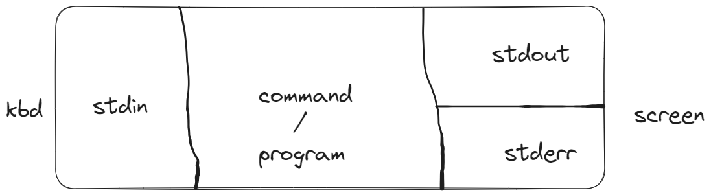

# Output Redirection Operators
`ls 1>demo.txt`

Stores only  success output to demo.txt

`ls 2> demo.txt `

Stores only error output to demo.txt.

```cmd
ls 1>success.txt 2>err.txt
abcd 1>success.txt 2>err.txt
```

If success, redirect output to `success.txt` else redirect output to `err.txt`. Both files will be created.

Redirect success and error to same file

```cmd
java -version 1>java_ver.txt 2>java_ver.txt
java -version 1>java_ver.txt 2>&1
java -version &> java_ver.txt
```
All are same commands. They all say, "please store my error also where my success is stored at".

# Precedence Operator ()
`$ Command1 && Command2 || Command3 && Command4`

If Command1 fails, Command2 will not get executed because of the AND relationship but the rest of the commands are exeuted due to the following OR operator.

```cmd
[root@my-server ~]# false && echo Command2 || echo Command3 && echo Command4
Command3
Command4
```

However, in the below example none of the commands will be ran if Command1 fails.
`$ Command1 && (Command2 || Command3) && Command4)`

```cmd
[root@my-server ~]# false && (echo Command2 || echo Command3) && echo Command4
[root@my-server ~]#
```

# Redirections
```cmd
cat > file1
hello---output goes to file
hekko---output goes to file
Ctrl+D---exits from cat.
```
File grows once I hit enter, it doesn't wait for <kbd>Ctrl</kbd>+<kbd>D</kbd> to be pressed.


## |& vs 2>&1
Both are same. Both redirect output(error free) and error to the same file.

`command1 |& command2` equal `command1 2>&1 | command2`

## time command output
real=wall clock time
sys=kernel time, the time that process took place in the kernel.
# Questions to Ponder
What's `-` operator (not the arithmetic subtraction operator) in bash?