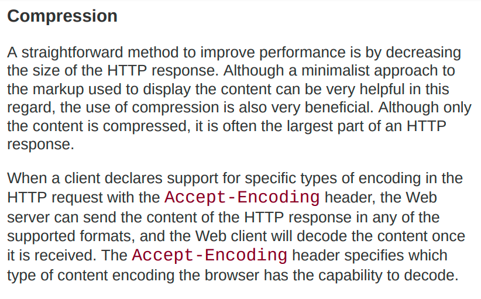
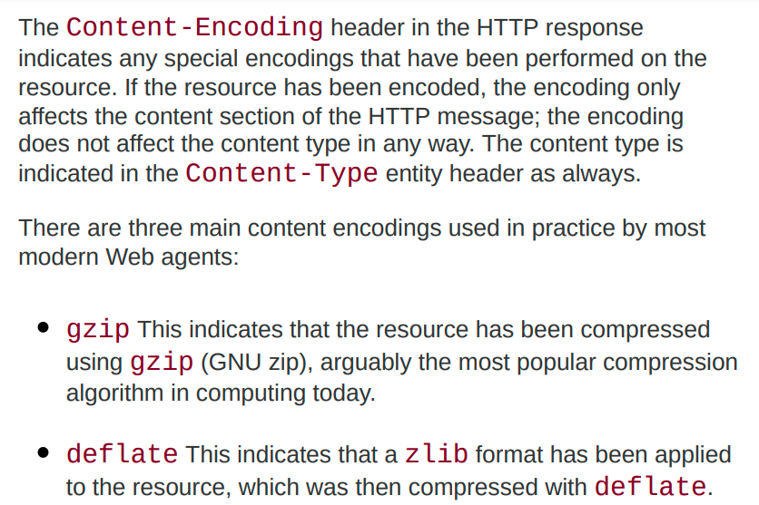
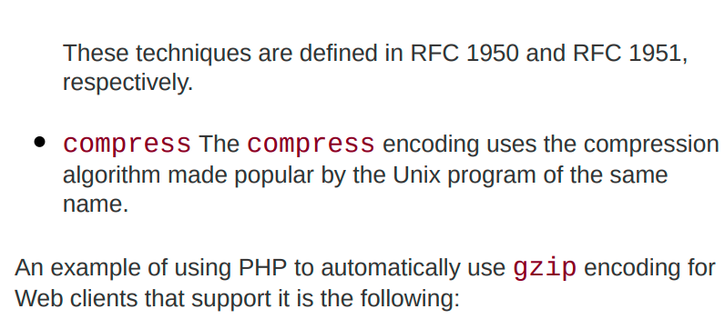
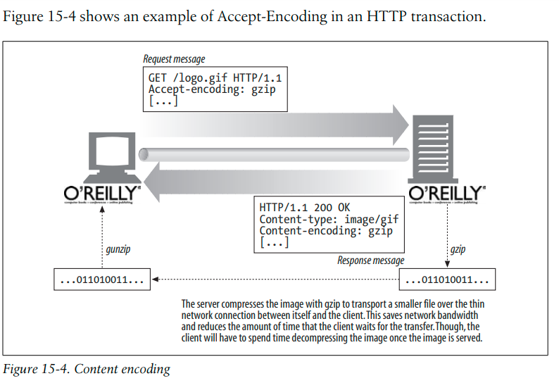
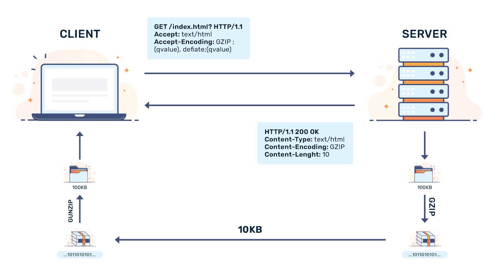

# Basics
Say you've a 3000B file. And say the MTU is 1500B

1) Without Compression

You'd require 3 TCP segments.

```cmd
+-+-+-+-+-+-+-+-+-+-+-+-+-+-+-+-+-+-+-+-+-+-+-+-+-+-+-+-+-+-+-+-+-+-+
|     Header_60B    |                  Payload_1440B                 |
+-+-+-+-+-+-+-+-+-+-+-+-+-+-+-+-+-+-+-+-+-+-+-+-+-+-+-+-+-+-+-+-+-+-+

+-+-+-+-+-+-+-+-+-+-+-+-+-+-+-+-+-+-+-+-+-+-+-+-+-+-+-+-+-+-+-+-+-+-+
|     Header_60B    |                  Payload_1440B                 |
+-+-+-+-+-+-+-+-+-+-+-+-+-+-+-+-+-+-+-+-+-+-+-+-+-+-+-+-+-+-+-+-+-+-+

+-+-+-+-+-+-+-+-+-+-+-+-+-+-+-+-+-+-+-+-+-+-+-+-+-+-+-+-+-+-+
|     Header_60B    |              Payload_120B              |
+-+-+-+-+-+-+-+-+-+-+-+-+-+-+-+-+-+-+-+-+-+-+-+-+-+-+-+-+-+-+
```
Imagine a site getting millions of requests in an instance. The benefit of saving even just 1 TCP segment is huge in this case. If you save 1 segment from each response from server, you save one million segments. You save the time and bandwidth required to deliver that segment.

2) With Compression
```cmd
+-+-+-+-+-+-+-+-+-+-+-+-+-+-+-+-+-+-+-+-+-+-+-+-+-+-+-+-+-+-+-+-+-+-+
|     Header_60B    |                  Payload_1440B                 |
+-+-+-+-+-+-+-+-+-+-+-+-+-+-+-+-+-+-+-+-+-+-+-+-+-+-+-+-+-+-+-+-+-+-+


+-+-+-+-+-+-+-+-+-+-+-+-+-+-+-+-+-+-+-+-+-+-+-+-+-+-+-+-+-+-+-+-+-+-+-+-+-+-+-+-+-+-+-+-+-+-+-+-+-+-+-+-+-+-+-+
|Header_60B|                                            Payload_560B                                           |
+-+-+-+-+-+-+-+-+-+-+-+-+-+-+-+-+-+-+-+-+-+-+-+-+-+-+-+-+-+-+-+-+-+-+-+-+-+-+-+-+-+-+-+-+-+-+-+-+-+-+-+-+-+-+-+
```
# Accept Content Encoding




This is how it works

Even after compressing, Content-Type won't change. This is important.

# Getting Started with Gzip for Nginx
`gzip on` means nginx server will support  gzip based compression utlitiy. 
Put all of these directives inside `http` context.
```cmd
gzip_types text/plain text/css text/xml text/javascript
```
This tells us what MIME types to compress. So, once the server sees the accept encoding header which is gzip from client side and if the get request has any of these particular type, then the server will actually compress the data and send.
We specify these because we don't want to compress data such as image file or video because there's not much scope for compression in these types of files. Compression can be mostly applied on text based data.

```cmd
gzip_disable "MSIE [1-6]\."
```
Since Internet Explorer 1-6 do not have gzip support, we want to disable gzip on these browser versions.

```cmd
curl ip/file > c1.txt
curl -H "Accept_encoding:gzip" ip/file > c2.txt
```
The difference between sizes of file will be seen.
