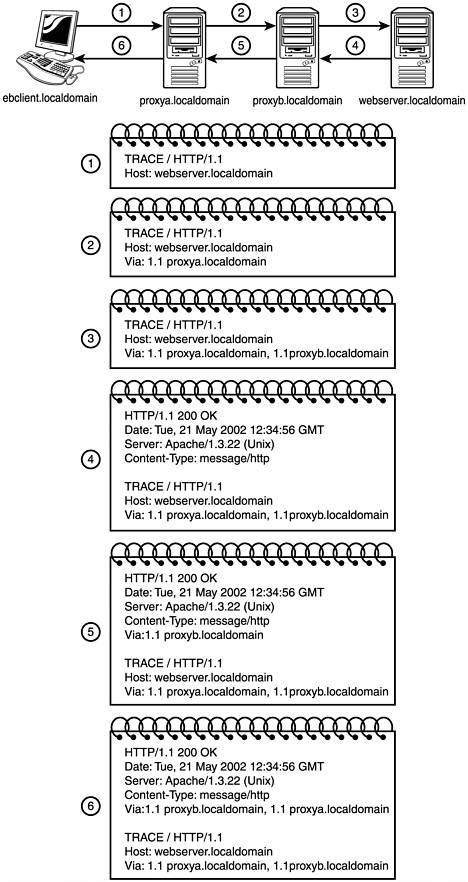

https://docs.google.com/document/d/1daWEkgwfxTAAEYw-42ZKAb6nV3CfLk66eoOS6ijzXgs/edit

# Infrastructure required
Centos 8 or Rocky Linux 8

Password based authentication is not recommended.

## Key based authentication
Two keys are generated.
Public key and private key.
If public key is stored in server and is used as authentication mechanism, only the corresponding private key can be used to successfully authenticate.

# Installing nginx
```cmd
yum install nginx
systemctl start nginx
systemctl enable nginx
nginx -V


yum -y install wget
wget https://nginx.org/packages/centos/8/x86_64/RPMS/nginx-1.20.1-1.el8.ngx.x86_64.rpm
yum install nginx-1.20.1-1.el8.ngx.x86_64.rpm
systemctl start nginx
systemctl enable nginx
nginx -V

```

# HTTP - GET
GET method is used to fetch the information which is specified in the request URI.

```cmd
Syntax: GET Request-URI

Example:

GET /admin HTTP/1.1
Host: dexter.kplabs.in
```
Besides GET you use the relative path of the resource you want to use from the Host website. You want to view dexter.kplabs.in/admin.

## Conditional GET Request
Conditional GET method is used to fetch the information with a condition.

```cmd
Example:
GET /sample.html HTTP/1.1
Host: dexter.kplabs.in
If-Modified-Since: Sat,29 Oct 2017 19:43:31 GMT
```

This means get dexter.kplabs.in/sample.html only if it was modified since Sat, 29 Oct 2017 19:43:31 GMT.

If it was not modified since that, it'd send a 304 page.

## Partial GET Request

Partial GET method is used to retrieve only specific content instead of everything.

```cmd
Example:

GET /movie.mp4 HTTP/1.1
Host: dexter.kplabs.in
Range: bytes=0-1024
```
Only give me partial file not the entire video. Used in youtube recorded videos.

## Handwriting GET

```cmd
telnet dexter.kplabs.in 80
Don't press the escape character. Type as it is here.
GET /sample.html HTTP/1.1
Host: dexter.kplabs.in
Press Enter Twice

Output is shown in screen.
HTTP/1.1 200 OK
Server: nginx/1.20.1
Date: Wed, 16 Aug 2023 14:02:05 GMT
Content-Type: text/html
Content-Length: 76
Last-Modified: Wed, 18 Oct 2017 05:19:43 GMT
Connection: keep-alive
ETag: "59e6e46f-4c"
Accept-Ranges: bytes

This is sample file.
Secially designed for your handwritten GET requests ;)
```
Remember, Web Browser=Telnet
Partial GET as the name implies is to retrieve only specific content instead of everything.
```cmd
curl dexter.kplabs.in/partial.txt
```
To print out only response headers use the option -I
```cmd
[root@localhost ~]# curl -I  dexter.kplabs.in/partial.txt
HTTP/1.1 200 OK
Server: nginx/1.20.1
Date: Wed, 16 Aug 2023 14:12:12 GMT
Content-Type: text/plain
Content-Length: 292
Last-Modified: Wed, 18 Oct 2017 05:58:53 GMT
Connection: keep-alive
ETag: "59e6ed9d-124"
Accept-Ranges: bytes
```
content length is in bytes.


```cmd
curl --header "Range: bytes=0-20" dexter.kplabs.in/partial.txt
```
This is how downloading websites limit free users from limiting them to resume the download.
Say you download upto 20 bytes, internet connection then disconnected. Now, you want to resume. But this time, the website will not send 20-last_byte in header. Instead, it'll again start from 0.

# Conditional GET continued
Conditional GET method is used to fetch the information  with a condition.


```cmd
Example:
 
GET /sample.html HTTP/1.1
Host: dexter.kplabs.in
If-Modified-Since: Sat, 18 Oct 2017 19:43:31 GMT
```
Get me this file only if it's modified since this specified time. Else, I don't need this file.


```cmd
[root@localhost ~]# curl -I  dexter.kplabs.in/sample.html
HTTP/1.1 200 OK
Server: nginx/1.20.1
Date: Thu, 17 Aug 2023 03:27:45 GMT
Content-Type: text/html
Content-Length: 76
Last-Modified: Wed, 18 Oct 2017 05:19:43 GMT
Connection: keep-alive
ETag: "59e6e46f-4c"
Accept-Ranges: bytes
```

Last-Modified is a response header which tells when was the last time the file was modified.


```cmd
curl dexter.kplabs.in/sample.html

curl --header "If-Modified-Since:Wed, 18 Oct 2017 05:19:43 GMT" dexter.kplabs.in/sample.html


```

Here we specified a header where we want to check if header if-modified-since is greater than 18 Oct 2017.

```cmd
curl -I --header "If-Modified-Since:Wed, 18 Oct 2017 05:19:43 GMT" dexter.kplabs.in/sample.html


HTTP/1.1 304 Not Modified
Server: nginx/1.20.1
Date: Thu, 17 Aug 2023 03:31:56 GMT
Last-Modified: Wed, 18 Oct 2017 05:19:43 GMT
Connection: keep-alive
ETag: "59e6e46f-4c"

```
Here we get 304 Not modified in header instead of not getting anything.

# HTTP POST method
Used to send some data to the server to be processed in some way.
```cmd
Example:

POST /login.php HTTP/1.1
Content-Type: application/x-www-form-urlencoded
Content-Length:32

user=admin password=test123
```
HTTP Post is very useful. When you type query in google search and click on search, POST request is sent to the google's server.

# HTTP HEAD
HEAD method is used to fetch only the HTTP Headers (not the content). So, it's similar to HTTP GET method except the server MUST NOT return the message-body in the response.

```cmd
Example:
curl -I dexter.kplabs.in
```

# HTTP TRACE
The TRACE method  is used to echo the contents of an HTTP Request back to the requestor which can be used for debugging purpose at the time of development.

The TRACE method is primarily used for debugging and testing purposes, and simply requests that the server echo back the request it received. This can be useful for identifying any changes to the request that is made by proxies(proxy manipulate the headers).

It is useful for proxy debugging purposes.
```cmd

curl -X  "TRACE" example.com


curl -X "TRACE" --proxy 127.0.0.1:8080 example.com

```


TRACE is another diagnostic request method. This method allows the client to gain more perspective into any intermediary proxies that lie between the client and the server. As each proxy forwards the TRACE request on route to the destination Web server, it will add itself to the Via header, with the first proxy being responsible for adding the Via header. When the response is given, the content is actually the final request including the Via header.


# HTTP OPTIONS Header
OPTION method is used to describe the communication option for the target resource.

```cmd
Syntax:
OPTIONS /index.html HTTP/1.1
Invocation:
curl -X OPTIONS http://example.org -i

HTTP/1.1 200 OK
Allow: OPTIONS, GET, HEAD, POST
Cache-Control: max-age=604800
Content-Type: text/html; charset=UTF-8
Date: Thu, 17 Aug 2023 11:18:11 GMT
Expires: Thu, 24 Aug 2023 11:18:11 GMT
Server: EOS (vny/0452)
Content-Length: 0
```
NGINX doesn't allow OPTIONS header at all.
```cmd
[root@localhost ~]# curl -X "OPTIONS" http://dexter.kplabs.in -i
HTTP/1.1 405 Not Allowed
Server: nginx/1.20.1
Date: Thu, 17 Aug 2023 11:19:37 GMT
Content-Type: text/html
Content-Length: 157
Connection: keep-alive

<html>
<head><title>405 Not Allowed</title></head>
<body>
<center><h1>405 Not Allowed</h1></center>
<hr><center>nginx/1.20.1</center>
</body>
</html>

```

# HTTP Request Methods
Sending resource to the server.
Summarize all of the above requests methods.

# HTTP Response Status Code
Sending resource to the server
There are various Response Status Codes available
- 100-199- Informational Status Codes
- 200-299- Success Status Codes
- 300-399- Redirection Status Codes
- 400-499- Client Error Status Codes
- 500-599- Server Error Status Codes

### 200 status code
200 status code indicates that the action received by the client is:
- Received, Understood, Accepted & Processed
Example: 200 OK
206 Partial Content

### 300 status code
300 series status code indicates that the client must take additional steps to complete the requests.

300 series status code are generally used in URL redirection.

Example: 301 Moved Permanently
304 Not Modified

### 400 status code
400 series status code indicates that the client seem to have sent some request which is not an ideal one or error some.
Example:  Unauthorized
403 Forbidden
404 Page Not Found

### 500 status code
500 series status code indicates that the issue is there on the server side and it has failed to fulfill the request.
Example: 500 Internal Server Error
504 Gateway Timeout
503 Service Unavailable
