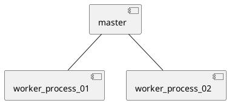
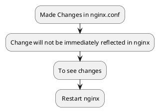
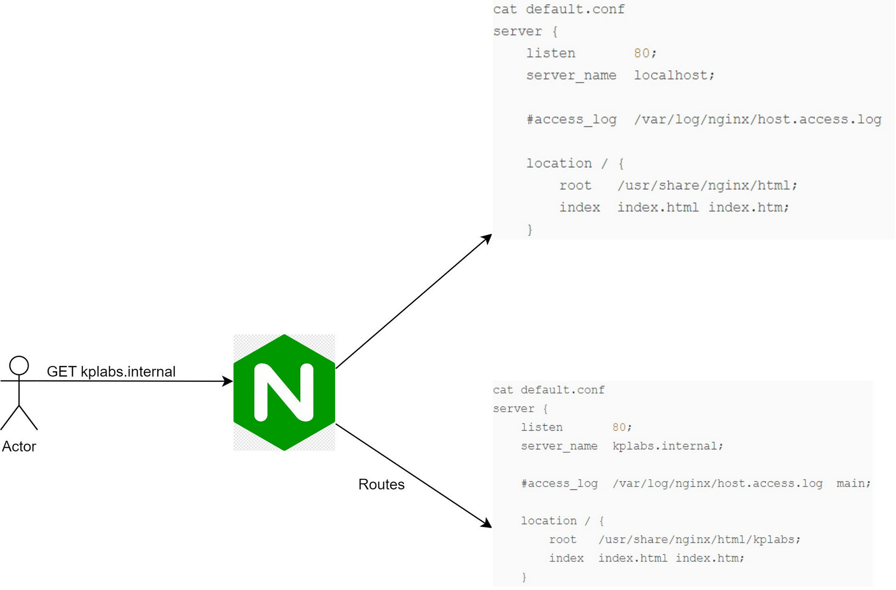

# Understanding NGINX Architecture
The nginx configuration file in Red Hat distributions lies in /etc/nginx directory.
It is usually named as nginx.conf.
It looks like this in centos 7 and RL8.
```cmd
# For more information on configuration, see:
#   * Official English Documentation: http://nginx.org/en/docs/
#   * Official Russian Documentation: http://nginx.org/ru/docs/

user nginx;
worker_processes auto;
error_log /var/log/nginx/error.log;
pid /run/nginx.pid;

# Load dynamic modules. See /usr/share/doc/nginx/README.dynamic.
include /usr/share/nginx/modules/*.conf;

events {
    worker_connections 1024;
}

http {
    log_format  main  '$remote_addr - $remote_user [$time_local] "$request" '
                      '$status $body_bytes_sent "$http_referer" '
                      '"$http_user_agent" "$http_x_forwarded_for"';

    access_log  /var/log/nginx/access.log  main;

    sendfile            on;
    tcp_nopush          on;
    tcp_nodelay         on;
    keepalive_timeout   65;
    types_hash_max_size 4096;

    include             /etc/nginx/mime.types;
    default_type        application/octet-stream;

    # Load modular configuration files from the /etc/nginx/conf.d directory.
    # See http://nginx.org/en/docs/ngx_core_module.html#include
    # for more information.
    include /etc/nginx/conf.d/*.conf;

    server {
        listen       80;
        listen       [::]:80;
        server_name  _;
        root         /usr/share/nginx/html;

        # Load configuration files for the default server block.
        include /etc/nginx/default.d/*.conf;

        error_page 404 /404.html;
        location = /404.html {

       error_page 500 502 503 504 /50x.html;
        location = /50x.html {
        }
    }

# Settings for a TLS enabled server.
#
#    server {
#        listen       443 ssl http2;
#        listen       [::]:443 ssl http2;
#        server_name  _;
#        root         /usr/share/nginx/html;
#
#        ssl_certificate "/etc/pki/nginx/server.crt";
#        ssl_certificate_key "/etc/pki/nginx/private/server.key";
#        ssl_session_cache shared:SSL:1m;
#        ssl_session_timeout  10m;
#        ssl_ciphers HIGH:!aNULL:!MD5;
#        ssl_prefer_server_ciphers on;
#
#        # Load configuration files for the default server block.
#        include /etc/nginx/default.d/*.conf;
#
#        error_page 404 /404.html;
#            location = /40x.html {
#        }
#
#        error_page 500 502 503 504 /50x.html;
#            location = /50x.html {
#        }
#    }

}

```

```cmd
ps -ef --forest | grep nginx


root       1779   1559  0 10:01 pts/0    00:00:00  |       \_ grep --color=auto nginx
root       1702      1  0 09:56 ?        00:00:00 nginx: master process /usr/sbin/nginx
nginx      1703   1702  0 09:56 ?        00:00:00  \_ nginx: worker process

There will be 1 master and 1 worker processes

```


Why Master?
The purpose of master process is to read and evaluate configuration files.
Another purpose is to maintain the worker process.

Why workers?
The worker processes do the actual processing of requests.

Master process runs with user root.
Worker processes run with user as defined in nginx.conf file.


Currently, we've one master and one worker process. Thanks to
`worker_processes auto`
Change `auto` to `2` if you want 2 worker processes.
Setting it to the nuber  of available CPU cores would be a good start (the value "auto" will try to autodetect it.)
Restart nginx and check the number of processes by:

`ps -ef --forest | grep nginx`

error log is stored here.
`error_log /var/log/nginx/error.log;`

The pid is of master is located at /run/nginx.pid
```cmd
[root@localhost nginx]# cat /run/nginx.pid
1702
```


# Configuration Contexts
 Within curly braces, they're called options.
 Primary container is called context.
Each options are like set of directives to control specific aspect of Nginx.
Various contexts in Nginx are
- main
- events
- http
- mail
## Main Context
Any directives that exist entirely outside of context blocks(something not inside curly brackets) is said to inhabit the "main" context.
```cmd
user nginx;
worker_processes auto;
error_log /var/log/nginx/error.log;
pid /run/nginx.pid;
```
These 4 lines are main context.
Main context is used to configure details that affect the entire application on a basic level.

## Event Context
It defines how Nginx handles connections at a general level.

worker_connections sets the maximum number of simultaneous connections that can be opened by a worker process.

```cmd
events {
    worker_connections 1024;
}
```

## HTTP Context
As a Nginx administrator in production environments, you'll use this a lot and configure this a lot.

This context tells how to handle HTTP or HTTPs connctions and associated parameters.

This, we'll look this in detail.

```cmd
http {
    log_format  main  '$remote_addr - $remote_user [$time_local] "$request" '
                      '$status $body_bytes_sent "$http_referer" '
                      '"$http_user_agent" "$http_x_forwarded_for"';

    access_log  /var/log/nginx/access.log  main;

    sendfile            on;
    tcp_nopush          on;
    tcp_nodelay         on;
    keepalive_timeout   65;
    types_hash_max_size 4096;

    include             /etc/nginx/mime.types;
    default_type        application/octet-stream;

    # Load modular configuration files from the /etc/nginx/conf.d directory.
    # See http://nginx.org/en/docs/ngx_core_module.html#include
    # for more information.
    include /etc/nginx/conf.d/*.conf;

    server {
        listen       80;
        listen       [::]:80;
        server_name  _;
        root         /usr/share/nginx/html;

        # Load configuration files for the default server block.
        include /etc/nginx/default.d/*.conf;

        error_page 404 /404.html;
        location = /404.html {
        }

        error_page 500 502 503 504 /50x.html;
        location = /50x.html {
        }
    }

```

`access.log` looks like this.
```cmd
192.168.46.1 - - [17/Aug/2023:11:14:18 -0400] "GET / HTTP/1.1" 304 0 "-" "Mozilla/5.0 (Windows NT 10.0; Win64; x64) AppleWebKit/537.36 (KHTML, like Gecko) Chrome/116.0.0.0 Safari/537.36" "-"
```
Compare this with this.
```cmd
log_format  main  '$remote_addr - $remote_user [$time_local] "$request" '
                      '$status $body_bytes_sent "$http_referer" '
                      '"$http_user_agent" "$http_x_forwarded_for"';
```
Both are same.
# Nginx Command Line Options

<table border="1px solid">
  <tr>
    <td>Options</td>
    <td>Description</td>
  </tr>
  <tr>
    <td>-v</td>
    <td>Print Version</td>
  </tr>
  <tr>
    <td>-V</td>
    <td>Print NGINX version, compiler version and configure parameters</td>
  </tr>
  <tr>
    <td>-t</td>
    <td>Don't run, just test the configuration file</td>
  </tr>
  <tr>
    <td>-c</td>
    <td>Specify which configuration file NGINX should use instead of the default</td>
  </tr>
  </table>


-V tells in more detail. It shows the configuration arguments with which nginx was configured with.

Whenever you modify nginx configuration file, test if it's successful (`-t`), then only restart nginx or reload nginx.

# Include Directive
We are talking about this line.
`include /etc/nginx/conf.d/*.conf;`

`nginx.conf` is in `/etc/nginx/nginx.conf`

`default.conf` is in `/etc/nginx/conf.d/default.conf`

I'm using Rocky Linux  8,9 and Centos 7, so the configuration files might differ. Rocky Linux 8 is preferred. The configuration file `default.conf` looks  like this in Rocky Linux 9 boot, Rocky Linux 8 minimal.

```cmd
server {
    listen       80;
    server_name  localhost;

    #access_log  /var/log/nginx/host.access.log  main;

    location / {
        root   /usr/share/nginx/html;
        index  index.html index.htm;
    }

    #error_page  404              /404.html;

    # redirect server error pages to the static page /50x.html
    #
    error_page   500 502 503 504  /50x.html;
    location = /50x.html {
        root   /usr/share/nginx/html;
    }

    # proxy the PHP scripts to Apache listening on 127.0.0.1:80
    #
    #location ~ \.php$ {
    #    proxy_pass   http://127.0.0.1;
    #}

    # pass the PHP scripts to FastCGI server listening on 127.0.0.1:9000
    #
    #location ~ \.php$ {
    #    root           html;
    #    fastcgi_pass   127.0.0.1:9000;
    #    fastcgi_index  index.php;
    #    fastcgi_param  SCRIPT_FILENAME  /scripts$fastcgi_script_name;
    #    include        fastcgi_params;
    #}

    # deny access to .htaccess files, if Apache's document root
    # concurs with nginx's one
    #
    #location ~ /\.ht {
    #    deny  all;
    #}
}
```


`nginx -T` to see more details of configuration files.


# Server Blocks

`listen 80` means that the server is listening at port 80.
`location` means from which location the file should load while browsing via the website.
To check the running processes and their ports.
`netstat -tnlp`
The port where web server runs is the port of master process.


To see its output in full, you might need to be root user.
Currently port 80 is listening.
Change the port to 65535.
(Make sure the selinux is disabled and firewall is disabled lol. Not recommended in production though.)

The server will open at port 65535.

To do hard refresh do <kbd>Ctrl</kbd>+<kbd>F5</kbd>  To do soft refresh do <kbd>Ctrl</kbd>+<kbd>R</kbd>. Used to test if there is cache or not.

```cmd
 location / {
        root   /usr/share/nginx/html;
        index  index.html index.htm;
    }
```

This is the location of root of our server i.e `x.x.x.x:port/` things that will be displayed here. From root the files will be loaded.
To change what will be displayed here.
Create a new file named `default.html` in `/usr/share/nginx/html` directory.

```cmd
default.html
This is a default html file.
```

Go to `/etc/nginx/conf.d/default.conf`
Edit the name of `index` from `index.html` to `default.html`

# Configuring Multiple Websites on Nginx
```cmd
cat default.conf
server {
    listen       65535;
    server_name  localhost;

    #access_log  /var/log/nginx/host.access.log  main;

    location / {
        root   /usr/share/nginx/html;
        index  index.html index.htm;
    }
	}
```
This is good for 1 website  on 1 server  only. If there are multiple websites on 1 server, we need separate server blocks.



Copy `default.conf` to `kplabs.conf`
`cp default.conf kplabs.conf`
in `/etc/nginx/conf.d`

```cmd
kplabs.conf

server {
    listen       65535;
    server_name  kplabs.internal;

    #access_log  /var/log/nginx/host.access.log  main;

    location / {
        root   /usr/share/nginx/html/kplabs;
        index  index.html index.htm;
    }
	}
```
Come to `/usr/share/nginx/html` and create a  new folder  `kplabs` with a file called `index.html`.
`/usr/share/nginx/html/kplabs/index.html`
`kplabs.internal` is not a public domain. So, we need to add a DNS entry in `/etc/hosts`.

Restart the nginx server after changing the settings to see the effect.
* * * 
### Possible confusion
I've 2 websites running on same server.

Their conf files go as follows. I'm on Rocky Linux 8.4.

```
cat /etc/nginx/conf.d/default.conf
server {
    listen       65535;
    server_name  localhost;

    #access_log  /var/log/nginx/host.access.log  main;

    location / {
        root   /usr/share/nginx/html;
        index  index.html index.htm;
    }
	}
```


```
cat  /etc/nginx/conf.d/kplabs.conf

server {
    listen       65535;
    server_name  kplabs.internal;

    #access_log  /var/log/nginx/host.access.log  main;

    location / {
        root   /usr/share/nginx/html/kplabs;
        index  index.html index.htm;
    }
	}
```

`index.html` for default.conf contains the default nginx starter page.

`index.html` for kplabs.internal contains "This is kplabs website".

When I type `curl kplabs.internal:65535`, it should give me "This is kplabs website".

Thus I went to `/etc/hosts` and mapped

`127.0.0.1 kplabs.internal`

I'm getting  403 Forbidden message.

```cmd
[root@localhost ~]# curl kplabs.internal:65535
<html>
<head><title>403 Forbidden</title></head>
<body>
<center><h1>403 Forbidden</h1></center>
<hr><center>nginx/1.20.1</center>
</body>
</html>

```
Why  am I getting this? And how do I resolve this issue?

Fixed by restarting nginx.
* * *
## To change the access_log location
Go to `/etc/nginx/conf.d/kplabs.conf` and change
`access_log /var/log/kplabs.access.log`
Then check `/var/log/kplabs.access.log` once you do
`curl kplabs.internal:65535`.
