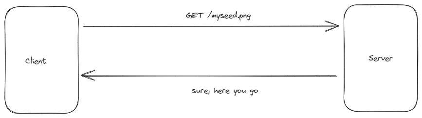
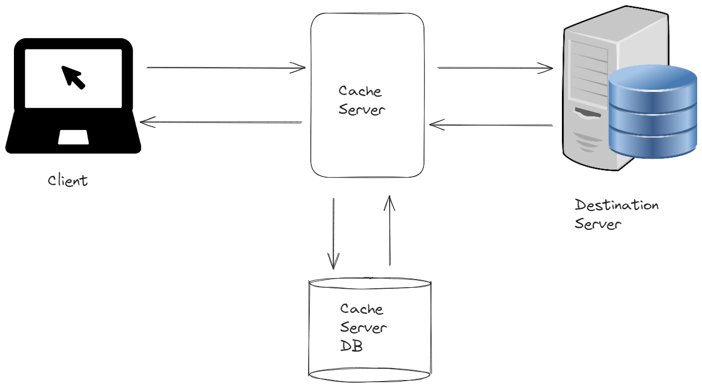
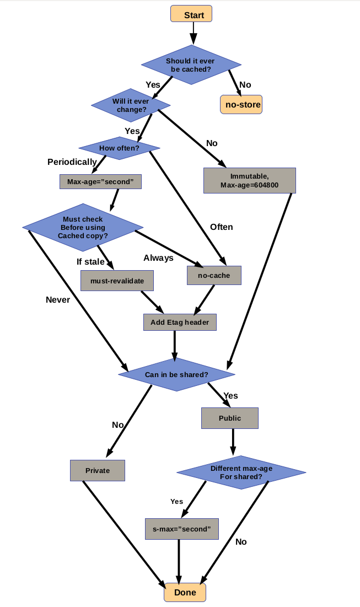
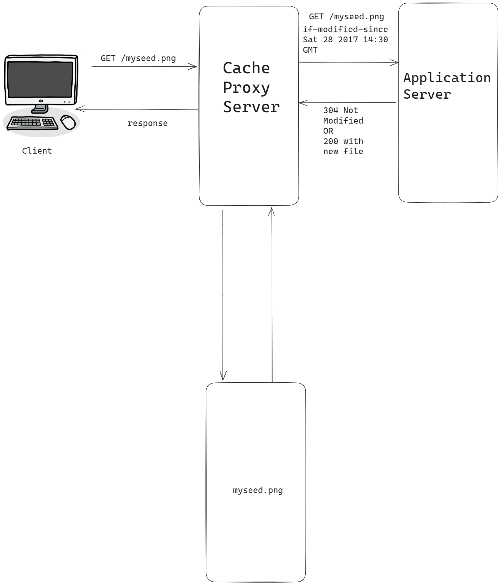
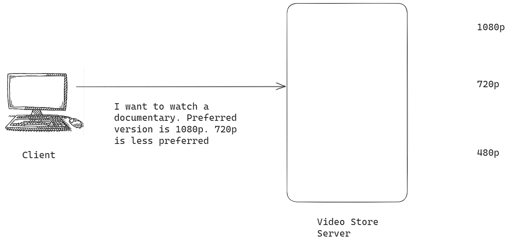

# Introduction to HTTP Caching

Imagine a scenario where a client wants to view `myseed.png` 10 times over a span of 2 days. If there was no concept of caching, you'd be sending each request to the server which would hog the server.
## Advantages of Caching
- It reduces overhead of server's resources.
- It decreases network bandwidth.
- Pages are loaded much more faster.
## How caching works?


1) Client's request goes to cache server.
2) If the cache is stored and isn't stale, it gets sent to client.
3) Else the destination server is called by cache server.
4) It stores the data sent by destination server into Cache Server DB so that when a next request arrives, it can deliver it.
5) It sends the response to the client.
Cache server could be software or hardware. They're software in our browsers like firefox, chrome etc.
# Understanding the HTTP Cache Control Headers 
 Stale cache issue would arise, thus we have cache control headers.
 You don't want anything to be cached in banking, forex application. How to tell the cache server to not cache? "Cache Control Headers".
 
 ## Cache Control Headers
 Various caching policies determined by this header.
 Policies like
 - Do not store any kind of cache at all.
 - Store the cache, but verify with webserver whether  file is modified.
 - Store the cache for 24 hrs.
## Various cache-control  header directives
```cmd
cache-control:no-store
cache-control:no-cache
cache-control:no-store, no-cache, must-revalidate
cache-control:public
cache-control:private
```
key=URL

# no-store

Get 2 images.

Put them into `/usr/share/nginx/html/img`

```cmd
# curl -I 192.168.1.76:80/img/pic1.jpg
HTTP/1.1 200 OK
Server: nginx/1.20.1
Date: Fri, 01 Sep 2023 09:32:26 GMT
Content-Type: image/jpeg
Content-Length: 164619
Last-Modified: Fri, 01 Sep 2023 09:30:40 GMT
Connection: keep-alive
ETag: "64f1af40-2830b"
Accept-Ranges: bytes
```


```cmd
# curl -I 192.168.1.76:80/img/pic2.jpg
HTTP/1.1 200 OK
Server: nginx/1.20.1
Date: Fri, 01 Sep 2023 09:35:04 GMT
Content-Type: image/jpeg
Content-Length: 12873899
Last-Modified: Fri, 01 Sep 2023 09:30:40 GMT
Connection: keep-alive
ETag: "64f1af40-c470ab"
Accept-Ranges: bytes
```

There is no cache-control headers here.
Once I add this configuration to 
`/etc/nginx/conf.d/kplabs.conf`.
```cmd
server{
        listen 80;
        server_name mywebsitename;

        location /{
                root /usr/share/nginx/html/;
                index index.html index.htm;
                }

        location ~ \.(jpg){
                root /usr/share/nginx/html/;
                add_header cache-control no-store;
                }
       }
```
Afterwards, you'd see this.
```cmd
# curl -I 192.168.1.76:80/img/pic2.jpg
HTTP/1.1 200 OK
Server: nginx/1.20.1
Date: Fri, 01 Sep 2023 10:01:36 GMT
Content-Type: image/jpeg
Content-Length: 12873899
Last-Modified: Fri, 01 Sep 2023 09:30:40 GMT
Connection: keep-alive
ETag: "64f1af40-c470ab"
cache-control: no-store
Accept-Ranges: bytes
```
cache-control is present now.

# if-modified-since

# Cache Control Headers Revisited


- Cache-Control: no-store
- Cache-Control: no-cache
- Cache-Control: max-age=0
- Cache-Control: s-maxage=0
- Cache-Control: must-revalidate
- Pragma: no-cache

## Date and Expires Header
Date: Wed 14 Apr 2015 20:00:00 GMT
Expires: Thu 15 Apr 2015 20:00:00 GMT

How much time it should store a document before revalidating it with origin server? 

Browsers can store cached response in memory or disk. In `Expires` header, there was no way of specifying if a response should be stored in explicitly in intermediary node, or in the caching node. However, with cache-control header, a origin server can explicitly specify whether a response stored in intermediary node or client side proxy server.

### no-store
don't store this particular response anywhere i.e neither in intermediary proxy nor browser cache.

### no-cache
you can store the cache either at the intermediary or browser side. However, before sending the response,  if the cache is stored in the intermediary proxy then if a client sends a request, before cache can send the response back, it should revalidate with the origin server. **If the response is the fresh one.**

### max-age=0
corresponds to max age in secs for which a document should be considered valid.

### s-maxage=0
is explicitly for the intermediary proxy node. This is not for client side caching.

### mus-revalidate
somewhat similar to no-cache. It means that a cache must revalidate the document after it is expired with the origin server.


### pragma:no-cache
Used for backward compatibility. Similar to cache-control. However pragma no-cache is specified for the http 1.0 based applications or .

nginx has expires as well as cache-control because there can be some applications still operating http 1.0. Thus required for backward compatibility. However, modern browsers will read only cache control header even if both of them have been specified.

# Content Negotiation

When client request comes how will video server determines what's the quality of the video to output to the client?

1) Based on user-agent
It is assumed that mobile clients have a slower internet connection than a laptop/typical broadband. So, whenever video streaming server gets a request with user agent based on mobile, they try to serve the lowest quality.
If user agent is based on  desktop browser, then the video streaming server can actually send higher quality video.

2) Relative Quality Factor
Client can specify that he wants to preferably 1080p and 720p is less preferred.


#### Q-parameter scale

```cmd
Accept-language:
de,
en-gb;q=0.8
en;q=0.7
```
Means de is most preferred language. (When no q-factor is given, it's 1 aka most preferred). Then, british english is preferred with q-factor of 0.8. Finally, english is preferred with q-factor of 0.7.

# Cache-Control: no-cache must-revalidate
## no-cache
Despite the name, "no-cache" doesn't mean to not store cache. It just means you're free to store the file in your cache but whenever you server it to the client, just revalidate with the origin server, whether the file is fresh or not.

### What if the origin-server goes down?
Cache will send header called age with warning that the document is stale document. Stale means older version of document which cache isn't aware if it's the latest version or not.

### But, many times there comes requirements that you should not serve stale document at any cost. Example in banking applications.

So, during that time, there is a header called a must-revalidate which comes into picture.

```cmd
server {
    server_name mywebsitename;
    location /{
        root /usr/share/nginx/html;
        index index.html index.htm;
    }
    
    location ~ \.(html){
        root /usr/share/nginx/html;
        add_header Cache-Control no-cache;
        # add_header Cache-Control must-revalidate;
    }
}
```

Add an `index.html` file in root location.
```cmd
# curl -I 192.168.169.206:80/index.html
HTTP/1.1 200 OK
Server: nginx/1.20.1
Date: Sat, 02 Sep 2023 11:45:15 GMT
Content-Type: text/html
Content-Length: 23
Last-Modified: Sat, 02 Sep 2023 11:44:50 GMT
Connection: keep-alive
ETag: "64f32032-17"
Cache-Control: no-cache
Accept-Ranges: bytes
```
## must-revalidate
Cache in no circumstances should send a stale document. It should revalidate every time for a document freshness. So, if a origin server is down due to some reason, then it should throw an error back and it should not server a stale response.
### How to use public and private directive in conjunction with other headers?
```cmd
add_header Cache-Control private max-age=200;
add_header Cache-Control public s-maxage=500;
add_header Cache-Control no-cache must-revalidate;
```
The first one means cache-control should be private followed by max-age of 200 seconds. i.e for private cache (which probably indicates browser related cache), max age should be 200 seconds.

The second one means  that for public cache, the s-maxage should be 500 seconds.

The third one means that we are free to store cache but must revalidate every time a request is received. So, if a server is down, you should not send stale responses.

### If we don't include must-revalidate header, lots of cache servers will server stale responses if origin server is down. So, remember to use it.

# maxage and s-maxage
## Public and Private Cache
Within an organization, there can be an intermediary cache server. And that does caching of 200 users within an organization. So essentially this cache server is being used by multiple users, so this can be considered as public cache.

However, we know that even browser has its own cache memory. And that cache is private to a particular user. So, it's called private cache.

## Cache-Control: max-age=120, Cache-Control: s-maxage=200
At first, Web Server is saying to cache proxy (both public and private) to consider this document as fresh for 120 seconds. After 120 seconds, the document won't be considered fresh and it'll ask the server to revalidate it.

At second, s-maxage means it's specially for intermediary cache servers. 

Let's assume for a particular file, there're 2 headers which are sent, which is max-age=120 and s-maxage=200.

So, it'll mean that the public cache server should store this file for 200 seconds before it gets stale.

However, for private cache, the file should be considered as fresh only for 120 seconds.
```cmd
add_header Cache-Control maxage=120;
add_header Cache-Control s-maxage=200;
```
Browser stores for 120 seconds and public server stores for 200 seconds.

s-maxage allows lots of flexibility if public or private cache.
# expires
Adding expires header automatically adds `Cache-Control max-age` header.

```cmd
server {
    server_name mywebsitename;
    location /{
        root /usr/share/nginx/html;
        index index.html index.htm;
    }
    
    location ~ \.(html){
        root /usr/share/nginx/html;
        add_header Cache-Control no-cache;
        # add_header Cache-Control must-revalidate;
		expires 1h;
    }
}
```

# keepalive-timeout
The amount of time to keep the connection alive before closing it. 
Keep it lower is recommended, not sure why, sounds uninituitive.

# Expires and Date Header
`age=Expires-Date`
Date header sent with all the responses. Expires header is configurable.