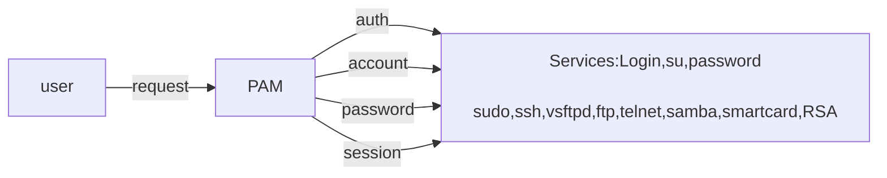

# Importance of PAM
## General authentication scenario
- User tries to login to linux server.
- Linux server checks if the user exists on /etc/passwd file.
- Then linus server checks if the user's password matches with the one in /etc/shadow file.
This is simply but clumsy.
## Problem with GAS
Each application requiring user authentication has to know how to get proper information when dealing with different authentication schemes.
If you want to change authentication scheme, then the entire application must be recompiled.
Whenever new or updated authentication released, all services( login, ftp, ssh etc) had to be recompiled.

# /etc/pam.d/login

## First Column
Linux-PAM separates the tasks of authentication into four independent management groups.
- Authentication: 
	- verify the user's identity, for example by requesting and checking a password or other secret.
- Account:
	- check that the specified account is a valid. This may include conditions like account expiration, time of day, and that user has access to the requested service. Example: User Account=Enabled, Not locked, Not expired, Allowed to login at this time, has service access.
- Password:
	- are responsible for updating passwords, and work together with authentication step. They may also be used to enforce strong passwords. Example: Password Update=Only when password is changed, enforces password policies like pw length, retires etc.
- Session:
	- manages actions performed at the beginning of a session and end of a session. Example: Establish session, making sure home directory is created if needed, setting up user environment etc.

References:
https://jojozhuang.github.io/tutorial/mermaid-cheat-sheet/