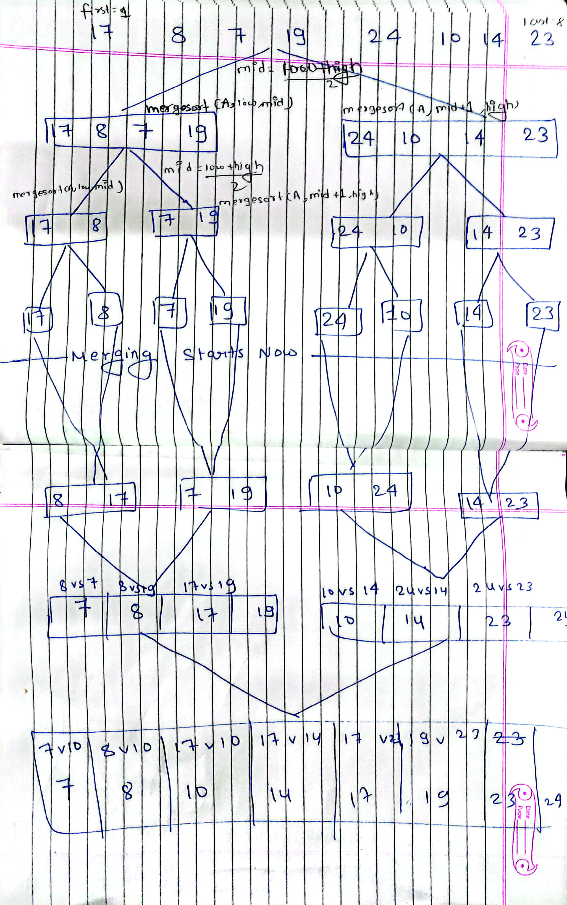
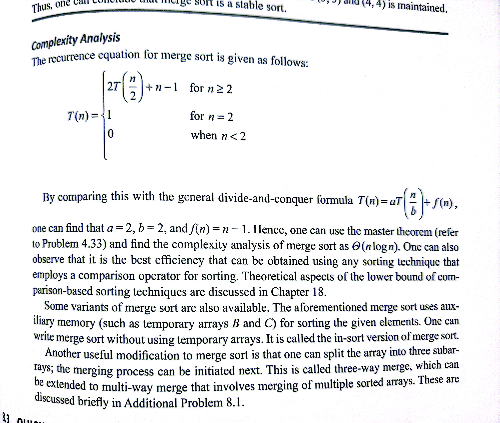

# Merge Sort
```
let A = [17, 8, 7, 19, 24, 10, 14, 23];
let temp = [];

function merge(A, low, mid, high) {
  let i = low;
  let j = mid + 1;
  let index = low;

  while (i <= mid && j <= high) {
    if (A[i] < A[j]) {
      temp[index] = A[i];
      i++;
    } else {
      temp[index] = A[j];
      j++;
    }
    index++;
  }

  // Copy the remaining elements from the first half, if any
  while (i <= mid) {
    temp[index] = A[i];
    i++;
    index++;
  }

  // Copy the remaining elements from the second half, if any
  while (j <= high) {
    temp[index] = A[j];
    j++;
    index++;
  }

  // Copy the sorted elements back to the original array
  for (let k = low; k <= high; k++) {
    A[k] = temp[k];
  }
}

function mergesort(A, low, high) {
  if (low < high) {
    let mid = Math.floor((low + high) / 2);
    mergesort(A, low, mid);
    mergesort(A, mid + 1, high);
    merge(A, low, mid, high);
  }
}

mergesort(A, 0, A.length - 1);

console.log(A);
```

## Time Complexity

