# 1 printf part 1
Just like echo, printf displays characters on standard output. Most of the time that'll be on the screen.
printf has lots of capabilities in formatting text according to our desire. echo is challenged in this regard. So, printf is very powerful in that regard.
There are 2 printf versions and 2 echo versions in same machine.
```cmd
# which printf
/usr/bin/printf
```

which scans the system path and looks for a program, an executable file called printf in each directory on the system path and it found printf here.
```cmd
# echo $PATH
/usr/local/sbin:/usr/local/bin:/usr/sbin:/usr/bin:/root/bin
```
format is not an optional thing in printf. This determines what ends up showing on the screen.
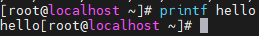
prints what I tell to print. I didn't say newline, so no newline is printed. That may look like a drawback compared to echo, but it is not. printf is more powerful. It gives you more control over the output.

While it's true that you can use `echo -e` to make recognize echo as printf, but printf is still very powerful.

```cmd
# echo -e "hello\rworld"
world
```
This will tell echo that after printing these 5 characters of hello, it will return the cursor to the beginning of the line and then continues to print the rest of the argument.

So, world will overwrite hello.

```cmd
# echo -e "hello\rworld\r22"
22rld
```

Most of what works in echo, works flawlessly in printf.

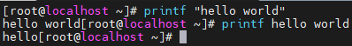

Here in the second case, it will consider hello as format string. There is nothing meaning in it to tell printf to do anything special. So, it doesn't do anything special.

So, what if I now want to have several words printed. Then I have to tell printf in an explicit format string. But if I want to tell printf to print a string, then this is how it looks.

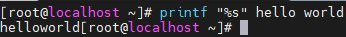

Here is no space between hello and world unless we tell, it won't come.

All format specifications start with a percent sign followed by a character.
s stands for string.
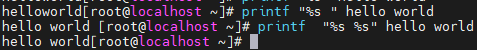
If we want no space at the end, we use the second stuffs.

`%15s` means print the corresponding argument i.e hello in right justified in a field of 15 characters and then do the same with the second argument.

`printf "%15s %15s" hello world`

To left justify, specify `-`

`printf "%-15s %-15s"`

printf also has lots of flexibility in formatting numbers.

# 2 printf part 2
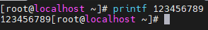

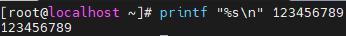

To tell printf to consider a number use `%d` or `%i`.

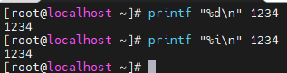

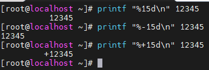

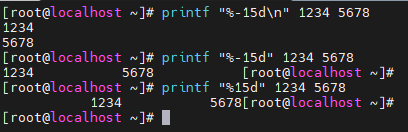


If I don't provide a number here by specifying i or d, I will get error here.

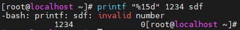

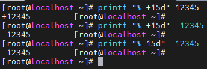

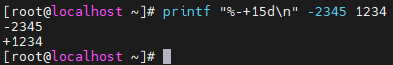

## Within double quote
Double quotes are used to protect certain characters from being processed by the shell but within double quotes, I can use variables. That's the benefit.
Let's do that.
Width of a field experiment.
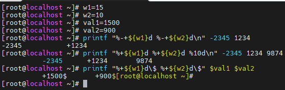

Then comes another conversion specifier for floating point.
Of course, the shell doesn't do floating point, but you can get a floating point from somewhere else.

Other applications do floating point and print to the screen.
So, if you've a floating point value and want printf to deal with it relatively, you can specify `%f`, where `f` stands for floating point.

printf will append zeros to make upto 6 digits after the decimal point. 
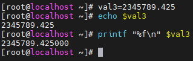

We can change that and say if we only want two of those.

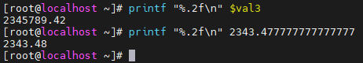

It just doesn't cut the number, it rounds off properly.

Again, we have width specifier overall.

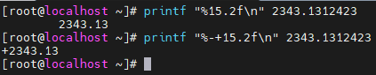


Say, we want to display the equivalent of decimal to octal and hexa as well.


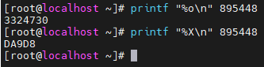

Note: In chmod command, it makes lot of sense to use octal.

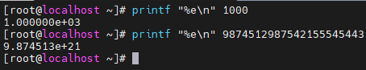
These are some use cases of exponential values.

# printf format date part 3

printf can display current time in a rather flexible and complex and not so complex way according to what you need.
parentheses and curly braces in the shell on the command line are actually used to group two commands.
Make sure parentheses reach printf, we've to prevent if from the eyes of shell. And you know we do that using quotes.
So, now parentheses are safe because within single quotes, the shell doesn't process anything.
Since you don't generally need variables inside the date format string, single quotes is enough.

Displaying time in Linux is a complex thing because, you can have so many details in the time starting with the hour of the day, the minute, the seconds, the day itself, the month, the year and what not.

so, there's lot of flexibility depending on what you need.

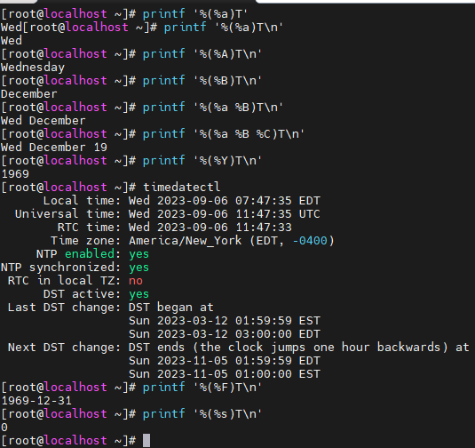

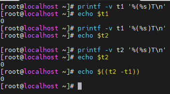

You could use this logic to calculate difference of time between two events (epoch time I mean you use). Not sure, why I'm getting time as 1969. 

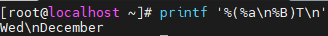

You'd have to use `%n` for newline.
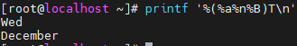
This works.
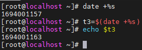
# stat
Doesn't say anything about content of file.
`stat` uses 512 bytes per blocks for reporting.
To use format specifiers, use "-c" option.
```cmd
stat -c%a filename
```
`%a` means access right.
Shell sees everything first, so if you're any special characters that have a meaning to the shell in the format specifier.
```cmd
stat -c "filename:%n size:%s blocks_on_disk:%b bytes_per_block%B" untilNotExist

stat -f untilNotExist
-f display file system status instead of file status.
```

# df
Obvious.
# du
Obvious.
# Shell patterns
 `*`
 `?`
 Don't confuse this with regular expressions.
 ## To use spaced file names
 ```cmd
 rm long\ file\ name.txt
 ```
 This will escape "spaces".
 Or you can use either of single or double quotes for file name.
 
 `?`
It represents a single character

`*`
It represents zero or more characters


The difference:
say there are these files in system.
```
file1
file2
file3
file4
file10
```

You do `rm -f file?`
It will not delete file10, meanwhile if you do `rm -f file*`, it'll delete all files.

What I'm trying to understand is its other use cases that I don't yet understand but you guys know about.

`[12]`
The square brackets matches any one of the enclosed characters.
How about file with a three letter extension?
```cmd
ls
barry.txt blah.txt bob example.png firstfile foo1 foo2
foo3 frog.png secondfile thirdfile video.mpeg
ls *.???
barry.txt blah.txt example.png frog.png
[!a-z]
Matches any single character from among the characters not in the range listed between the brackets.
```

## Differences
```cmd
x[yz] matches xy and xz
x[!yz] matches everything except xy and xz
x[0-9] x0-x9 matches
x[!0-9] except x0-x9
```
# Read more about this from bash cookbook book. And upload more notes in next iteration.

# find
Always enclose the argument following `-name` in quotes.
`find ~ -name "testfile"`
It is done so that the shell doesn't actually get hold of it, to protect it from the eyes of the shell and then the shell will pass this as an argument to find.
## Why should you always enclose the argument following name in quotes?
I am doing a video course from a site.
This is what the author says.

> Argument following -name is interpreted by find as a shell pattern. So, I can use the special characters `*`, `?`, `[]` because find interprets this argument as a shell pattern.

>`find ~ -name testfile`

> testfile is also a pattern. It's a shell pattern, a very simple shell pattern that just matches itself for example.

> Say you want everything that starts with 'test'.

> `find ~ -name "test*"`

> You should always enclose the argument following name in quotes so that the shell actually don't get hold of it. i.e to protect this from the eyes of shell and then the shell will pass this as an argument to find. So, find actually applies this shell pattern to what it finds in the filesystem.

When the author tried to do the search in one case, he got this error:

> find: paths must precede expression


Can you give me one example that explains this perfectly?

**Answer**

The shell is doing exactly what you are telling it to do. Without the quotes it is being very literal in expanding the asterisk.

For an example, think of a directory with N>1 files in it. Lets use 3 as an example.

```
# touch test1 test2 test3
# ls *
```
test1 test2 test3
The quotes encapsulate the search term into a string of text ("test"). Without the quotes, the linux shell expands the `test*` to be "test1 test2 test3". Think of the quotes as a container.

Without quotes your command is spelled out by the shell to be:

`# find ~ -name test1 test2 test3`
The find command doesn't understand 'test2 test3' as arguments because there are no dashes to precede the parameters of the expression.

## find files by type
`find ~ -name "test" -type d -exec ls -ld {} \;`
This is the way how you tell find to pass the filename it found to the program that I want to run.
I have to use backslash along with semicolon because we have to tell where this argument list ends and for that you have to use `;` with backslash because this way the semicolon is also past to find and find will use it to determine where the argument list ends. I'd get error w/o backslash.
## Why use backslash?
Without backslash shell considers that as shell command separator and I get an error message because the semicolons is not passed to find.
If I use backslash, the shell will pass semicolon to find and find will use it then to determine where the ls command line ends.

```cmd
find . -name "[0-8]?[3-4]" -exec rm {} \;
OR
find . -name "[0-8]?[3-4]" -delete
```
## We can use script as well.
```cmd
find . -name "[0-8]?[3-4]" -exec script {} \;
```

 For exec to look into current directory, either write `./script` or `bash script`.
 ```cmd
 find ~ -name random -exec bash fileinfo {} \;
 find ~ -name random -exec ./fileinfo {} \;
 ```
 For every file same thing is being done. Any solution of this? YES.
 ```cmd
 find . -exec ./fileinfo {} +
```
`+` signals that fileinfo can handle multiple files and find will now just add up all the files it found.
So, if it found 2 files it will have fileinfo to file1 file2 as a command line parameter. If it found 100 files, fileinfo will receive 100 arguments on its command line.
```cmd
find . -exec ./fileinfo {} +
```
But this will do only 1 argument and exit.

You have to change the `fileinfo` script.

```cmd
#!/bin/bash
echo hello from fileinfo - $1
while(( $#>0 ));do
	stat -c "%4on - %-13F %5s (%b blocks)" "$1"
	shift
done
```
It's not necessary to use `>0` there. As long as arithmetic status >0, exit status will be 0.
shift command shifts entire command line one location to the left.
What was $1 is now discarded, what was $2 now becomes $1.
Second argument becomes the first argument on command line.
