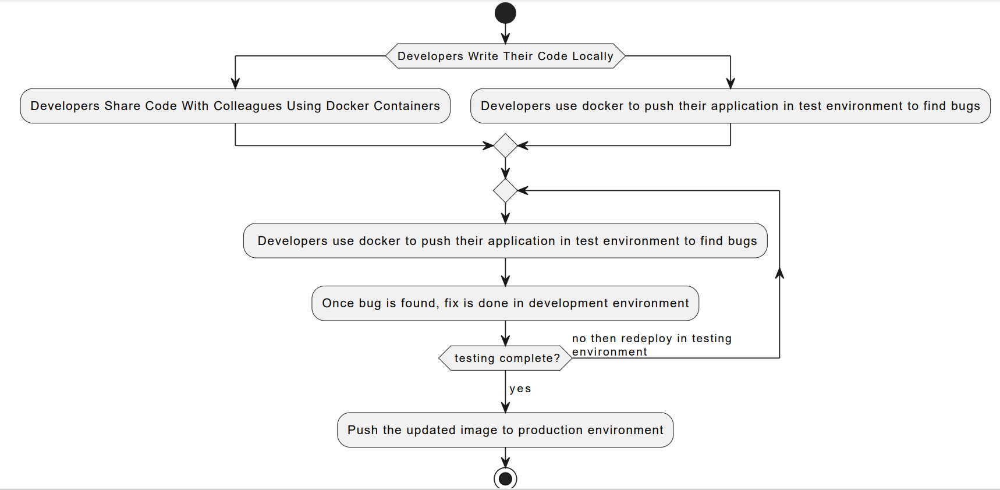
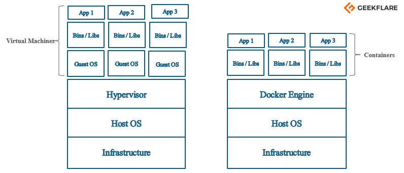
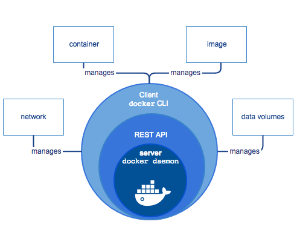
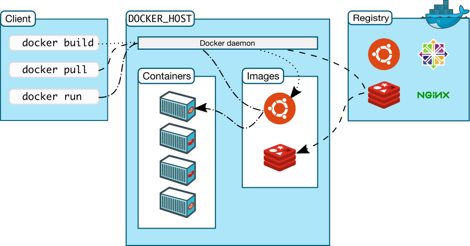
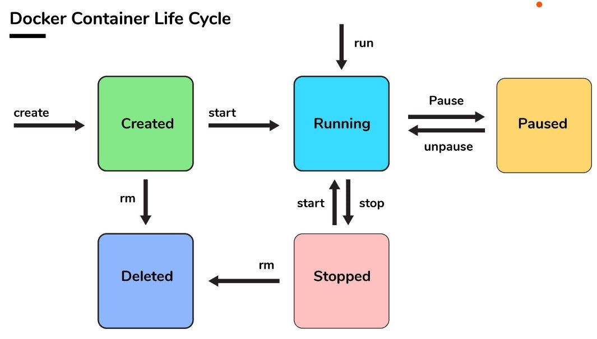
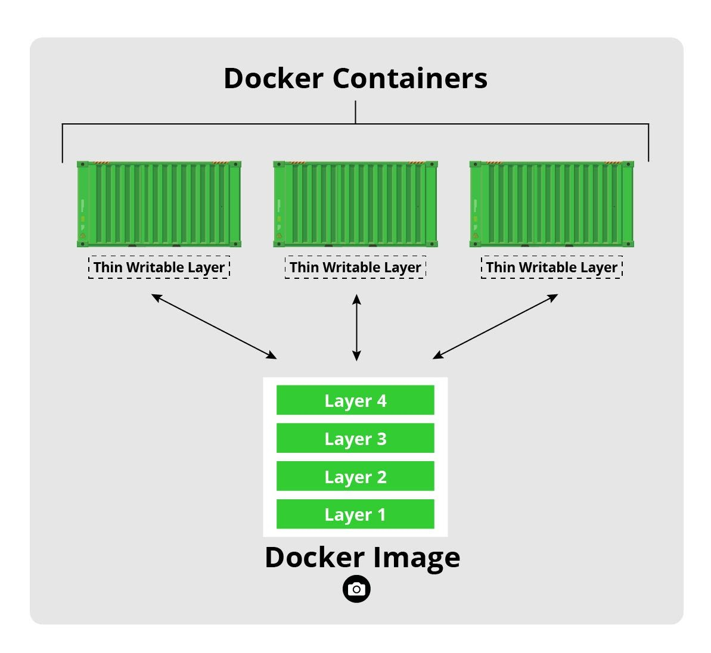

# Beware-Read at your Own Risk
- I am not an expert at Docker.
- Neither I am expert at Teaching.
- Nor am I expert at Writing Technical Articles.
- I am not writing this to teach anybody, this is "Docker for nobody".
- But, I welcome forks to correct this article.

With Docker, you can build a Node.js or Java project (but you are of course not limited to those two) without having to install Node.js or Java on your host machine. 
# An example scenario where Docker could prove useful.


# Understanding Virtual Machines vs Containers


 <table border="1px solid">
    <tr>
      <td>Containerization</td>
      <td>Virtualization</td>
    </tr>
    <tr>
      <td>Containers are lightweight.</td>
      <td>Virtual Machines are heavyweight.</td>
    </tr>
    <tr>
      <td>The startup time of containers is in order of miliseconds.</td>
      <td>The startup time of containers is in order of seconds.</td>
    </tr>
    <tr>
      <td>All containers share host kernel.</td>
      <td>Each VM runs its own OS.</td>
    </tr>
    <tr>
      <td>Containers virtualize the Operating System</td>
      <td>VMs virtualize the hardware.</td>
    </tr>
    <tr>
      <td>Obviously containers take less memory</td>
      <td>Obviously VMs take more memory because you have to allocate fixed memory generally</td>
    </tr>
    <tr>
      <td>Containers isolates processes.</td>
      <td>VMs isolates systems.</td>
    </tr>
    <tr>
      <td>Containers are easier to maintain.</td>
      <td>VMs are difficult to maintain</td>
    </tr>
  </table>




The catch here is that you don't need REST API when you've 1 tier server architecture i.e both client and server in the same machine. But when client and daemon are in different machines, you need the REST API.



The figure is clear in saying docker client and docker server need not be in same machine or same network.

Example of Docker Registry is hub.docker.com


Main point is that To delete a running container, it must be stopped first. Also that a container can be created then started or just run(which is equivalent of creating and starting).

```cmd
Create container
$ docker create –name ubuntu-cont ubuntu

Run docker container
$ docker run -itd ubuntu
$ docker run -itd –name ubuntu-cont ubuntu

Pause container
$ docker pause <container-id/name>

Unpause container
$ docker unpause <container-id/name>

Start container
$ docker start <container-id/name>

Stop container
$ docker stop <container-id/name>

Restart container
$ docker restart <container-id/name>

Kill container
$ docker kill <container-id/name>

Destroy container
$ docker rm <container-id/name>
```
# Docker Images
- Read-only
- Immutable once created. Can't be changed but be deleted.


# Docker Containers
- It's a process by itself.
- Each process has its own hostname(IP address) like a virtual mchine.
- If process ends, container ends. Thus, the lifecycle of the container is tied to this process.
- The container will contain the following components:
	- An operating system selection (for example, a linux distribution or windows)
	- Files added by the developer(for example, app binaries)
	- Configuration(for example, environment settings and dependencies)
	- Instructions for what processes to run by Docker
- Container makes it possible for each application to have its own networking stack, which means it can have its own IP address, file system (and windows registry). In short, its an isolated process.

# Orchestrator
It's how you manage Docker images, containers and hosts. Be it through a CLI or a GUI. You can manage container networking, configurations, load balancing, service discovery, high availability etc and many more.
An orchestrator is responsible for running, distributing, scaling and healing workloads across a collection of nodes.
Example: Docker swarm, kubernetes etc.
