# Working With Docker Images
- Every Docker container is based on an image.
- Till now we have been using images which are created by others and available in Docker Hub.
- Docker can build images automatically by reading the instructions from a Dockerfile.
## Understanding Dockerfile
A dockerfile is a text document that contains all the commands a user could call on the command line to assemble an image.
In order to build an image, you need to have a Dockerfile.
```cmd
FROM ubuntu
RUN apt-get update
RUN apt-get -y install nginx
CMD ["nginx","-g","daemon off;"]
```
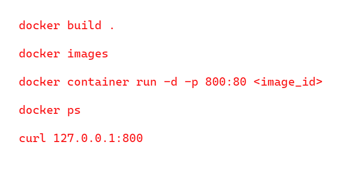
# Overview of Dockerfile
The format of Dockerfile is similar to the below syntax:
```cmd
# Comment
INSTRUCTION arguments
```
A Dockerfile must start with a "FROM" instruction.
FROM basically means that from which base image you want to start creating your image from.
Let's say you want to have a nginx container. The first thing that you want to define is the from.
So, your container can be from the base image of Ubuntu or it can be from the base image of Centos or it can even be from the base image of Alpine.
The various Dockerfile commands are as follows:
- FROM
- RUN
- CMD
- LABEL
- EXPOSE
- ENV
- ADD
- COPY
- ENTRYPOINT
- VOLUME
- USER
- Many More...
## Simple Use Case
We want to create a custom nginx image from which all the containers within organization will be launched.
The base container image should have a custom index.html file which states "Welcome to base nginx container from kplabs".
Let's first do this thing manually and once we understand what are the steps which are required to have this configuration, then we'll automate it with the Dockerfile.
Let's launch a new container from the Ubuntu image.
```cmd
docker container run -d -p 80:80 -t --name mynginx ubuntu
docker ps
Connect inside container.
docker container exec -it mynginx bash
To install nginx using ubuntu
apt-get update
apt-get install -y nginx
Verify nginx is installed
/etc/init.d/nginx status
Modify index.html file
echo "Welcome to base nginx container"> /var/www/html/index.html
Start nginx
nginx -g 'daemon off;'
This will run it in foreground.
We'll convert these commands in a Dockerfile.
```
  Now, close this container, we'll do it Dockerfile way.
 ```cmd
cd /root
mkdir demo
cd demo
vi Dockerfile
```
```cmd
FROM ubuntu
RUN apt-get update
RUN apt-get install -y nginx
#Create index.html in /root/demo with custom information manually
# We now want that file to be copied inside the Docker container on a specific path.
# That specific operation can be achieved with the instruction COPY.
COPY index.html /usr/share/nginx/html
# Default container command is important
# That's the container command which automatically gets run when a container starts or a container restarts.
CMD nginx -g 'daemon off;'
# whenever someone does a docker run on the image which is created from this specific instruction, automatically
# this specific container command would get executed and it can also be overridden during the docker run operation
# by the user.
```
To build and run do the exact same thing done in above figure with red font.
To specify a container name:
```cmd
docker container run -d -p 8001:80 --name mycustomnginx <image_id>
```
Now `docker ps`will show a mycustomnginx container up and running.

# COPY vs ADD instruction
```cmd
FROM busybox
COPY copy.txt /tmp
ADD add.txt /tmp
CMD ["sh"]
```
This creates an image from busybox.
COPY instruction copies the file called as copy.txt to the tmp directory.
ADD instruction add the file called as add.txt to the tmp directory.
CMD instruction which basically runs the shell.
Build this.
```cmd 
docker build -t demobusybox .
```
Do
```cmd
docker images
```
You'd see that built demobusybox image.
Now, create a new container from this specific image.
```cmd
docker container run -dt --name demobusybox demobusybox
```
Our assumption is that both copy.txt and add.txt should be within the /tmp directory of the container.
```cmd
docker ps
```
Then start a bash shell within that container.
```cmd
docker container exec -it demobusybox sh
```
Inside /tmp directory, you'd see both files add.txt and copy.txt.

## What's the difference?
COPY and ADD instruction are basically serving a similar purpose.
Both of them allows you to copy files from a specific location into a Docker image.
COPY takes source and destination.
So, basically whatever file you might have in the source, the COPY will copy that specific file in a specific source.
So, source can be a local file or directory and it will copy that file inside the container image.
So, that's what COPY does.
ADD also does a similar thing which COPY instruction does, but it supports 2 other kind of sources.
1) ADD will allow you to make use of URL instead of local file or directory whereas COPY can only copy a file which is present locally or within a specific directory.
2) Second important aspect of the ADD command is that it can allow you to extract a tar file from the source directly into the destination. So, if you've compressed file within your source, then if you make use of ADD instruction, ADD instruction will decompress the file and it will store the contents of the decompressed file into the destination. 
Using ADD for downloading archives from internet is highly discouraged, use wget or curl instead. Because 3 layers will be created here i.e it will increase the size of image.
```cmd
ADD http://example.com/big.tar.xz /usr/src/things/
RUN tar -xJf /usr/src/things/big.tar.xz -C /usr/src/things
RUN make -C /usr/src/things all
```
Instead do this which will create less layers and less size of the image.
```cmd
RUN mkdir -p /usr/src/things \
    && curl -SL http://example.com/big.tar.xz \
    | tar -xJC /usr/src/things \
    && make -C /usr/src/things all
```
Go to wordpress directory.
Create a new file called compress.txt
`tar -czvf compress.tar.gz compress.txt`
Change the docker file
```cmd
FROM busybox
COPY copy.txt /tmp
ADD add.txt /tmp
ADD compress.tar.gz /tmp
CMD ["sh"]
```
Let's build the image
```cmd
docker build -t demobusybox02 .
```
Now run container from image.
```cmd
docker container run -dt --name demobusybox02 demobusybox02
```
We're keeping container name and image name same.
Verify using
```cmd
docker ps
```
Let's connect to busybox02 container.
```cmd
docker container exec -it busybox sh
```
Inside tmp directory you'd see txt file instead of tar.gz file (i.e add UNCOMPRESSES that file)
```cmd
/ # cd /tmp
/tmp # ls
add.txt       compress.txt  copy.txt
```
## When to use ADD?
When you've a compressed file within your host and you want to decompress it and send it inside the container image, in that cases you can make use of ADD.
# EXPOSE instruction
It informs docker that a container listens on a specified port at a runtime. Let's say that you've a docker image and the service or the application within that docker image is listening on port number 5000. So, how will an individual who's running a docker container know that a service is listening on port 5000? Because the service can listen on port 8000, 9000 or any ephemeral port.
The primary aim of EXPOSE instruction **is not to actually publish the port** but **to inform on which port a specific application or a specific service is running**.
If you want to actually publish a port at a docker level, then you'll have to use the -p option.
EXPOSE instruction functions as a type of documentation between the person who builds the image and the person who runs the container about which ports are intended to be published.
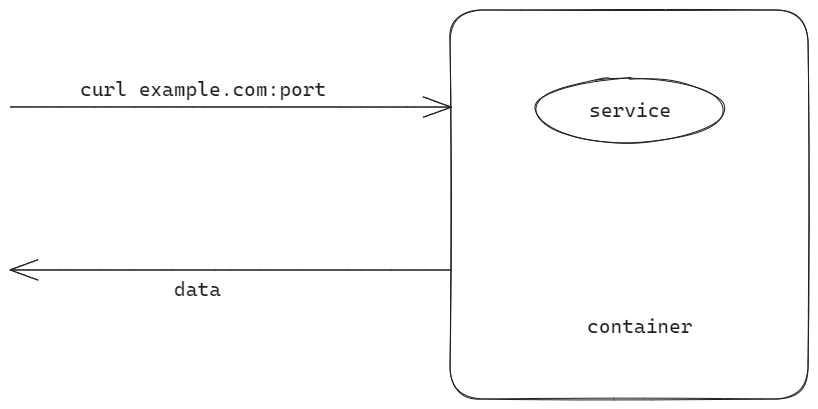
Till you don't know the port this service container is listening to, it becomes difficult to publish that port.

```cmd
#Dockerfile
FROM ubuntu
RUN apt-get install service
EXPOSE 9324
CMD["service"]
```


```cmd
docker run -d --name nginx nginx
docker ps
CONTAINER ID   IMAGE     COMMAND                  CREATED          STATUS          PORTS     NAMES
4ece4506ba48   nginx     "/docker-entrypoint.…"   23 seconds ago   Up 20 seconds   80/tcp    nginx
```
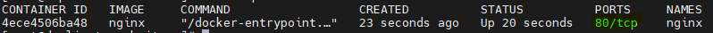
This port 80 has been exposed in that image itself.

```
docker inspect nginx
"ExposedPorts": {
                "80/tcp": {}
            },
```
Again repeat the similar action.
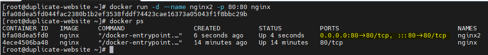
Any traffic coming to host port 80 will be automatically be forwarded to the container port 80.
```cmd
#Dockerfile
FROM nginx:1.17-alpine
COPY index.html /usr/share/nginx/html/
COPY nginx.conf /etc/nginx
EXPOSE 9080
CMD["nginx","-g","daemon off;"]
```

```cmd
docker run -d --name custom-nginx mykplabs/kubernetes:nginx
```


```cmd
docker inspect custom-nginx|less
 "ExposedPorts": {
                "80/tcp": {},
                "9080/tcp": {}
            },
```

```cmd
# Dockerfile
FROM centos:6
RUN yum -y install epel-release && yum -y install nginx
CMD["nginx","-g","daemon off;"]
```
Here's no EXPOSE instruction.
```cmd
docker run -d --name kplabs-nginx nginx:custom
```
# HEALTHCHECK instruction
Whenever a Docker starts a container, it monitors the process that the container runs. If the process ends, the container exits. Sometimes process might be running but not responding properly. So, there's a need to have proper health check which can verify whether the application is working as expected or not.
```cmd
docker container run -dt --name busybox busybox sh
docker ps
docker inspect busybox| grep IPAddress
"IPAddress": "172.17.0.5"
```

```cmd
# Dockerfile
FROM busybox
HEALTHCHECK --interval=5s CMD ping -c 1 172.17.0.5
```
`docker build -t monitoring .`
This is for monitoring the busybox image.
```cmd
docker container run -dt --name monitor monitoring sh
377788944e7bcb5bf7e4a08ee22401bfbf529975086fb60d87cc8c6302772927
docker ps
```
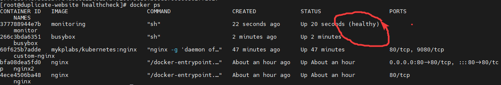
```cmd
docker inspect monitor | less
"Log": [
                    {
                        "Start": "2023-10-28T03:37:47.741481169-04:00",
                        "End": "2023-10-28T03:37:47.837620137-04:00",
                        "ExitCode": 0,
                        "Output": "PING 172.17.0.5 (172.17.0.5): 56 data bytes\n64 bytes from 172.17.0.5: seq=0 ttl=64 time=0.076 ms\n\n--- 172.17.0.5 ping statistics ---\n1 packets transmitted, 1 packets received, 0% packet loss\nround-trip min/avg/max = 0.076/0.076/0.076 ms\n"
                    },
```
The logs show success as well.
```cmd
docker stop busybox
docker inspect monitor
{
                        "Start": "2023-10-28T03:39:19.749642754-04:00",
                        "End": "2023-10-28T03:39:29.848641072-04:00",
                        "ExitCode": 1,
                        "Output": "PING 172.17.0.5 (172.17.0.5): 56 data bytes\n\n--- 172.17.0.5 ping statistics ---\n1 packets transmitted, 0 packets received, 100% packet loss\n"
                    }

```
As you can see, exit code is greater than 1.
## Parameters for HEALTHCHECK
We can specify certain options before the CMD operation, these includes.
```cmd
HEALTHCHECK --interval=5s CMD ping -c 1 172.17.0.2
--interval=DURATION(default:30s)
--timeout=DURATION(default:30s)
--start-period=DURATION(default:0s)
--retries=N(default:3)
```
# HEALTHCHECK options
```cmd
docker run -dt --name tmp --health-cmd "curl -f http://localhost" busybox sh
docker ps 
docker ps
docker ps
```
After few `ps`, docker will show the health status is unhealthy because `curl` command was not found.

```cmd
docker inspect tmp
docker stop tmp
docker rm tmp
docker run -dt --name tmp --health-cmd "curl -f http://localhost" --health-interval=5s busybox sh
docker ps # will immediately show unhealthy
```
Use `curl -f` to fail silently.

# ENTRYPOINT
The best use of ENTRYPOINT is to set the image's main command. ENTRYPOINT doesn't allow you to override the command. It's important to understand distinction between CMD and ENTRYPOINT.
```cmd
# Dockerfile
FROM busybox
CMD["sh"]
```

```cmd
docker build -t base01 .
docker container run -dt --name base01 base01
```
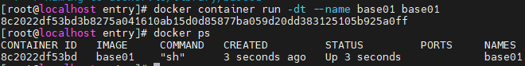
```
docker container run -dt --name base02 base01 ping -c 10 google.com
docker ps
The command being used is ping -c 10 google.com

```
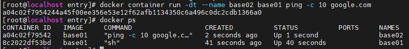
After 10 pings, the container is no more there.
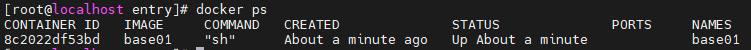

Thus whatever specified by CMD can be overridden at runtime.
**GIST:**
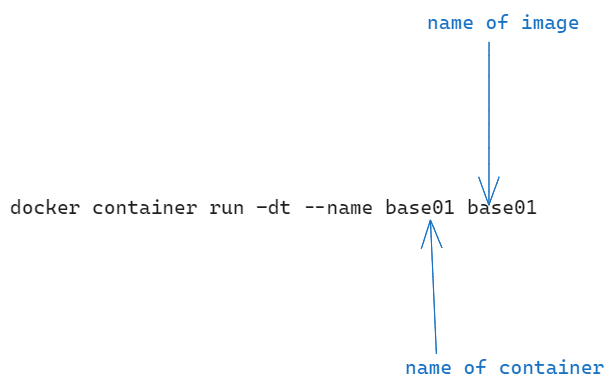

ENTRYPOINT can only be appended.

```cmd
FROM busybox
ENTRYPOINT ["/bin/ping"]
```

```cmd
docker build -t base02 .
docker container run -dt --name base03 base02 -c 20 google.com
```
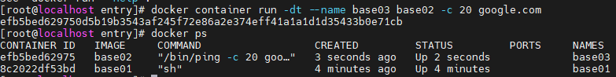

# WORKDIR

WORKDIR instruction sets the working directory for any of the RUN, CMD, ENTRYPOINT, COPY and ADD instructions that follow in the dockerfile.

Any subsequent instructions specified after WORKDIR will automatically be associated with folder1.
```cmd
FROM busybox
RUN mkdir /root/demo
WORKDIR /root/demo
RUN touch file01.txt
CMD ["/bin/sh"]
```

```cmd
docker build -t workdir-demo .
docker run -dt --name workdir-demo workdir-demo sh
docker ps
# Connect to this container
docker exec -it workdir-demo sh
~/demo # pwd
/root/demo
~/demo # ls
file01.txt
```
## Question To Ponder
What if I don't put sh in docker run command? What'll happen?
WORKDIR instructions can be used multiple times in a dockerfile.
```cmd
WORKDIR /a
WORKDIR b
WORKDIR c
RUN pwd
Output=/a/b/c
```

```cmd
# Dockerfile
FROM busybox
RUN mkdir -p /root/demo/context1/context2
WORKDIR /root/dem
WORKDIR context1
WORKDIR context2
RUN touch file01.txt
CMD ["/bin/sh"]
```

```cmd
docker build -t workdir-demo02 .
docker run -dt --name workdir-demo02 workdir-demo02 sh
docker ps
docker exec -it workdir-demo02 sh
```

```cmd
# docker exec -it workdir-demo02 sh
~/dem/context1/context2 #
~/dem/context1/context2 # ls
file01.txt
~/dem/context1/context2 # pwd
/root/dem/context1/context2
```
# ENV instruction
- sets the environment variable which is in the format "key value".
Example: `ENV NGINX 1.2`
where NGINX is the key and 1.2 is the value.

```cmd
# Example snippet 1
ENV NGINX 1.2
RUN curl -SL http://example.com/web-$NGINX.tar.xz
RUN tar -xzvf web-$NGINX.tar.xz
```


Real example:

```cmd
# Dockerfile 1
FROM busybox
ENV NGINX 1.2
RUN touch web-$NGINX.txt
CMD["/bin/sh"]
```
Build and run it.
```cmd
docker build -t image-env .
docker run -dt --name env image-env sh
docker ps
docker exec -it env sh
/# ls
web-1.2.txt
```
## Setting environment variables from the CLI
You can use the -e, --env and --env-file flag to **set** simple environment variables in the container you're running, or **overwrite** variables that are defined in the dockerfile of the image that you're running.

```cmd
# Example snippet 2
docker run --env VAR1=value1 --env VAR2=value2 ubuntu env | grep VAR 

# Example snippet 3
docker run -dt --name env02 --env USER=ADMINUSER busybox
docker ps
docker exec -it env02 sh
/#$USER
ADMINUSER
```


# Tagging docker images
```cmd
ls -l
Dockerfile
docker build .
docker  images
# This creates a tagless docker image
# remove the tagless docker image
docker rmi <image_id>
# Build a tagged docker image.
docker build -t demo:v1 
docker images
# you see a tagged docker image
# Say you already built the image without tags
docker build .
docker images
# You've already built images without tags
docker tag <image_id> <tagname>
# Another case, you've already built images that are already tagged
docker tag <old_tagname> <new_tagname>
This creates an alias kind of thing. Two images with same image id but different tags.
```
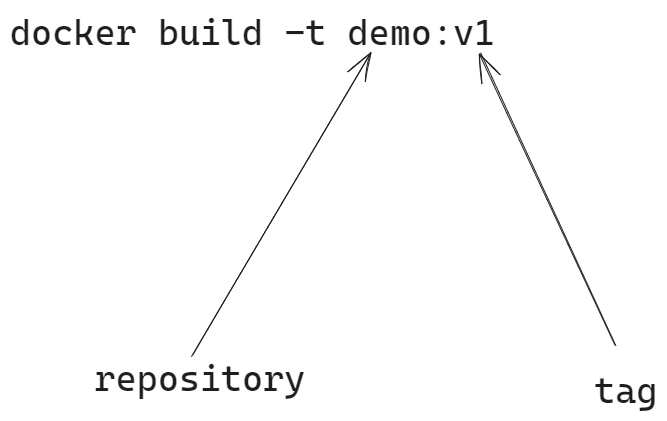
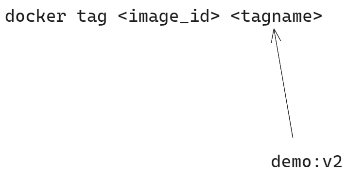
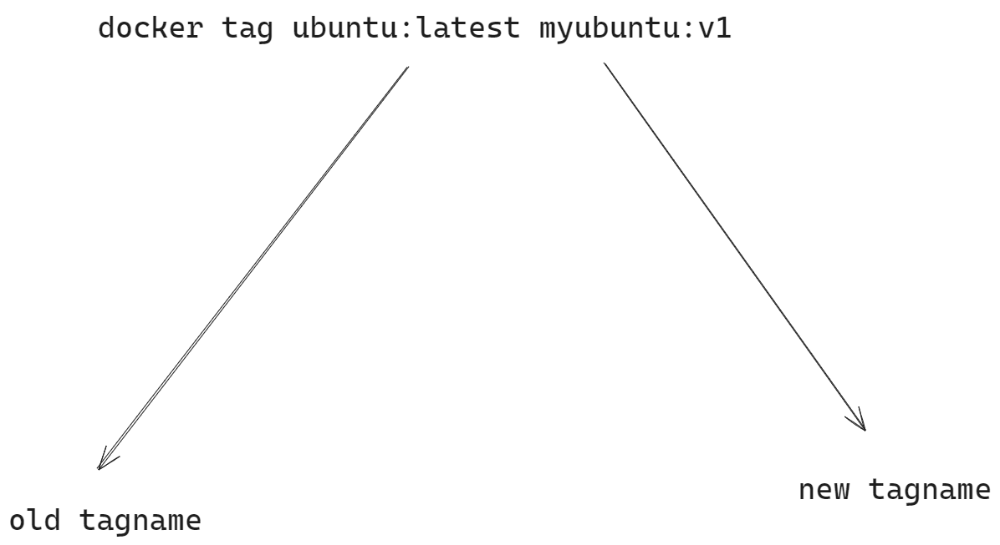
# Docker commit
Whenever you launch a new container from image (while modifying lots of files to achieve a particular target), it can be useful to commit a container's file changes or settings into a new image.
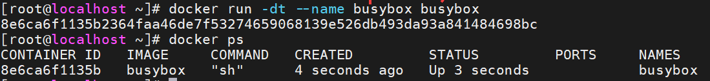
busybox container is up and running as of now.

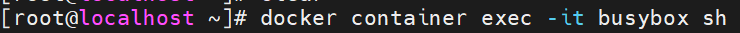
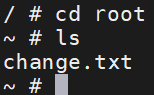
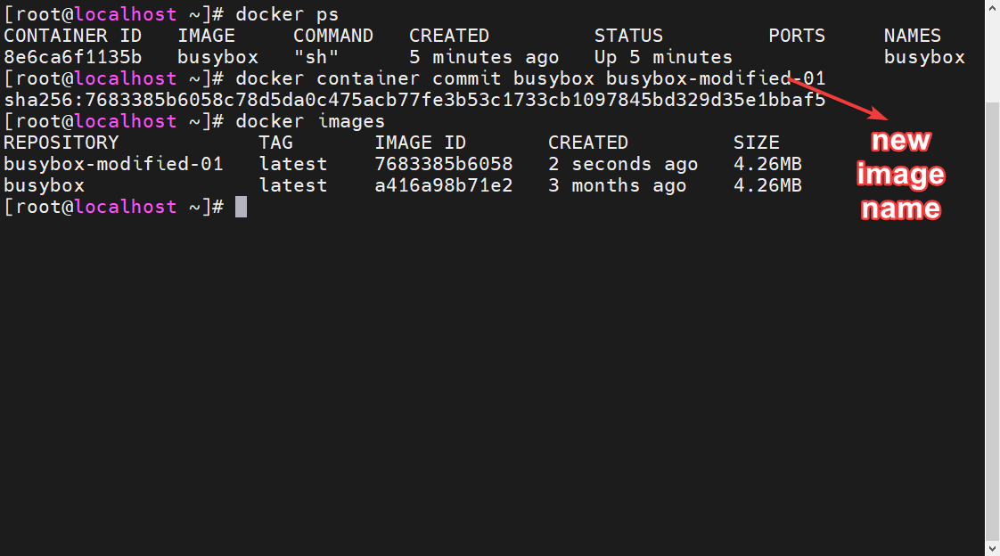
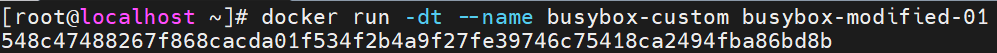
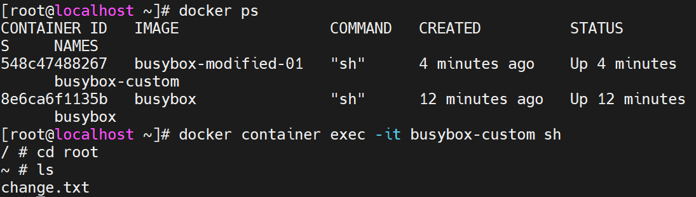
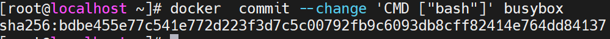

# Layers of docker image
```cmd
# Example-1
FROM ubuntu:15.04
COPY . /app
RUN make /app
CMD python /app/app.py 


# Example-2
FROM ubuntu
RUN dd if=/dev/zero of=/root/file1.txt bs=1M count=100
RUN dd if=/dev/zero of=/root/file2.txt bs=1M count=100 
RUN rm -f /root/file1.txt
RUN rm -f /root/file2.txt

# Dockerfile-1
FROM ubuntu
RUN dd if=/dev/zero of=/root/file1.txt bs=1M count=100
RUN dd if=/dev/zero of=/root/file2.txt bs=1M count=100 

docker build -t layerdemo01 .

docker images
# an image with 3 layers 

docker image history <image-name>
there are multiple layers in this image 

ubuntu image already has multiple layers in it.
So, you'd have ubuntu image layer+ the instructions that you're adding.

docker images
# total size of your image

Now remove both of the files with the next dockerfile, and see what happens to the file size.
# Dockerfile-2
FROM ubuntu
RUN dd if=/dev/zero of=/root/file1.txt bs=1M count=100
RUN dd if=/dev/zero of=/root/file2.txt bs=1M count=100 
RUN rm -f /root/file1.txt
RUN rm -f /root/file2.txt

docker build -t layerdemo02 .


docker images
# The image is yet 297 MB still. (same size even though we've removed the file).


File is only deleted from layer 4 and it still exists in layer 2.
If you execute this instruction in the same layer itself, then only the overall size of the image will decrease.


# Dockerfile-3
FROM ubuntu
RUN dd if=/dev/zero of=/root/file1.txt bs=1M count=100 &&  rm -f /root/file1.txt
RUN dd if=/dev/zero of=/root/file2.txt bs=1M count=100 &&  rm -f /root/file2.txt


docker build -t layerdemo03 .

docker images 

image size is 87.5MB which is similar to that of ubuntu image.
# To find layers of an image
docker image history layerdemo03
First 5 of ubuntu, next 2 layers are of size 0 Bytes.


Always write  linux commands in docker using && separator so that you'll have minimum layers as possible.
```
# Docker image child commands
```cmd
docker image build
docker image history
docker image import
docker image inspect
docker image load
docker image ls
docker image prune
docker image pull
docker image push
docker image rm
docker image save
docker image tag
```

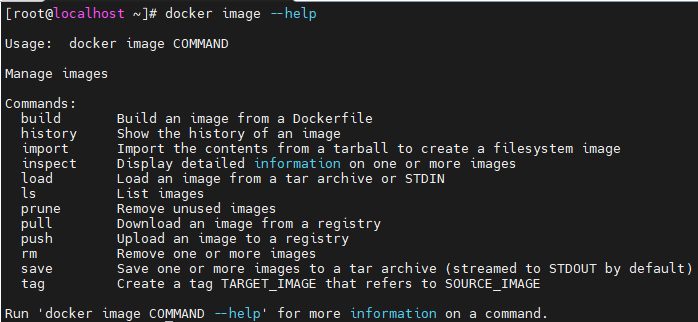

# Inspecting docker images
A docker image contains lots of information, some of these include:
- creation date
- command
- environment variables
- architecture
- os
- size
`docker image inspect` command allows us to see all the information associated with a docker image.
```cmd
# Example formatting
docker image inspect nginx --format='{{.Id}}'
docker image inspect nginx 
docker image inspect nginx --format='{{.ContainerConfig}}'
docker image inspect nginx --format='{{.ContainerConfig}}'
# To get json values in key-value pair
docker image inspect nginx --format='{{json .ContainerConfig}}'
# Only 1 keyvalue
docker image inspect nginx --format='{{.ContainerConfig.Hostname}}'
```

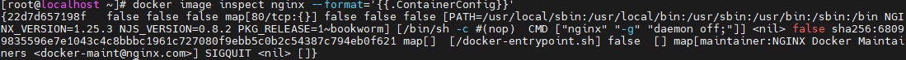
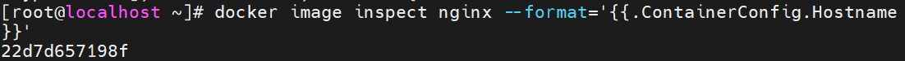
# Pruning docker images
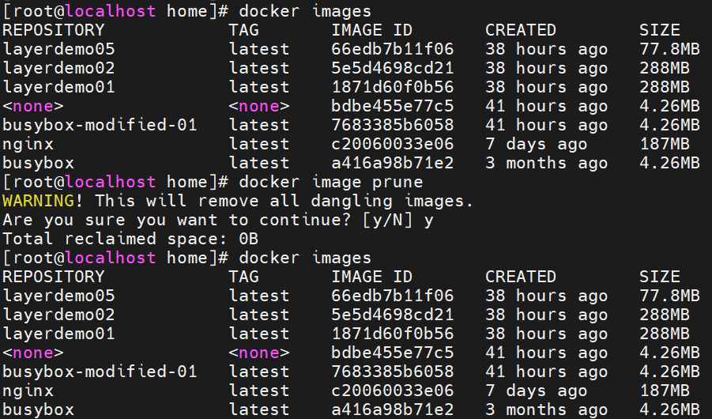
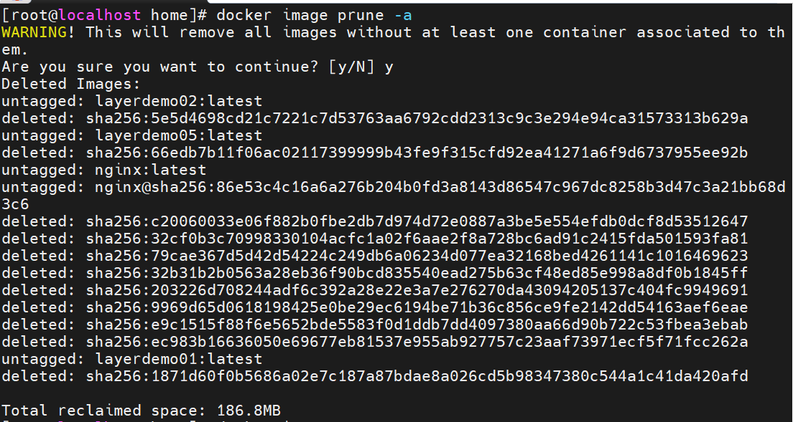
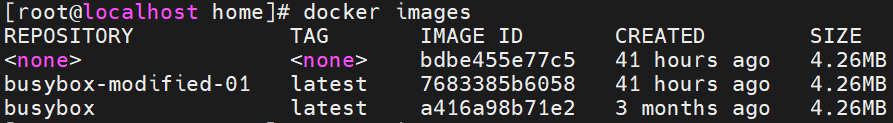
# Flattening docker image(Modifying an image to a single layer)
Size of image increases as layers of image increases.
```cmd
docker image history ubuntu
docker pull mysql
docker image history mysql
docker container run -dt --name myubuntu ubuntu
docker ps
# Merge multiple layers to single layer
docker export myubuntu > myubuntudemo.tar

ls -l myubuntudemo.tar


Now import it back
cat myubuntudemo.tar| docker import - myubuntu:latest

docker images
# the size will be decreased

docker image history myubuntu
# will have only 1 layer
```
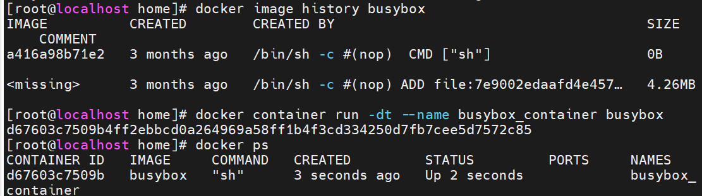
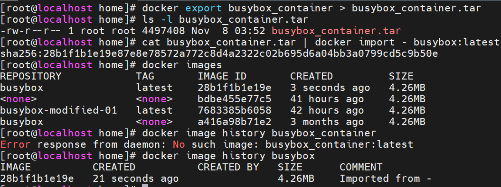
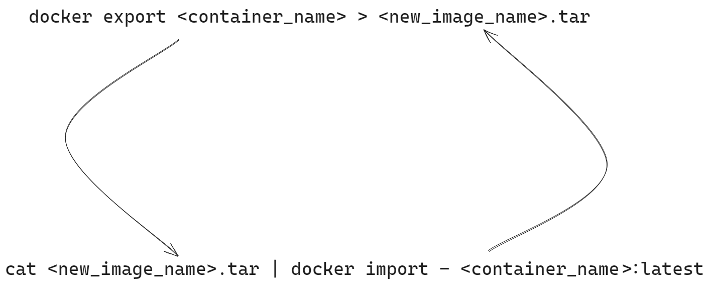

# Docker Registry
server side web application
- stateless
- highly scalable
- example: docker hub

Run a registry locally.
```cmd
docker run -d -p 5000:5000 --restart always --name registry registry:2
```
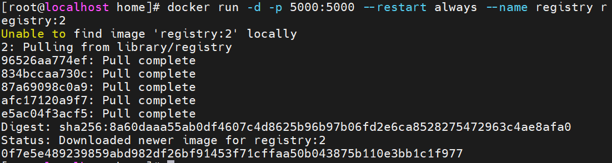
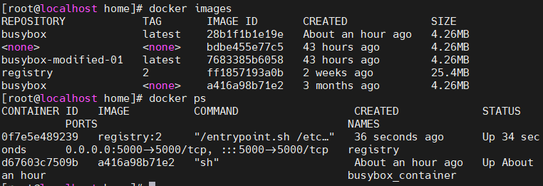
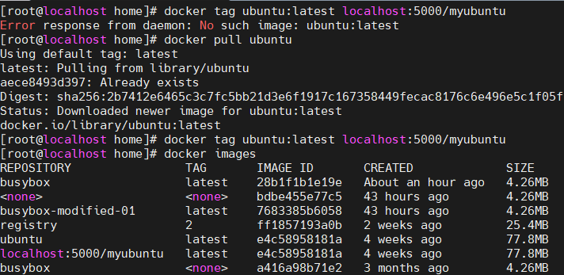
new image is created but image id remains the same.
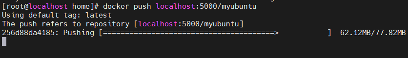

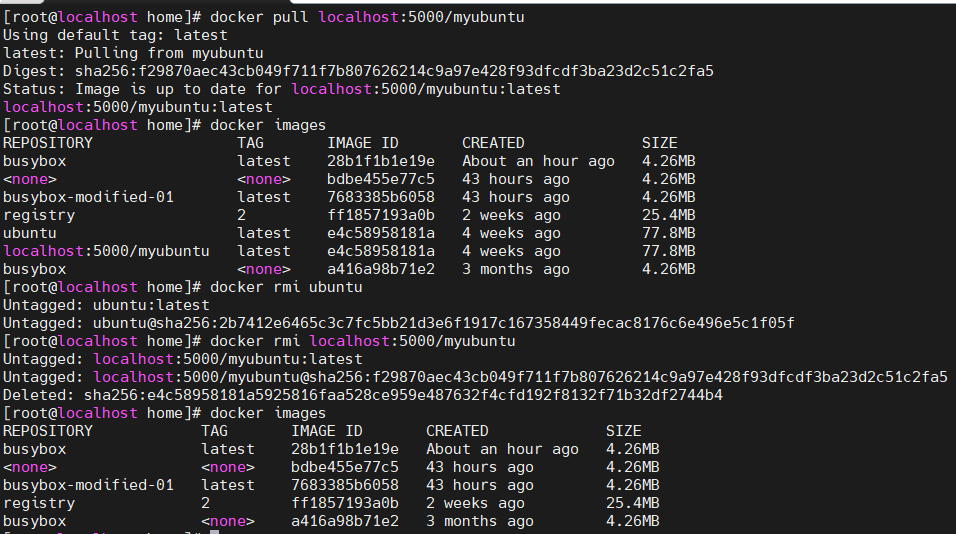
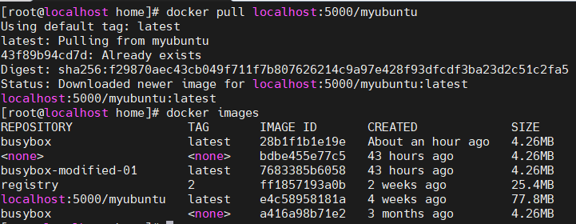

# Pushing images to dockerhub
```cmd
docker login
docker tag <imgname>:<version> <repo>/<imgname>
docker tag buildpackdemo:0.0.1-snapshot dailycodebuffer/buildpackdemo
docker images
docker push <name of image>
docker pull dailycodebuffer/buildpackdemo
```
# Docker search
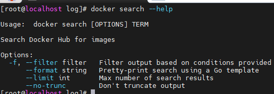
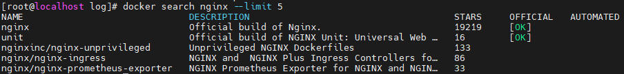
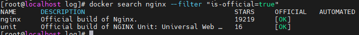
# Moving docker images between hosts
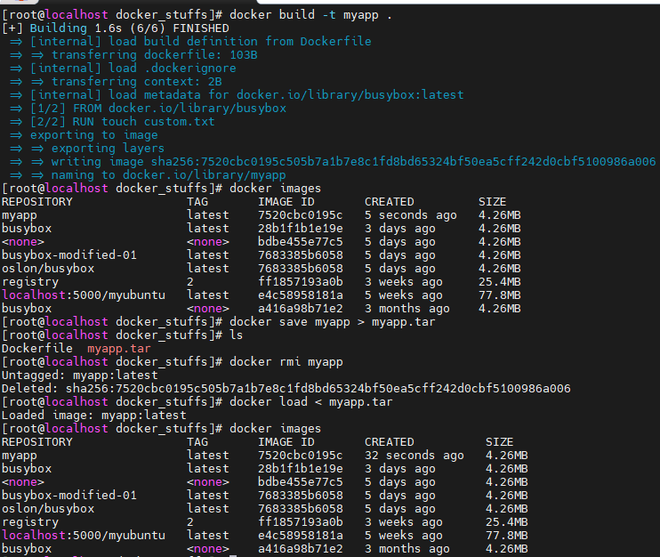
```cmd
Step 1) docker save busybox > busybox.tar
Step 2) docker load < busybox.tar
```
# Build Cache
Docker creates container images using layers.
Each command that is found in a Dockerfile creates a new layer.
Docker uses a layer cache to optimize the process of building Docker images and make it faster.
**If the cache can't be used for a particular layer, all subsequent layers won't be loaded from the cache.**

