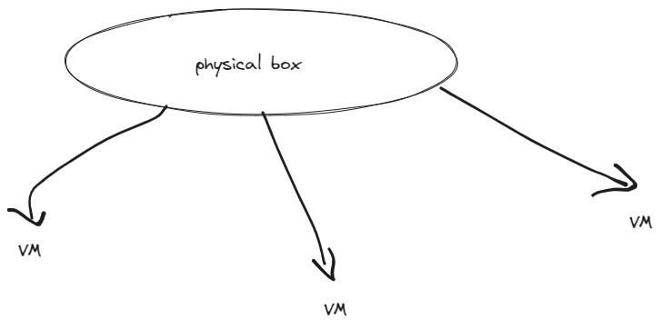

# To monitor system there are various different commands available.
- ps
- top
- free
- lsblk
- findmnt
- df
- du
- GNOME system monitor
# ps

Monitoring process.

`ps` lists only running process from current shell.
`pts` means pseudo terminal
`ps -A` or `ps -e`  lists all processes except session leaders.
`ps -x` shows all the process in system even the processes not associated with current tty also seen.
`tty=?` means not the current terminal.
`ps aux` is the BSD format for process monitoring.
`a`= all processes of all the users.
`u`= details in user oriented form.
`x`=list all processes even not attached to the terminal.
## Output of ps aux meaning
user: user who owns the process
pid: process id of process.
%CPU: CPU Utilization
%MEM: RAM(primary memory) utilization
VSZ: Virtual Memory Size
RSS: Resident Set Size which is not swapped (physical memory)
Stat: Different Stats of processes
Start: Start time of process
time: CPU Time of process

`ps -u username` lists processes for particular username.
Full format listing output
`ps -fu username`
Details about any specific process
`ps -p $(pidof sshd)`


To see sorted by memory in descending order as output.
`ps ax --format pid,%mem,cmd --sort -%mem`

# top
Top is very useful to figure out which users and processes are consuming the most system resources at any given time.

`top -n 1`
terminates program after the single display of process list.

`us`- user processes
`sy`-system processes
`ni`-how much cpu is giving priority
`id`- idle cpu not in use.
`wa`- % of CPU waiting for I/O (issue with disk)
example case: backup running at background. 
writing to disk.
disk not responding.
wa will go higher number.
`hi` - hardware interrupts
`si`-software interrupts
`st`-steal time

VMs steal time from Physical Box.
`PR` priority of process by CPU.
Ranges from -19 to +19.
-19 means more priority, +19 means least priority.
`VIRT` Virtual memory used by processes
`RES` physical memory
`SHR` shared memory
`S`-sleep
`R`-Running
`Z`-zombie
`TIME+` total time of activity.
`command` name of process

Sort based on `RES` memory.
<kbd>Shift</kbd>+<kbd>M</kbd>

Sort based on `pid` .
<kbd>Shift</kbd>+<kbd>N</kbd>

## Questions to Ponder
How do identify zombie processes using command line?


# Monitoring memory `free`
Output of `free` command.
```cmd
              total        used        free      shared  buff/cache   available
Mem:       14183336     8309988      205176      238128     5668172     5305132
Swap:       2097148      534824     1562324
```

`total`
total amount of memory that can be used by applications.

`used`
total-free-buffer/cache

`free`
unused memory

`shared`
no meaning, just  kept for backward compatibility.

`buffer/cache`
combined memory used by kernel buffers and page cache and slabs. This memory can be reclaimed at any time if needed by the applications. If you want buffer and cache to be displayed in two separate columns, use `-w` option.
```cmd
[root@server-02 ~]# free -w
              total        used        free      shared     buffers       cache   available
Mem:         995676      140580      750564        7896        2108      102424      727496
Swap:       2097148           0     2097148
```

When an application starts, they always resolve some memory into the buffer and cache and this memory can be reclaimed by the application at any time.

`available`
estimated amount of memory that is available for starting new application.


`free -m`
output in MB.

`free -g`
output in GB

`free -h -t`
gives total sum as well as in human readable form.

`free -s 2`
continuously display memory information on screen every 2 seconds.

## Low memory situation
Look for low values in buffer/cache and available.
If both are nearly equals to zero, system indicates low memory situation.

## Healthy memory situation

Available=20% of total memory
used memory=total

These values indicate healthy system.

# Monitoring file system usage
`lsblk`
`df`
`du`
They're obvious
 # Practice Lab Session
 ```cmd
 ps -p $(pidof httpd)
 ```
 How long a process has been running?
 ```cmd
 ps -p 1194 -o etime
```
Suppose I want to print the process in hierarchy order and I also want to include few properties like pid, ppid and command.

```cmd
ps --forest -C httpd -o pid,ppid,cmd,rss,%cpu
```
BSD style(sort by rss in descending order)
```cmd
ps axo pd,ppid,rss,%cpu --sort=-rss
```

# iostat
Reports all statistics about your CPU and I/O statistics for I/O device.
`mpstat`
```cmd
/proc/stat
/proc/uptime
/proc/diskstats
/proc/sys
```


```cmd
iostat -xd
```
Extended statistics
```cmd
iostat -k
```
Captures statistics in kilobytes and if you want to get report in megabytes use `-m`

```cmd
iostat -k 1 3
```
Displays CPU and device statistics with delay of 1 sec and number of times=3..
```cmd
iostat -c 2 2
```
Shows CPU report 2 sec interval, and 2 times report appears.
```cmd
iostat -d nvme0n1
```
# mpstat
Reports processor related statistics.
It accurately displays the statistics of CPU usage of the system.
```cmd
mpstat -P ALL
```
This command will display the processor number of all CPUs which is currently in working state here.
To get all information
```cmd
mpstat -A
```
To find CPU utilization by a specific processor.
```cmd
mpstat -P 0
```
0 is the processor number.
CPU usage with a interval.
```cmd
mpstat 1 3
```
It'll give delay of 1 seconds and number of outputs will be 3.
# pidstat
Used to provide the statistics about running processes, tasks, CPU, memory etc.
To display statistics for all running process or a specific process.
```cmd
pidstat -p ALL
```
Performance statistics of all running process. By default display only CPU usage. If ALL removed, only active processes.
```cmd
pidstat| wc -l
99
pidstat -p ALL|wc -l
268
```
Repeat output at a certain interval.
```cmd
pidstat -p 1230 2
```
1230 is pid.
2 display output with delay of 2 sec.
IO statistics for a specific device
```cmd
pidstat -p 1230 -d 1
```
Repeat output with interval of 1s.
Paging activity at specific interval.
```cmd
pidstat -p 1230 -r
```
`-r` option to display page faults and memory utilization for a specific process.
```cmd
pidstat -C httpd
pidstat -C httpd -l 
```
`l` will give full path of command.
# SAR
- Using SAR you can monitor performance of different Linux subsystems (CPU, memory, I/O) in real time.
- The System Activity Reporter SAR, can display a lot of information about your computer and save that information to files for later analysis. This program and its related tools are part of the sysstate package.
- SAR command can be used interactively.
- To use it noninteractively, an agent is executed at a scheduled time using the cron command to collect data.
- Cron file name is in `/etc/cron.d/sysstat` which runs the `/usr/lib64/sa/sa1` and `/usr/lib64/sa/sa2` commands.
- By default the cron command runs the sa1 script every 10 minutes. If you want script to run every 2 minutes, you can change it.
- `sa2` scripts writes a daily report to the `/var/logs/sa` and that directory start creating data file saDD, DD is the current date. So, everyday it is capturing all the statistics, information and putting in that file.
- Configuration file of your sysstat file is `/etc/sysconfig/sysstat` file. The `/etc/sysconfig/sysstat` file is read by the `sa1` and `sa2` scripts and allow some configurable options for the `sar` command.
# Advantages of SAR
- Cumulative stats data will be available.
- Continuous monitoring of system stats.
- Able to fetch system starts at any point of time.
- Daily system performance will get captured. For 30 days.
- No need of manual intervention for collecting stats.
- Quick stats overview at any time.
- 24 hours system stats will get collected.
## Why SAR?
You need different command for different types of user reports. SAR will provides you all the usage data at one place.

# LAB-SAR
```cmd
cd /usr/lib64/sa
ls
sa1->runs every 10 mins
sa2->runs every 1 day
cd /var/log/sa
ls
sa15
Contents can't be viewed by simple text editor, need to use SA.
```

```cmd
cd /etc/cron.d
cat sysstat
```
To check CPU utilization.
```cmd
sar -u | less
```
To get CPU utilization of all CPU, you've to use
```cmd
sar -P ALL 1 2
```
Delay=1 sec
Number of times to display the output=2
To get CPU utilization of specific CPU, you've to use
```cmd
sar -p 1 1 3
```
Where the first ones means the second core of CPU.
To check how much memory is free
```cmd
sar -r 1 3
```
CPU utilization of some previous data
```cmd
cd /var/log/sa
```
I need sa16.
```cmd
sar -u -f /var/log/sa/sa16
```
To check for swap utilization.
```cmd
sar -s 1 2
```
Not using swap memory means system is in good condition.
To check io stats
```cmd
sar -b 1 3
```
If you want to get the detail about any block.
```cmd
sar -d 1 1
```
Provides details about the disk.
If you want to get the detail about network, simply use:
```cmd
sar -n DEV 1 1
```
DEV is a keyword.
You want to get sar data from any previous date, but also you want to specify the time as well.
```cmd
sar -u /var/log/sa/sa16 -s 10:00
```
# Scheduling tasks with systemd timer
```
cd /usr/lib/systemd/system
vi sysstat-collect.timer
vi sysstat-collect.service
```
