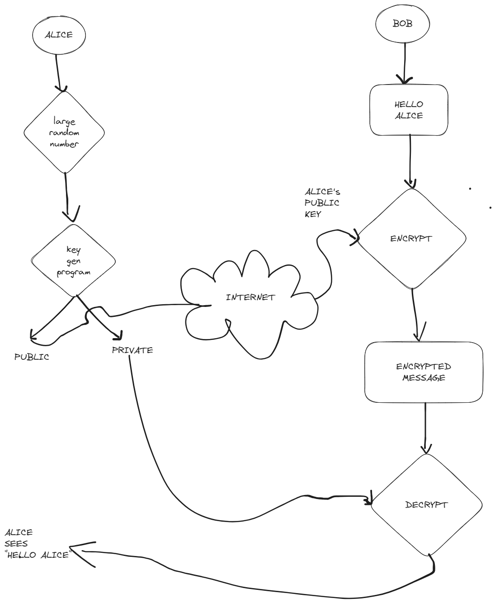

# Understanding Asymmetric Key Encryption

Either of the keys can encrypt and the other key will decrypt.
Public key is available in internet.
Private key is kept secret.
They use Asymmetric Key Encryption
- PGP
- SSH
- Bitcoin
- TLS
- S/MIME

# Plain Text vs Encrypted Text
FTP sends data in plain text whereas SFTP in encrypted text.
# HTTPS
### Which certificates will the browser trust?
They are given in browser's privacy settings as list of authorities.
# Revocation of Certificate
Revoke certificate once the private key is stolen.
`certbot revoke --cert-path path/to/certificate --key-path path/to/key`
# SSL Termination
if you've reverse proxy based configuration, you should put ssl conditions there.

I really got lazy on this one chapter lol. Hope no more laziness. 