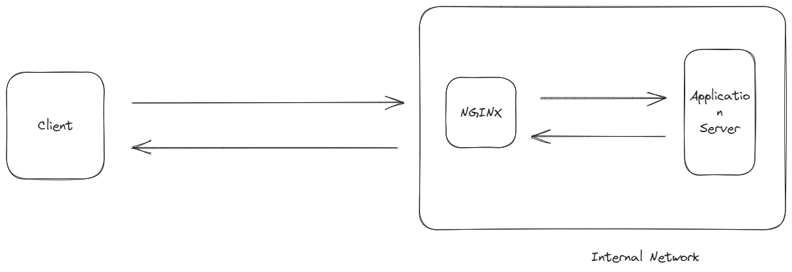
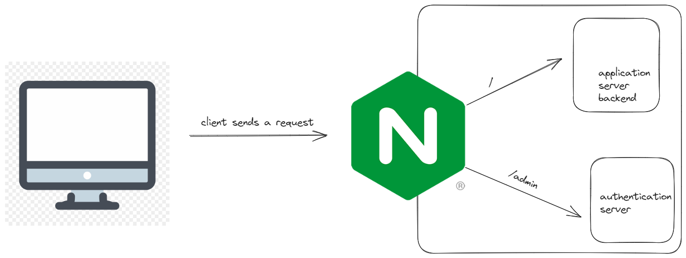
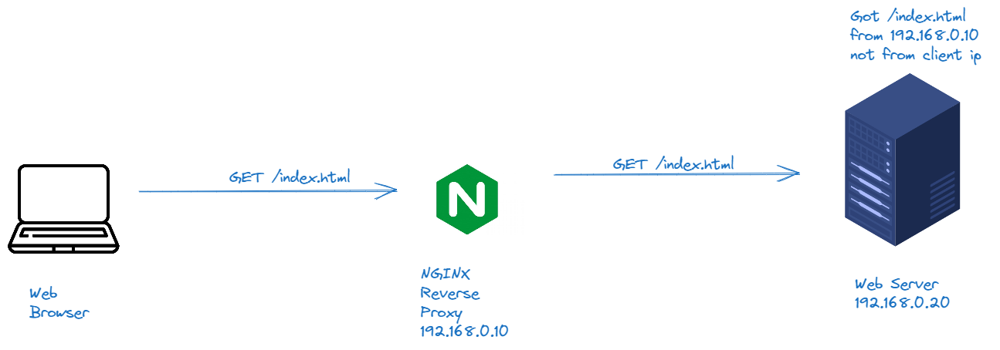

Reverse Proxy is type of proxy server which retrieves resources on behalf of a client from one or more servers.


# What a Reverse Proxy can do?
* It hides the existence of the original backend servers.
* Can protect the back-end servers from web-based attacks, DOS and many more.
* Can provide great caching functionality.
* Can optimize the content by compressing it.
* Can act as a SSL termination proxy.
* Request routing and many more.

# proxy_pass directive
Create three servers.

## Step 1: Launch 3 Servers
1st - Nginx Reverse Proxy
2nd - Application Server
3rd - Authentication Server

## Step 2: Install Nginx using RPM Method

```cmd
yum -y install wget
wget https://nginx.org/packages/centos/8/x86_64/RPMS/nginx-1.20.1-1.el8.ngx.x86_64.rpm
yum -y install nginx-1.20.1-1.el8.ngx.x86_64.rpm
systemctl start nginx
```


## Step 3: Installing net-tools

```cmd
yum -y install net-tools
ifconfig
```

## Step 4: Adding contents to html file

### Admin Server:

```cmd
cd /usr/share/nginx/html
echo "This is application server backend" > index.html
```

### Auth Server:
```cmd
cd /usr/share/nginx/html
mkdir admin && cd admin
echo "This is auth server file under admin" > index.html
```
## Disable SELinux:
```cmd
getenforce
setenforce 0
```
## Final Configuration nginx-reverse-proxy:
```cmd
cd /etc/nginx/conf.d
nano proxy.conf
server {
    listen       80;
    server_name  localhost;
 
    location / {
        proxy_pass http://10.139.0.3;
    }
 
    location /admin {
        proxy_pass http://139.59.11.125;
      }
}
nginx -t
systemctl restart nginx
```


Response is not shown here in this diagram, but obviously response will come when requested.

# X-Real-IP

This is the problem that X-Real-IP Wants to solve in reverse proxy setup in nginx.
Whenever a request arrives to webserver, it comes as if the nginx reverse proxy is requesting(which indeed is the case), but sometimes we want to bind client ip with webserver ip, so in that case it's necessary to know the client ip. That's where X-Real-IP finds it place.

## Reverse Proxy Side

```cmd
nano /etc/nginx/conf.d/proxy.conf
proxy_set_header X-Real-IP $remote_addr;
```

## Backend Server Side
```cmd
nano /etc/nginx/nginx.conf
"$http_x_real_ip" (put this where log format is mentioned)
```

# Proxy Host Header
## Reverse Proxy Level
```cmd
vi /etc/hosts
127.0.0.1 kplabs.internal
```
Basically reverse proxy calls itself on `/` when `curl`ed for `kplabs.internal`.
`proxy_set_header Host $host`
## Backend Server Level
```cmd
yum -y install tcpdump
tcpdump -A -vvvv -s 9999 -i ens33 port 80 > /tmp/headers
```

`echo > /tmp/headers` will clear everything in headers.