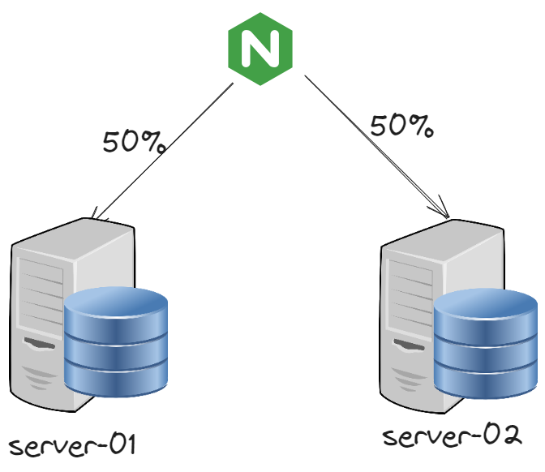
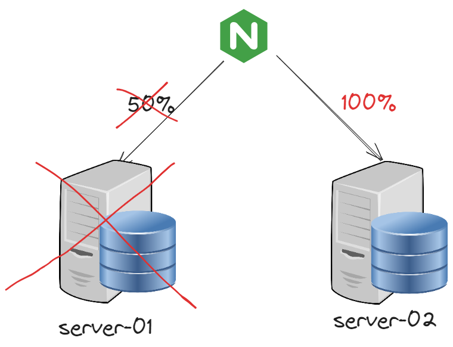
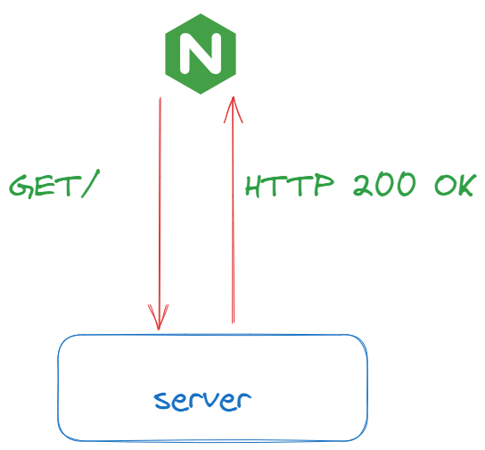
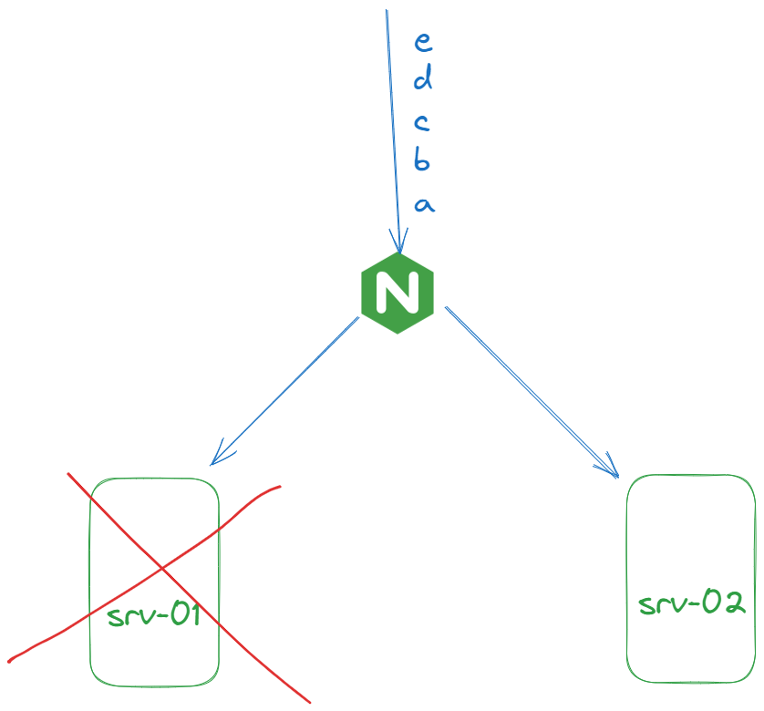
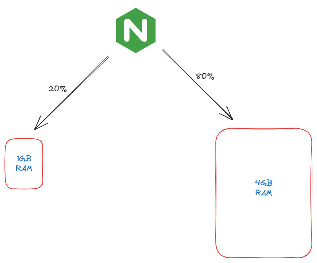
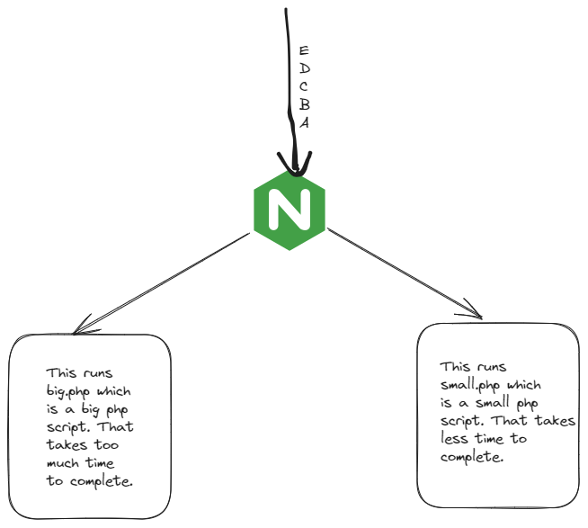

# 1
Load balancers can do health check among other things like distributing the load among servers. They also support SSL/TLS termination.

# 2 Load Balancer Practical

These are my 3 servers.

    Load Balancer-192.168.1.72
    Server-01-192.168.1.79
    Server-02-192.168.1.80

# In Load Balancer Server, I've configured these things in `/etc/nginx/conf.d/load-balancer.conf`


    	upstream backend{
      server 192.168.1.79:80;
      server 192.168.1.80:80;
    }
    
    server {
      listen 80;
      server_name localhost;
      
      location / {
      proxy_pass http://backend;
      }
    }


# In server-01, I've configured this thing in `/usr/share/nginx/html/index.html`

    cat index.html
    This is server-01


# In server-02, I've configured this thing in `/usr/share/nginx/html/index.html`

    cat index.html
    This is server-02

# The problem

The configuration is successful. But when I `curl localhost:80` , I am getting empty response(which is the content at `/usr/share/nginx/html` for load-balancer.)

What's the issue here and how can I resolve it. I suspect it's something related to DNS. But I'm not aware how I fix this issue?

I added 

`192.168.1.72 localhost`

to `/etc/hosts` of load-balancer server.

How do I solve this issue?

Issue was resolved by changing the name localhost to something like "mywebsitename". Not sure why.

# 3  Understanding Health Checks
Say, nginx is load balancing by sending half traffic to server-01 and another half traffic to server-02.


Now consider the case server-01 fails.



100% of traffic will be redirected to server-02.

In case, server-01 becomes alive again, again load balancing will be done 50% 50%.

To test this, just stop nginx in server-01 in above practical by
`systemctl stop nginx`
Then `curl mywebsitename` from load-balancer server. Your requests should be fulfilled only by server-02.

# Active vs Passive Health Checks

Active health checks mean periodically sending GET requests by NGINX to the server. (Not the live GET requests, but kind like test GET requests). Whereas Passive Health Check means almost the opposite.


Say nginx was getting 5 requests, a,b,c,d,e from the user. In passive health check case, it'll first send request a to srv-01, get no response, then send to srv-02. It again sends request b to srv-01, gets no response, then send to srv-02. From onwards, the requests c,d,e will be sent to srv-02 until nginx figures out that srv-01 is up.

# Configuration Flexibility in Passive Health Check

Nginx has the ability to stop sending new requests to a specific server where the previous request had a failed response.

 <table border="2px solid">
      <tr>
        <th>Parameters</th>
        <th>Description</th>
      </tr>
      <tr>
        <td>max_fails</td>
        <td>
          Sets the number of failed attempts that must occur during the
          fail_timeout period for the server to be marked unavailable.
        </td>
      </tr>
      <tr>
        <td>fail_timeout</td>
        <td>
          Sets the time during which a number of failed attempts must happen for
          the server to be marked unavailable, and also the time for which the
          server is marked unavailable.
        </td>
      </tr>
    </table>
	
## Configuration
```cmd
upstream backend{
  server 192.168.1.79:80 max_fails=2 fail_timeout=30s;
  server 192.168.1.80:80 max_fails=2 fail_timeout=30s ;
}

server {
  listen 80;
  server_name mywebsitename;

  location / {
  proxy_pass http://backend;
  }
}
```
In this case, if there are 2 attempts that are failed in this 30 seconds, then this specific server will be blocked.

### Install ab tool
`yum -y install http-tools`

`ab -n500 http://mywebsitename:80/`

And run 

` tcpdump -i ens33 port 80` after stopping nginx in it.

I sadly could not view it, but you'll observer that only few packets will come to server-01, most will go to server-02.

This is because of failed-timeout configuration.

# Traffic Distribution Method-Server Weight
Server weight allows us to customize the request flow between nginx acting as a loadbalancer to the upstream backends.



In cases where the one server is having less hardware resources compared to the second server, we want to distribute the load based on the weight of the servers. More the weight, more the weight value for it.
```cmd
upstream backend{
  server 192.168.1.79:80 ;
  server 192.168.1.80:80 weight=2 ;
}

server {
  listen 80;
  server_name mywebsitename;

  location / {
  proxy_pass http://backend;
  }
}
```
In the load-balancer server
`ab -n10 http://mywebsitename:80/`

In server-01
`tail -f /var/log/nginx/access.log`


In server-02
`tail -f /var/log/nginx/access.log`

You'll see 70% of requests will go to server-02 and rest to server-01.
# Least Connect Method

Imagine a scenario like this. Here, if we had followed the Round Robin Load Balancing Algorithm, the first request would go to server-01. A will execute a big.php script that takes too much time. Then the second request B will go to server-02. B will execute small.php that takes less time.
Then the third request C will go to server-01 again. Meanwhile server-01 is still processing the last request as the script was big. So, there will be delay in output to the client.

So, we have least connect which means to forward requests to servers which has least amount of active connections. So, instead of going to server-01 in this case, you'd go to server-02 as the number_of_connections for server-02 is 0 at the moment, whereas it's 1 for server-01.

```cmd
load-balancer.conf

upstream backend {
	least_conn;
	server 52.4.121.83;
	server 52.3.20.56;
}
server{
	server_name mywebsitename;
	listen 80;
	location / {
		proxy_pass http://backend/test.php;
	}
}
```
Update this after you learn how to test this.