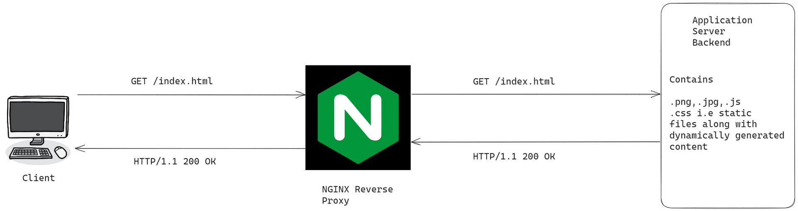

# Why Static Assets?

In the original case where the static assets are in the upstream backend server, all the requests need to be sent there.
Example:
1) Client A sends request for index.html.
2) A will in total send 1+Number_Of_Static_Assets requests to proxy server. Proxy server will send 1+Number_Of_Static_Assets requests to upstream backend server.
This is problem and results in critical performance and user experience problems when there are lots of users requesting that file which is always the case for enterprise applications.
So, static assets are implemented in enterprise websites.

In this case where the static assets are put in nginx reverse proxy server, the number of requests will significantly decrease, particularly by 2 * Number_Of_Static_Assets which is indeed a huge improvement over earlier case. It benefits more as traffic and static content increases.

# Configure Reverse Proxy with Static Assets
### Reverse-Proxy
```cmd
rev-proxy.conf
server{
    server_name mywebsitename;
    location / {
        proxy_pass http://backend_ip;
        proxy_set_header Host $host;
    }
    location ~* \.(css|js|jpeg|JPG|png){
        root /usr/share/nginx/html/static_files;
    }
}
```

### Upstream-Backend
```cmd
server{
    server_name mywebsitename;
    location / {
        root /usr/share/nginx/html/static_server_with_reverse_proxy;
    }
}
```
Here, in `/var/log/nginx`,
`tail -f *`
To check `access.log` and `error.log` both.
Don't keep static assets at upstream. To test the incoming requests, can put firstly static contents at upstream server though.
# Lab
- Make 2 servers
	- reverse-proxy
	- upstream-backend
- Download any html,css,js,bootstrap etc file from github. Like this. https://github.com/bedimcode/portfolio-responsive-complete
- Put the assets folder in `/usr/share/nginx/html` of reverse-proxy. We want to serve static assets from reverse-proxy directly.
- Put the index.html file in `/usr/share/nginx/html` of upstream-backend. We want to serve dynamic content directly from the upstream backend server.
- In reverse-proxy server, `/etc/nginx/conf.d/reverse-proxy.conf`
```cmd
server{
    listen 80;
    server_name mywebsitename;
    location /{
        proxy_pass http://192.168.1.76 ;
    }
    location ~* \.(css){
        root /usr/share/nginx/html/ ;
    }
        location ~* \.(jpeg|JPG|png){
        root /usr/share/nginx/html/ ;
    }
    location ~* \.(scss){
        root /usr/share/nginx/html/ ;
    }

    location ~* \.(js){
        root /usr/share/nginx/html/ ;
    }
}
```
- In upstream-backend server, create a configuration file in `/etc/nginx/conf.d/upstream-backend.conf`
```cmd
server{
        listen 80;
        server_name mywebsitename;
        location / {
        root /usr/share/nginx/html/;
    }
}
```
# Questions to Ponder
Try the same lab but with static files in upstream backend server and see the differences in `access.log` and `error.log`.
`tail -f *`

# Linux Tips
To copy multiple files, recursively to a same destination.
```cmd
cp -R css/ img/ js/ master/ vendor/ /usr/share/nginx/html/assets
```
