# White Listing
Way to have strict access control on your files on your webserver is with the help of whitelisting.
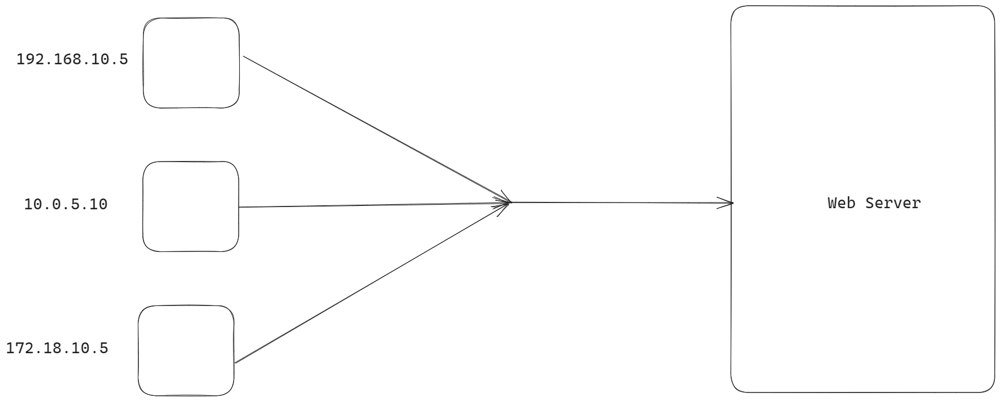
Let's assume this is an example.com web server and you've /admin portal. Now, you don't want everyone to access the /admin page.

You might only want to allow only certain IP addresses to access that particular page. The way with which you can do this is called whitelisting.

There are 3 clients over here with unique IP addresses. So, as a web server, what you can do is that you can allow access to a certain resource only if the client has particular IP addresses.  i.e you say only the client with IP address `10.0.5.10` can access the /admin page of the web server and everyone else is denied.

So, only 1 particular computer can access the particular admin panel and no one else.

Syntax

```cmd
location /admin {
    allow 172.18.10.5;
    deny all;
}
```
`allow` directive is saying to allow this IP address, deny directive is saying to deny everyone else.

```cmd
rev-proxy.conf
server{
    server_name mywebsitename;
    location /{
        root /usr/share/nginx/html;
    }
    location /admin{
        root /usr/share/nginx/html;
        index index.html;
        allow 192.168.1.75;
        deny all;
    }
}
```
Now, to do the test, you need this folder `/usr/share/nginx/html/admin/index.html`.
From the host Ip address, if I do
`curl -I 192.168.1.75/admin`, I'll get `200 OK`. Meanwhile, if I curl from any other IP address, I will get `403 Forbidden`.

Now, say you want to allow lots of IP addresses, one straightforward way to do this is as follows.
```cmd
rev-proxy.conf
server{
    server_name mywebsitename;
    location /{
        root /usr/share/nginx/html;
    }
    location /admin{
        root /usr/share/nginx/html;
        index index.html;
        allow 192.168.1.75;
		allow 192.168.1.76;
        deny all;
    }
}
```
This isn't an elegant solution. A rather elegant approach is to create a new file named `whitelist.conf` and include it in `rev-proxy.conf`.
```cmd
rev-proxy.conf
server{
    server_name mywebsitename;
    location /{
        root /usr/share/nginx/html;
    }
    location /admin{
        root /usr/share/nginx/html;
        index index.html;
        include /etc/nginx/conf.d/whitelist.conf;
        deny all;
    }
}
```

```cmd
whitelist.conf
allow 192.168.1.74;
allow 192.168.1.75;
```
# limit_connection module
This is useful for servers which are providing download related content.
So, if you've a server with lots of files which people would be downloading, then `limit_conn` module will be a very useful tool for you.
Say the bandwidth of your web server is 100Mbps and you expect 10 users at a time to download the file. Assume a scenario where out of the 10 users, 2 of them have 50Mbps connection and the rest 8 of them have 2Mbps connection. 

Problem here is that 2 users with 50Mbps connection will occupy 100Mbps bandwidth of the server and thus choke the server.
So, rest 8 people when they try to download the file, either the download will be slow or the server will return 503.

So, during these types of scenarios, it's very important to limit the amount of connection speed that you give to each individual user.

So, a better approach here would be that you give 10Mbps of bandwidth to each user, then essentially all the 10 users will be able to download the file.

But if you don't have any restrictions on the amount of download speed a user can have, then typically the people who will have very fast download speed will choke up the whole server.

## Lab
Download a 100MB test file from this site.
https://speed.hetzner.de/
Upload this to your server.
Go to the configuration
```cmd
rev-proxy.conf
server{
    listen 80;
    location /{
        root /usr/share/nginx/html;
        index index.html;
    }
    location /downloads{
        root /usr/share/nginx/html;
    }
}
```
Say its IP Address is `192.168.1.75`
Now, go to another server and
`wget 192.168.1.75/downloads/100MB.bin`
It'll be downloaded in fulll speed of your host network.
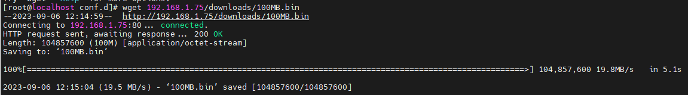
Now, let us introduce `limit_conn` module and put up a restriction.
```cmd
rev-proxy.conf
server{
    listen 80;
    location /{
        root /usr/share/nginx/html;
        index index.html;
    }
    location /downloads{
        root /usr/share/nginx/html;
        limit_rate 50k;
    }
}
```
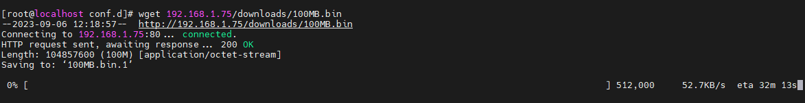
It'll be downloaded with around 50KBps speed.

Again, consider a scenario where the same file will be downloaded multiple times in the same server with the current configurations.
Here's the speed in instance 1 of the server.

Here's the speed in instance 2 of the server.
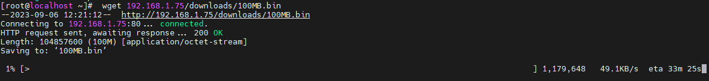
So, apparently when you combine both, they're hogging 100KBps which you probably don't want. So, this is not ideal. So, we've to limit the amount of speed that we give to each and every individual connections. We can also do that with nginx.

In order to do that, we've to define a zone similar to the zone that we've defined earlier for shared memory and buffer.

```cmd
limit_conn_zone $binary_remote_addr zone=addr:10m;
server{
    listen 80;
    location /{
        root /usr/share/nginx/html;
        index index.html;
    }
    location /downloads{
        root /usr/share/nginx/html;
        limit_rate 50k;
        limit_conn addr 1;
    }
}
```
This means that binary remote addr (alternative to remote addr). Basically, this means that the IP address of client who will be downloading the file.  IDK wtf it means.
So, if from same IP address, if you get two download request, the latter will get 503 Service Temporarily Unavailable.
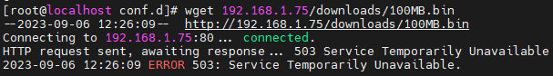
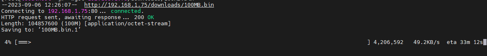
This is how websites that have premium subscription for downloads use this nginx configuration.
```cmd
limit_conn_zone $binary_remote_addr zone=addr:10m;
server{
    listen 80;
    location /{
        root /usr/share/nginx/html;
        index index.html;
    }
    location /downloads{
        root /usr/share/nginx/html;
        limit_rate 50k;
        limit_conn addr 1;
        limit_rate_after 50m,
    }
}
```
When you add `limit_rate_after 50m`, it means till 50MB there is no limit in downloading, but once 50MB file is downloaded, then there is limit in downloading as per the configuration.
# Basic Authentication


>The realm is used to describe the protected area or to indicate the scope of protection. This could be a message like "Access to the staging site" or similar, so that the user knows to which space they are trying to get access to.

Source: https://developer.mozilla.org/en-US/docs/Web/HTTP/Authentication

Remember that base64 can be decoded, so always use basic authentication on the top of ssl.
# Basic Authentication Practical
```cmd
rev-proxy.conf
server{
    server_name mywebsitename;
    location /{
        root /usr/share/nginx/html;
        index index.html;
    }
    location /admin{
        root /usr/share/nginx/html;
        index index.html;
        auth_basic "Basic Authentication";
        auth_basic_user_file "/etc/nginx/.htpasswd";
    }
}
```

```cmd
htpaswd -c /etc/nginx/.htpasswd admin
type password twice
cat .htpasswd
```
Go to browser and open the page `ip_address/admin`. Then credentials will be asked. 

# Understanding hashing
Hash changes entirely even if 1 extra character is added or deleted.
```cmd
# cat nepal
nepal
# cat nepalaya
nepalaya
# md5sum nepal
31ed3e3527b9098f9138b33709b24c13  nepal
# md5sum nepalaya
1bf0bf424b20ca04e1a4cb953f2cba43  nepalaya
```
Hashing algorithm will tell us if the file is modified or not.
Viruses attach to the file and change the structure of the file.
So, it's through the help of hashing, it's possible for us to know whether a file is modified or not.

In production environment, generally files would not be modified. So, in production environment for all the important files, there is a program which monitors whether the file is changed or not. And if the file is changed, it will immediately email to the system administrator saying that this file is modified.

## Difference between encryption and hashing?
Encryption is two way function whereas hashing is one way function. You can't recover the original text after it is hashed. But you can recover the original text, after it's encrypted via decryption.

## Benefit of hashing?
- Your system files do not change. If it has changed, then there is a high probability that a virus has done it.
- You can store passwords in hashed value instead of encrypted value.
- Verify the integrity of the software that you download.
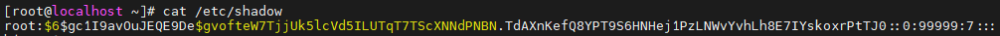
Linux stores the hashes.
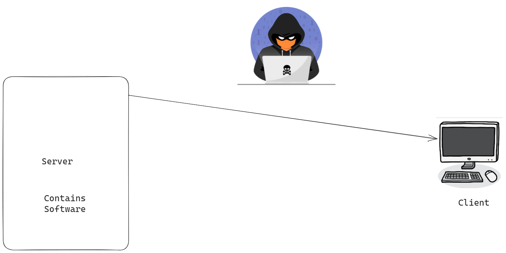
Say you download ms-office from server to computer. File comes via  network to your computer. Say the server is in USA and client is in India. There is a huge communication channel. So, the file could be tampered by hacker in the journey of the packet from USA to India. So, we use MD5 in this case. 
Once you download ms-office from server to your laptop, now your job is to take a hash value of this and compare it with hash value that microsoft has provided.

Different hash value could mean two things
- File is corrupted. It was not downloaded correctly.
- Integrity has been changed in the network by a hacker.
# Digest Authentication
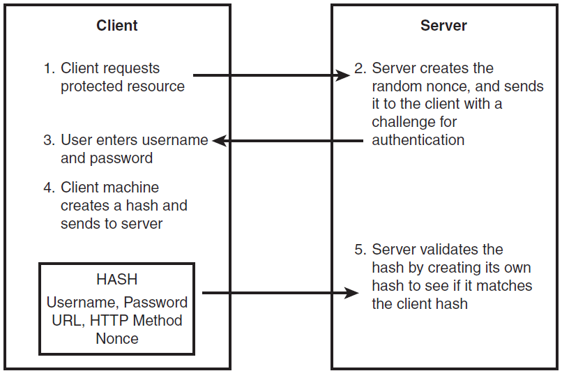
One of the reasons to provide digest authentication  was to provide an advantage over the basic authentication.
I quote this from HTTP Developer's Handbook By Chris Shiflett
> Digest Authentication mitigates the risk of exposing the username and password by utilizing a one-way cryptographic algorithm(also commonly called a hash or a message digest). These algorithms are called one-way algorithms because they are practically impossible to reverse. Although this might seem like a bold claim, consider that MD5 (Message Digest 5, a popular one-way algorithm) always returns a 128-bit digest. Thus, if you were to create a message digest of the text of an entire book, it would be 128 bits in length. If it were possible to generate the text of this entire book from 128-bit message digest, MD5 would be an amazing compression algorithm.

> Note that the data can still be hacked if common username, password combination is being used like admin 1234 etc.

> The basic series of events for digest authentication is nearly identical to that of basic authentication and is illustrated below.

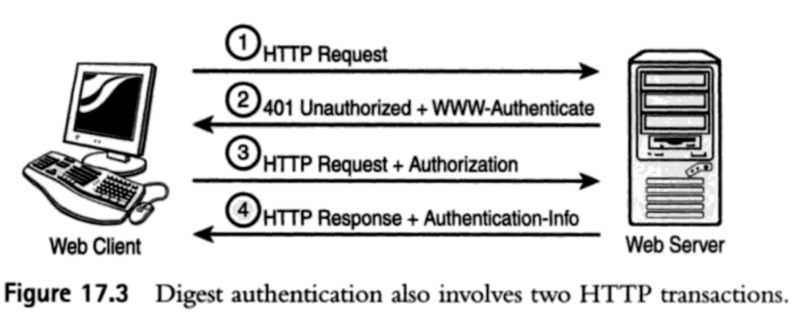

> - The client makes the initial request for the protected resource as normal, including no authentication information, because it is initially unaware that the resource requires authentication.
> - The authentication begins with the server's 401 Unauthorized response, in which it includes the www-authenticate response header. This header explains the type of authentication required as well as several other details.
> - The client's second request includes the Authorization header, which includes the message digest as well as some additional information about the authentication.
> - Finally, the resource is returned in the second HTTP response. This response also includes the Authentication-Info header, which completes the mutual authentication.

More information
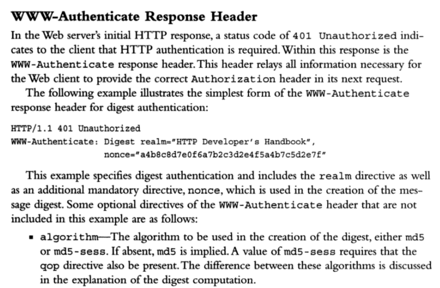

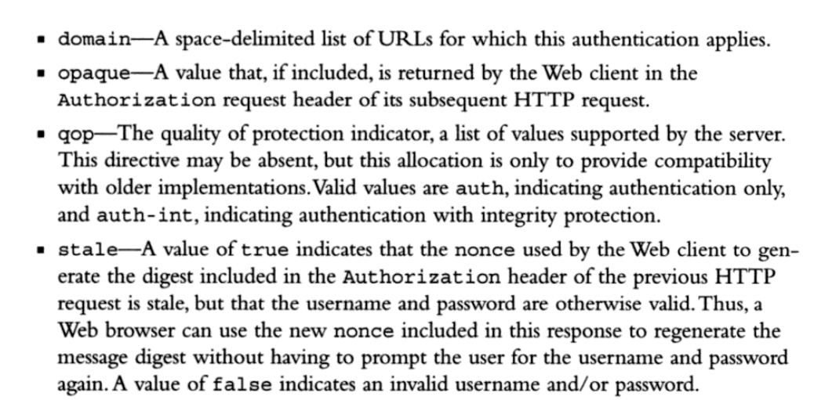

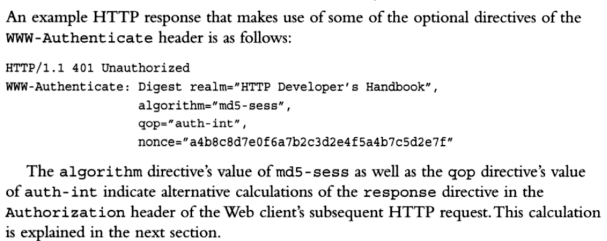

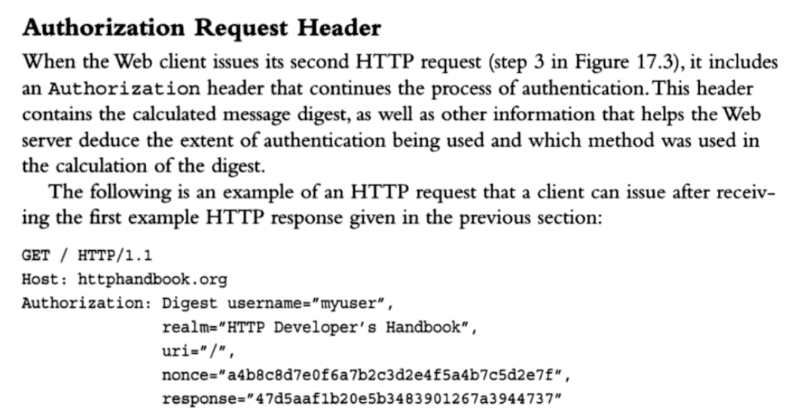
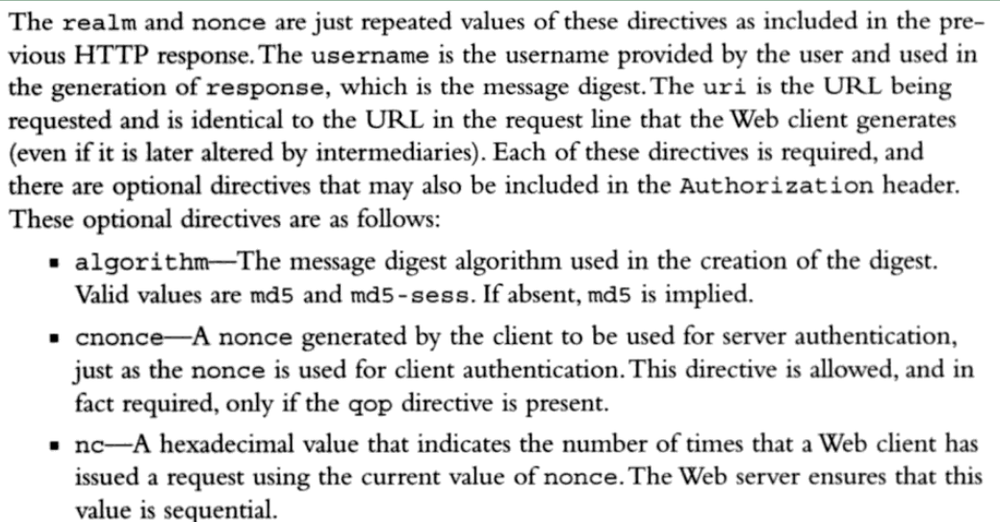
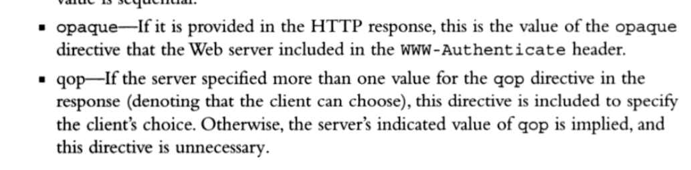
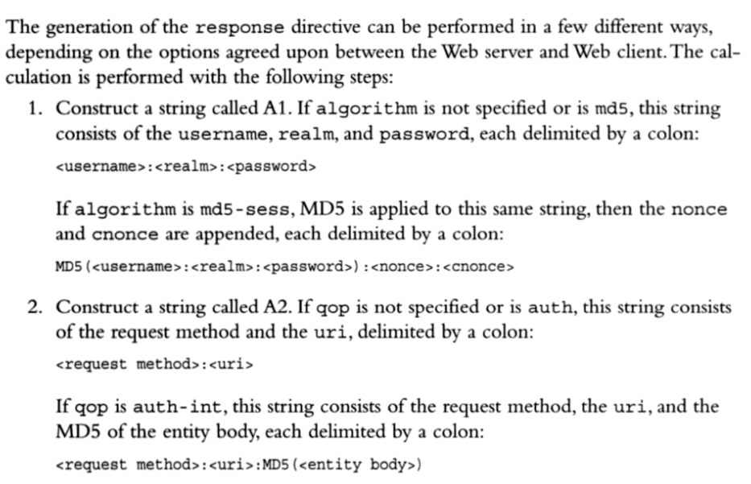
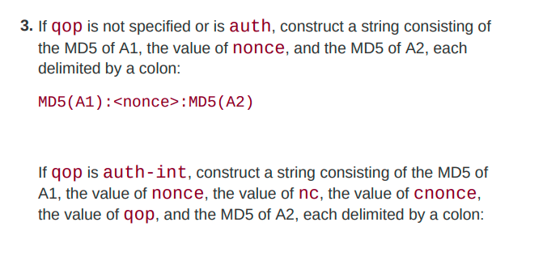
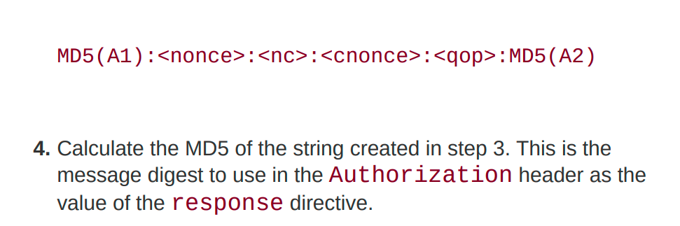
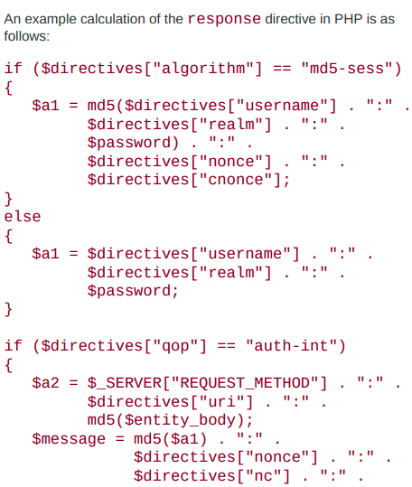
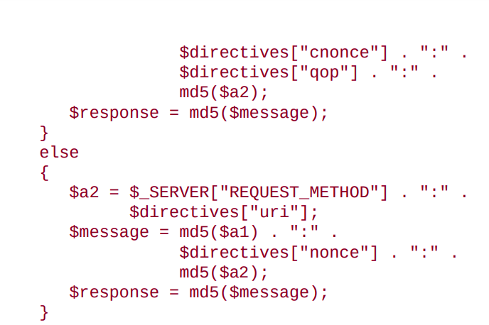
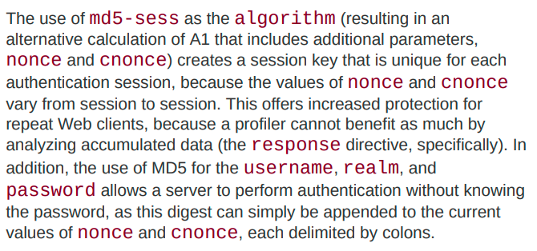
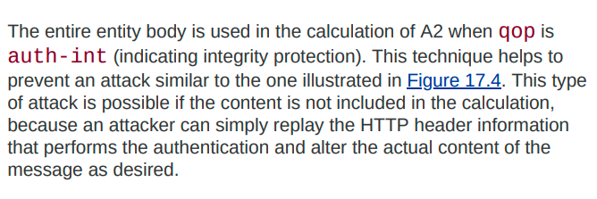
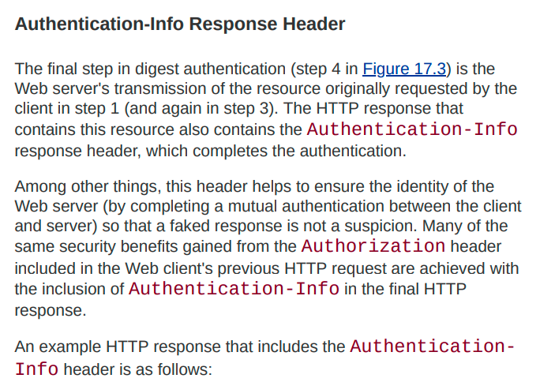
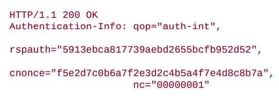
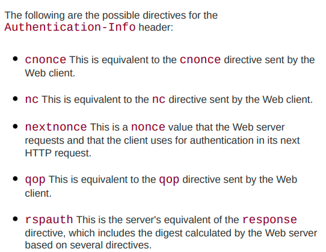
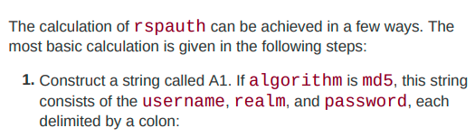
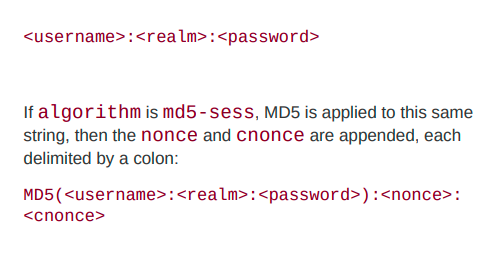
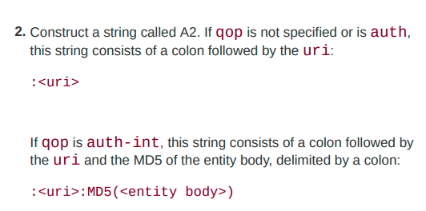
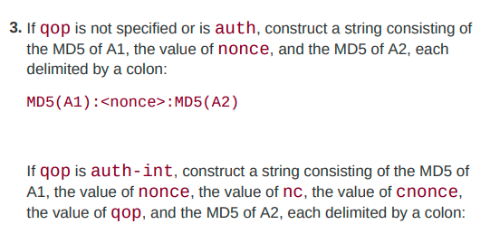
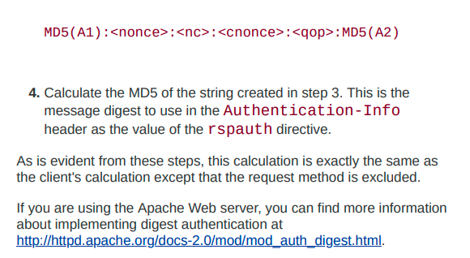
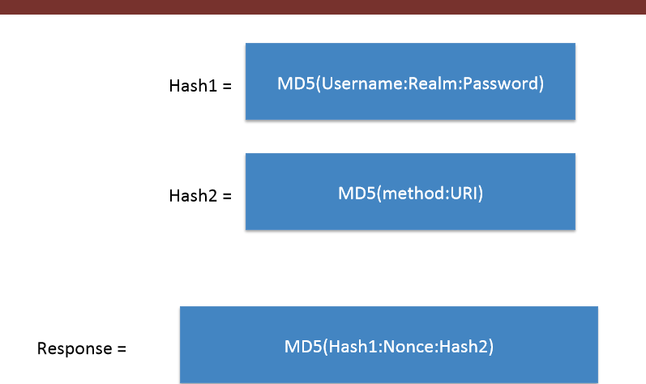
Instead of base64, it sends MD5 value.
How has value is calculated is shown in above figure.
## Nonce Value
It is used to prevent replay attacks. So, let's say a hacker captures this response and after 1 hour, he decides to send the same response back to the server.
Now, as the username, password and realms are correct, ideally the server should be able to verify it. So, this is one of the flaws and the reason why nonce value is added. In any programmed systems, we can take current datetime (or epochtime) and use it as a nonce. Thus this nonce value will keep changing on every interval.
So, even if a hacker captures this particular request and he replays it after half an hour, he won't be able to get authenticated because the nonce value has changed. And because the nonce value has changed, the whole MD5 value has also changed.
This is one the ways in which digest authentication works.
Nginx plus doesn't support the http digest authentication.

# GeoIP module
Say some websites are specific to clients in India, so there is no need to open up the website for the whole world. So, block website for specific countries.
`ngx_http_geoip_module` is used for it. This allows you to block website on certain countries.
May be you could use firewall to block some IP addresses. But it's not convenient to do that in firewall. Hence, you've to use GeoIP module which nginx provides which can block certain countries.
geoip is available only in nginx plus. So,


