# File: Name, Structure, Types, Access, Attribute, Operations
## What is file attribute?
A file's attributes vary from one operating system to another but typically consist of these:
- Name: The symbolic file name is the only information kept in human readable form.
- Identifier: This unique tag, usually a number identifies the file within the file system; it is the non-human readable name for the file.
- Type: This information is needed for systems that support different types of files.
- Location: This information is a pointer to a device and to the location of the file on that device.
- Size: The current size of the file (in bytes, words, or blocks) and possibly the maximum allowed size are included in this attribute.
- Protection: Access-Control information determines who can do reading, writing, executing and so on.
- Time, date and user identification. This information ma be kept for creation, last modification, and last use. These data can be useful for protection, security, and usage monitoring.
## In  Linux
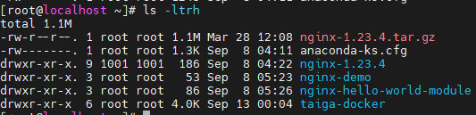
First column means type of file and file permissions.
Second column  means number of links to the file. i.e the number of names there are for the file. Generally an ordinary file will only have one link but a directory will have more.
Third and fourth column are the user who owns the file and the group of users to which the files belong. Unless you are working together on the same file, you need not worry about Unix groups.
Fifth column is the size of the file in bytes.
The last column is the name of the file.

# Directory and File Paths
## Write the difference between single level directory system and hierarchical directory system.
To answer this question, we need to learn few things.
 ### Device vs Partition vs File System vs Volume
 <table border="1px solid" width="500px">
      <tr>
        <td>Device</td>
        <td>Partition</td>
        <td>File System</td>
        <td>Volume</td>
      </tr>
      <tr>
        <td>It is a physical block disk</td>
        <td>
          Physical storage device can be divided into multiple logical storage
          units known as partitions. Each partitions will show up under /dev as
          a separate device node.
        </td>
        <td>
          Filesystem is just a layer in order to give some meaning to the bytes
        </td>
        <td>
          Any entity containing a file system is called a volume. Volume may be
          a subset of devices, whole device or multiple devices. Each volume can
          be thought of as a virtual disk. Volumes can store multiple operating
          systems, allowing a system to boot and run more than one operating
          system. Anything that gets mounted is a volume on Linux
        </td>
      </tr>
    </table>

### Questions To Ponder
What is the difference between volume and partition?
Fill this at next iteration of reading.
### Storage Structure
- tmpfs- a "temporary" file system that is created in volatile main memory and has its contents erased if the system reboots or crashes.
### Directory Overview
In linux, the directory is really just a mapping from filenames to 'inodes'. The inodes have all the real info about the file, dates, locations on the physical disk, etc. Since it is just a mapping, there's nothing special about any particular ordering, or representation of the directory. Files on disk to not have to be organized the same way they are presented to the user. 
>There can be many directory entries across the filesystem that reference the same inode number--these are known as hard links, and that is why hard links cannot reference files on other filesystems. 

Source: https://www.kernel.org/doc/html/latest/filesystems/ext4/directory.html

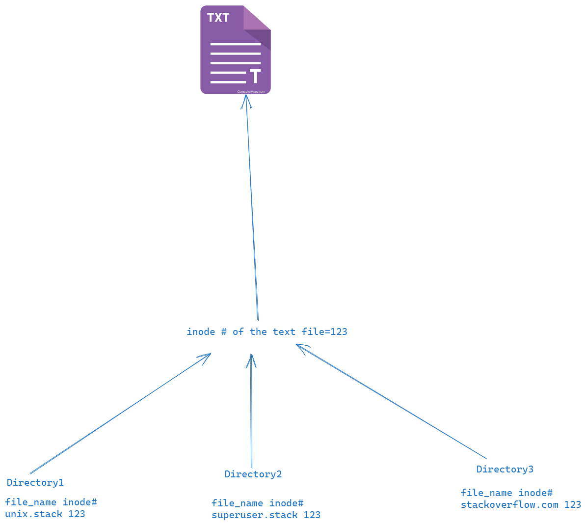

>A "hard link" just is the circumstance that two (or more) entries in the hierarchy of your file system refer to the same underlying data structure. Your figure illustrates that quite nicely!

>That's it; that's all there is to it. It's like if you have a cooking book with an index at the end, and the index says "Bread: see page 3", and "Bakery: see page 3". Now there's two names for what is on page 3.

>You can have as many index entries that point to the same page as you want. What does not work is that you have an index entry for something in another book. The other book simply doesn't exist within your current book, so referring to pages in it just can't work, especially because different versions of the other book could number pages differently over time.

https://unix.stackexchange.com/questions/756751/why-cant-hard-links-reference-files-on-other-filesystems

>Imagine moving a USB connected device from one computer to another. It must work, but will probably use same inode numbers as an existing device.

### Most common schemes for defining the logical structure of a directory.
- Single Level Directory
- Two Level Directory
- Tree Structured Directories
- Acyclic-graph directories
- General graph directory

#### Single Level Directory
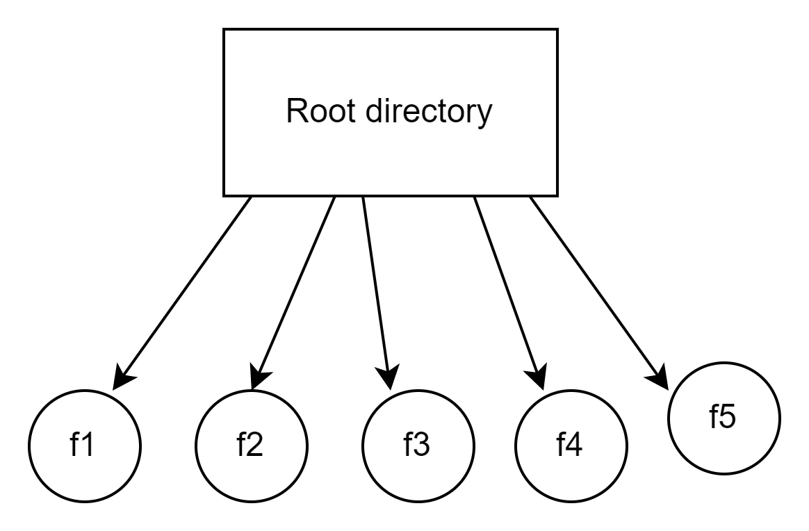
#### Two Level Directory
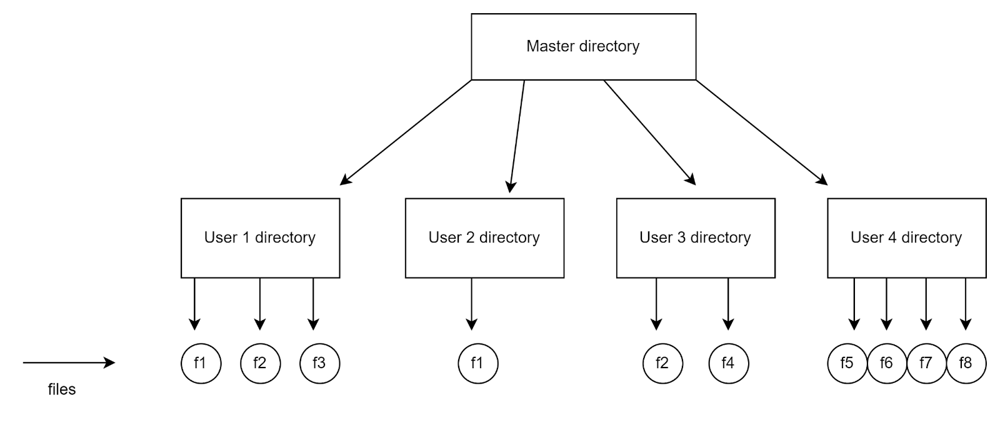
Interesting issue with this is what'd you do with system commands?
Would you copy each system command to each User Directory? Definitely Not.
Hence the solution is to create a special user directory is created where all the commands are put. 

#### Tree-Structured Directories
Perhaps it's called hierarchical directories.
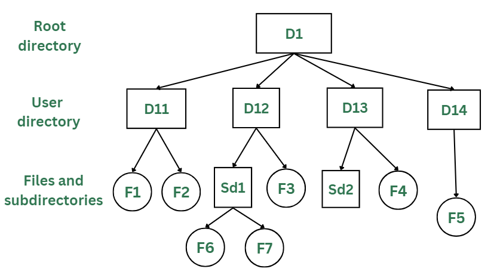
**How will deletion work?**
To delete a directory
- either the directory must be empty
- or the removal procedure must be applied recursively to them, so that they are also deleted.
Both two level directory and tree structured directories can access files from other user directory?
#### Acyclic Graph  Directories
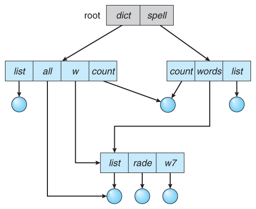
The purpose is to share files between two users.
A common way to do this  is to create a new directory entry called a link. A link is effectively a pointer to another file or subdirectory.
>OS ignores links when traversing directory trees to preserve the acyclic structure of the system.

Otherwise this would not be acyclic.

Another way to share directories between two users is to copy that to both users. The big issue here  is Consistency.

A same file now will have multiple absolute path names. Consequently, distinct file names may refer to the same file. 

Since they have different names even if they're same file, while traversing the entire file system, this problem becomes significant as we don't want to traverse shared structures more than once.

Another issue is **deletion**.

When  can the space allocated to a shared file be deallocated and reused?
- Remove the file whenever anyone deletes it, but this may leave dangling pointers to the non-existent file.
In a system where sharing is implemented  by symbolic links, this situation is somewhat easier to handle. The deletion of a link doesn't affect the original file, only the link is removed.

Another approach to deletion is to preserve the file until all references to it are deleted. At first, you might think you would want to store all the details of who references this file in your database. But the clever solution is to maintain a count of the number of references. And delete the file when the count becomes 0.
The UNIX system uses this approach for nonsymbolic links (or hard links)

### General Graph Directory
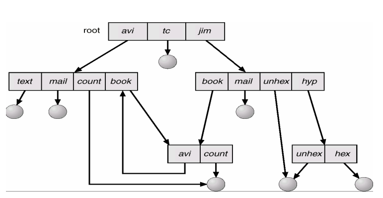
It's tough to maintain no cycles in acyclic graph directories. 
A tree structured directory, by definition can never have loops. But if we add links, the tree structure is not preserved and it results in general graph directory.
In the above figure, there is a loop from `avi->book->avi`.
So you'd not want to search any two components twice.
# File System Mounting
Before you can access the files on a file system you need to mount the file system.
Mounting a file system attaches that file system to a directory(mount point) and makes it available to the system. The root file system is always mounted. Any other file system can be connected or disconnected from the root file system.
Typically mount point is empty directory.

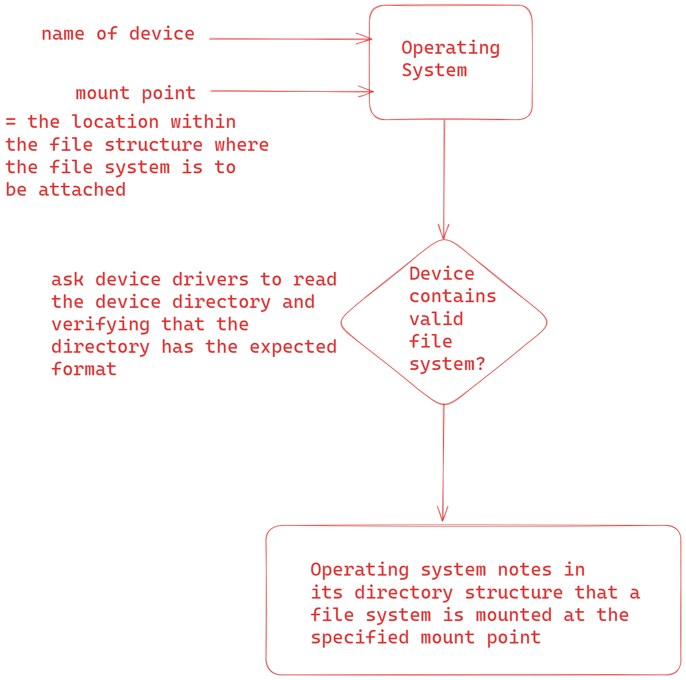

The general semantics of how a mount point should be is as follows:
- empty preferred
- if not empty; when a new file system has been mounted over that mount point, the earlier contents of that directory are inaccessible.
- delete the earlier contents of that directory if mounting new filesystem there.
# Hard Link and Soft Links
A link is a directory entry that references a data file or directory that is typically located in a different directory. Users often employ links to simplify file system navigation and to share files.
## Soft Link
A soft link(also called a symbolic link in UNIX based systems, a shortcut on Windows system and alias on MacOS systems) is a directory entry containing a pathname for another file. 
The file system locates the target of the soft link by traversing the directory structure using the specified pathname.
## Hard Link
A hard link is a directory entry that specifies the location of the file(typically a block number) on the storage device.
The file system locates a hard link's file data by directly accessing the physical block it references.
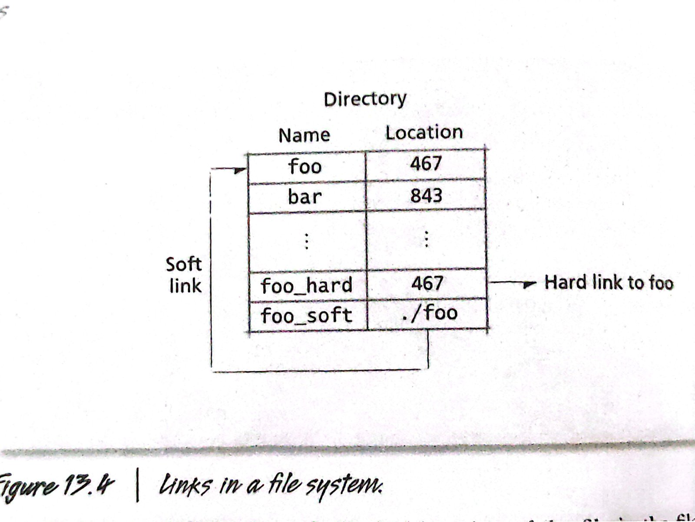
The figure above illustrates the difference between soft links and hard links. Files foo and bar are located at block numbers 467 and 843 respectively. The directory entry `foo_hard` is hard link because it specifies the same block number (467) as `foo`'s directory entry. The directory entry `foo_soft` is a soft link because it specifies the pathname for `foo` (in this case, .`/foo`).

https://s3.us-west-1.wasabisys.com/oscourse/slides/25-FileSys.pdf

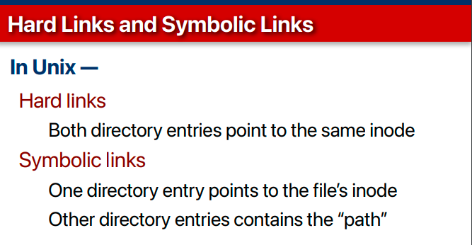
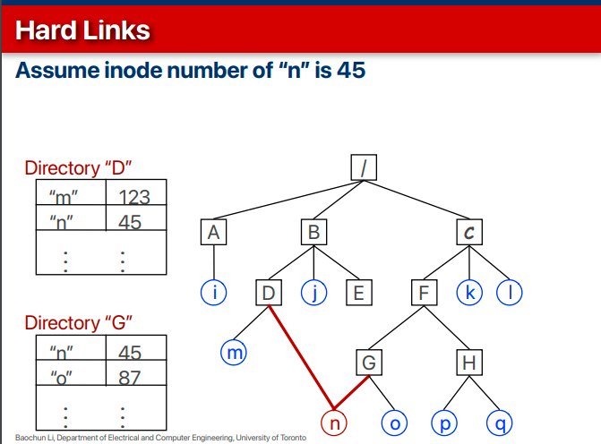
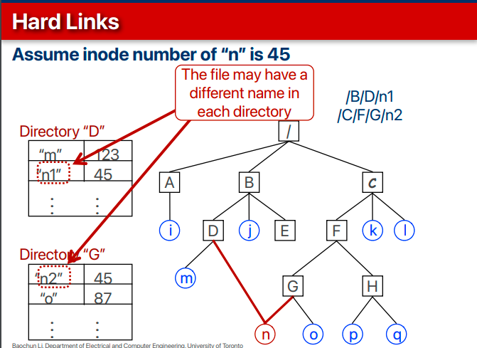
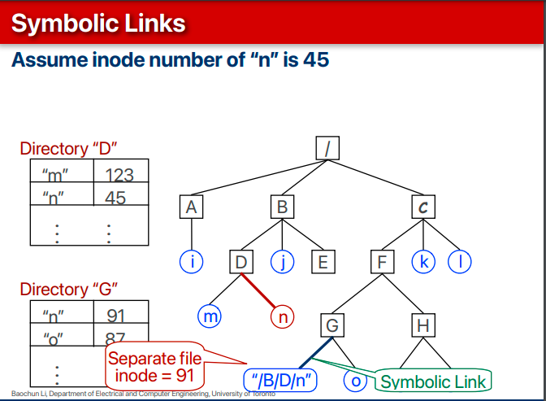

# Explain the role of each layer in a file system. 
When thinking about file system implementation in Operating Systems, it is important to realize the following:
- The majority of file systems all work in terms of files and directories.
- An OS typically supports multiple file systems.
- A file system is independent of the (type of) disk it is stored on.
	- The same file system could be used on hard disks, USB sticks, SD cards, and so on.
- So, there is the potential to share a lot of code. File system implementations are therefore almost always layered.
- Layering useful for reducing complexity and redundancy, but adds overhead and can decrease performance.
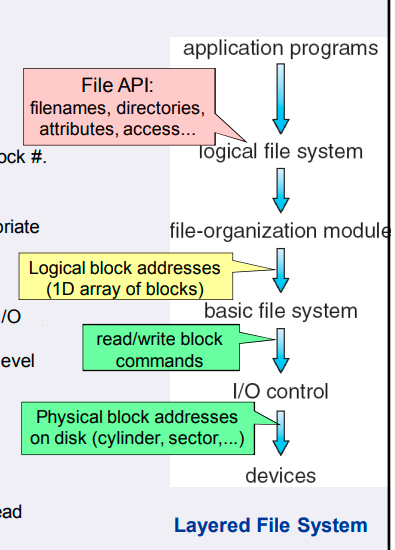
It is important you look this from top-bottom.
## Logical File System
- Common implementation of the concept of files and directories.
- Manages metadata information.
- Manages directory structure to provide the file organization.
- It maintains file structure via file-control blocks (also called inode in UNIX file systems). It contains information about the file, including ownership, permissions, and location of the file contents.
- Logical file system is also responsible for protection.
- In fact, it also provides programming interface to application programs.
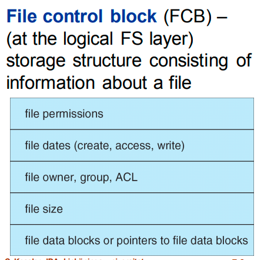
## File Organization Module
- It knows about files and their logical blocks, as well as physical blocks. By knowing the type of file allocation used and the location of the file, the file-organization module can translate logical block addresses to physical block addresses for the basic file system to transfer.
- Each file's logical blocks are numbered from 0 through N. Since the physical blocks containing the data usually do not match the logical numbers, a translation is needed to locate each block. 
- The file organization module also includes the free-space manager, which tracks unallocated blocks and provides these blocks to the file-organization module when requested.
## Basic File System
- The basic file system needs only to issue generic commands to the appropriate device driver to read and write physical blocks on the disk. Each physical block is identified by its numeric disk address ( for example, drive 1, cylinder 73, track 2, sector 10). 
- It also manages in-memory buffer cache of disk blocks. So ensures a memory buffer is allocated before the device driver is set to work.

## I/O control & devices
- It is a device driver implementation.
- Translate abstract commands like "retrieve block X" to actual low-level commands to the hardware devices.

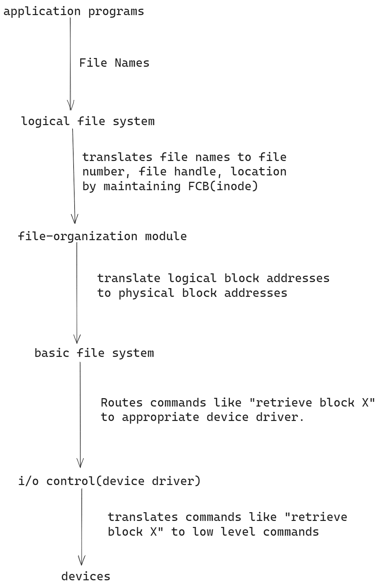

# File Allocation Methods

# Contiguous Allocation

Disk Blocks has 2 important concepts
- Disk Block Address (bits)
- Disk Block Size (bytes)
- Maximum possible file size=Maximum possible disk size=$2^{DBA}*DBS$ 
## Performance
- Internal fragmentation
	- yes
	- like paging in last block.
	- if I'm using only half of the last block, I get internal fragmentation.
- External fragmentation
	- yes
	- external/unused blocks piling up but not contiguously, then they have no meaning because I need contiguous blocks.
- Increasing existing file size
	- Say I've a file with 2 blocks which now requires 4 blocks, now if there's no free space contiguously, I need to find where's the free space and allocate accordingly.
	- Inflexible
- Type of Access
	- Sequential and Random both possible, because it's like an array.
	- Since it supports random access, it's faster. That's the only benefit of this file allocation method.
# Linked Allocation

- Internal Fragmentation
	- Yes, last block
- External Fragmentation
	- No
- Increase in file size
	- Always possible as long as free blocks are available.
- Type of Access
	- Sequential as it's linked list alike. Thus slower.
- Performance efficiency with respect to space overhead.
	- pointers needed for every disk block. Say the block size is 512 byte but say 2 bytes are storing the address, thus you will have only 510 bytes per block effectively to store the file. This reduces the file size.
- Vulnerability of pointers
	- Pointers can break. If they're broken then the whole file can't be accessed. That's the reason why generally in linked list allocation, last address of file is also stored.
1:06:20

# Image Credits
Operating Systems Godbole, Kahate